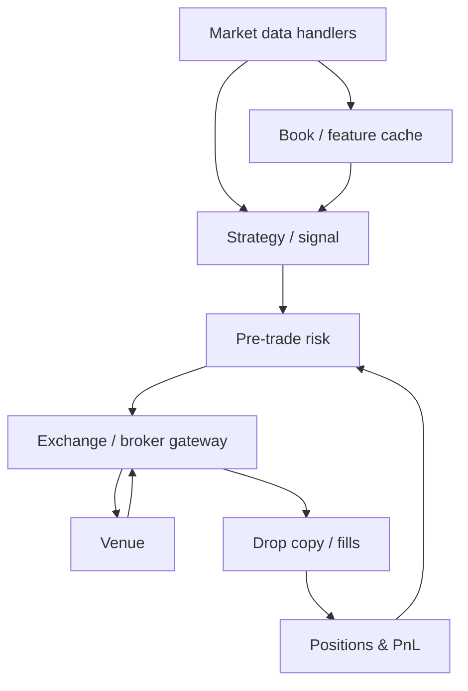
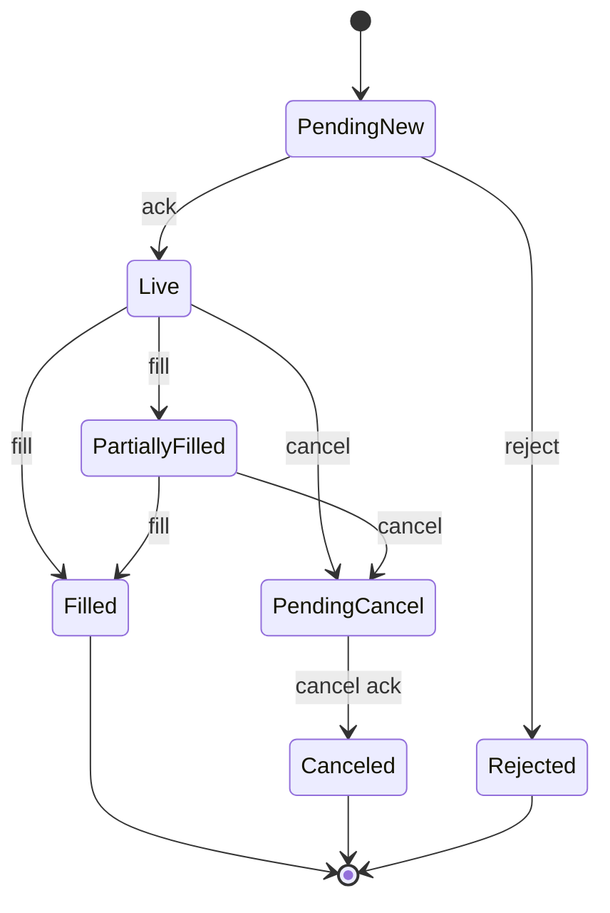

Trading systems architecture
Live trading is a **pipeline of deterministic components** with hard clocks: market data in, risk checks, orders out, drops and reconciliations when something lies.

## 1. Reference architecture

| Component | Job |
|-----------|-----|
| **MD handler** | Decode, sequence-check, normalize |
| **Strategy** | Decide intents (orders/cancels) |
| **Risk** | Enforce limits before send |
| **Gateway** | Session, protocol, retries |
| **OMS/EMS** | Parent/child orders, routing, state |
| **Drop copy** | Independent fill/ack stream for books |

## 2. Hot path vs warm path

| Path | Latency | Examples |
|------|---------|----------|
| **Hot** | µs–ms | MD → signal → order |
| **Warm** | ms–s | UI, reallocations |
| **Cold** | minutes+ | Research jobs, reports |

Don’t put GC-heavy or blocking I/O on the hot path. Many shops separate **native gateways** from **Python research**.

## 3. Order state machine (simplified)

Idempotent **client order ids** and clear ownership of state (gateway vs OMS) prevent double sends.

## 4. Messaging patterns

| Pattern | Use |
|---------|-----|
| **Inbound MD multicast / TCP** | Venue feeds |
| **Internal bus** | Fan-out normalized events |
| **Request/ack to venue** | Orders |
| **Drop copy** | Parallel truth for positions |

Related: [Kafka overview](../swe101/kafka/i-overview.md) for firm-wide distribution — not always on the HFT hop.

## 5. Latency budget (example)

| Hop | Typical concern |
|-----|-----------------|
| NIC → user space | Kernel bypass / busy poll |
| Decode + book | Allocation-free updates |
| Strategy | Bound compute; preallocate |
| Risk | O(1) checks where possible |
| Wire to venue | Colocation, protocol efficiency |

Measure **histograms**, not only averages — tails move PnL.

## 6. Resilience

| Failure | Response |
|---------|----------|
| Feed sequence gap | Snapshot resync; pause strategy |
| Session drop | Reconnect rules; cancel-on-disconnect if configured |
| Partial outage | Fail closed on risk if marks stale |
| Clock skew | NTP/PTP monitoring |

**Cancel-on-disconnect** and **throttles** are product features — encode them explicitly.

## 7. Colocation and ops

| Concern | Note |
|---------|------|
| **Colo** | Rack near matching engine / proximity hosting |
| **Cert / prod** | Separate credentials and symbols |
| **Release** | Change windows vs market hours |
| **Observability** | Order rates, rejects, mark age, feed gaps |

## Next

[Risk, PnL & controls](ix-risk-pnl-and-controls.md) — keeping the firm solvent while systems stay fast.
