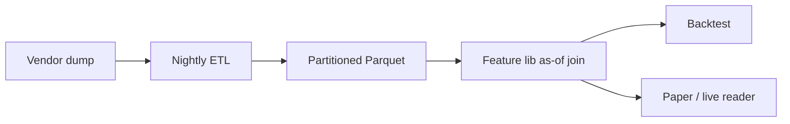
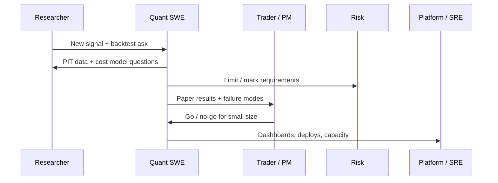

Day in the life — Quant SWE (example)
Concrete sketch of what a **quant software engineer** might do on a normal US-equity trading day. Roles vary by firm (prop, buy-side, bank, crypto). This is one plausible **mid-level QSE** on a small systematic desk — not a job description, and not financial advice.

Companion concepts: [Trading systems architecture](viii-trading-systems-architecture.md), [Research & backtesting](vii-research-and-backtesting.md), [Risk, PnL & controls](ix-risk-pnl-and-controls.md).

## Persona

| | |
|--|--|
| **Role** | Quant SWE / quant developer |
| **Desk** | Systematic equities, a few live strategies + research backlog |
| **Stack** | Python research; C++/Rust gateway; Postgres + Parquet lake; internal bus |
| **Not** | Pure researcher (they partner with one); not pure SRE (they own trading path bugs) |

## Timeline (ET)

### 07:15 — Pre-open checks

```text
Slack / pager quiet?
  → feed sessions UP
  → cert ≠ prod configs
  → yesterday EOD reconcile green
  → limit file matches intended book
```

| Task | Why |
|------|-----|
| Glance **mark age** and **feed gap** dashboards | Stale data → fail closed |
| Confirm **holiday / early-close** calendar | Avoid empty-bar false alerts |
| Skim overnight **deploy** notes | Know what changed before open |

Often 20–40 minutes — boring when healthy; career-defining when not.

### 09:20–09:45 — Open

| Happening | Quant SWE action |
|-----------|------------------|
| Auction / open volatility | Watch **reject rates**, order ack latency |
| Strategy spins up | Confirm risk gate allows intended symbols |
| First fills | Spot-check drop copy vs OMS state |

If something is wrong: **kill switch** first, debug second ([Risk controls](ix-risk-pnl-and-controls.md)).

### Mid-morning — feature work (typical ticket)

Example ticket: *“Research wants lagged short-interest as a PIT feature; serve it to sim and to one paper strategy.”*



| Step | Day-to-day work |
|------|-----------------|
| **Spec** | Agree as-of rules with researcher — no leakage |
| **Implement** | Loader + unit tests with known as-of fixtures |
| **Parity** | Same feature values in batch sim and streaming reader |
| **Review** | PR: data version, schema, owners |
| **Shadow** | Paper strategy only until tearsheet + risk sign-off |

This is the core loop: **make research production-safe**, not “train a model in a notebook and ship the notebook.”

### Midday — interrupt: prod incident

```text
Alert: sequence gap on venue X depth feed
  → strategy auto-paused (stale book)
  → rebuild book from snapshot
  → confirm BBO sane vs secondary vendor
  → re-enable with trader ack
  → write timeline for postmortem
```

| Skill used | Track note |
|------------|------------|
| Book builder / resync | [Order books](v-order-books-and-microstructure.md) |
| Clocks & capture time | [Market data](iv-market-data-and-time-series.md) |
| Fail closed | [Risk & controls](ix-risk-pnl-and-controls.md) |

### Afternoon — backtest surgery

Researcher: *“Sharpe collapsed after we added fees.”*

| Quant SWE does | Avoid |
|----------------|-------|
| Re-run with **pinned data version** + fee schedule | Silent fee = 0 |
| Check fill model (mid vs touch) | “Alpha” that was free liquidity |
| Walk-forward slice that broke | One magic parameter |
| Capacity / turnover report | Ignoring impact |

Output: a **tearsheet artifact** (config hash + git SHA + data version), not a screenshot.

### 15:50–16:15 — Close / EOD

| Task | Detail |
|------|--------|
| Flatten or hand off | Per desk rules |
| EOD jobs | Positions, cash, fees → warehouse |
| Reconcile | Internal vs broker / drop copy |
| PnL explain | Trading vs fees vs marks — chase breaks |

Unexplained PnL becomes tomorrow’s bug, not a shrug.

### After close — engineering depth

Examples of “real SWE” work that still counts as Quant SWE:

| Project | Outcome |
|---------|---------|
| Faster Parquet partition layout | Research iteration time ↓ |
| Gateway cancel-on-disconnect drill in cert | Confidence in kill path |
| Limit config as code + audit log | Fewer fat-finger deploys |
| Replay harness for one trading day | Deterministic incident repro |

## What they do *not* spend most days on

| Myth | Reality |
|------|---------|
| “Only write α formulas” | Mostly data, infra, correctness, ops |
| “Always HFT kernel bypass” | Many QSEs never touch µs paths |
| “Ignore compliance” | Audit logs and access show up constantly |
| “Solo hero” | Pair with research, desk, risk, SRE |

## Collaboration map



## Sample calendar (one week)

| Day | Focus |
|-----|-------|
| **Mon** | Pre-open + ship feature behind flag |
| **Tue** | Incident + harden gap handling |
| **Wed** | Backtest cost model with research |
| **Thu** | Cert drill: kill switch + COD |
| **Fri** | EOD reconcile tooling + backlog grooming |

## Takeaway

Day-to-day Quant SWE work is **software engineering with market clocks**: keep data honest, keep the path to the venue safe, and turn research ideas into systems that survive open, incidents, and close.

## Next

Revisit [Overview](i-overview.md) or deepen [Trading systems architecture](viii-trading-systems-architecture.md).
