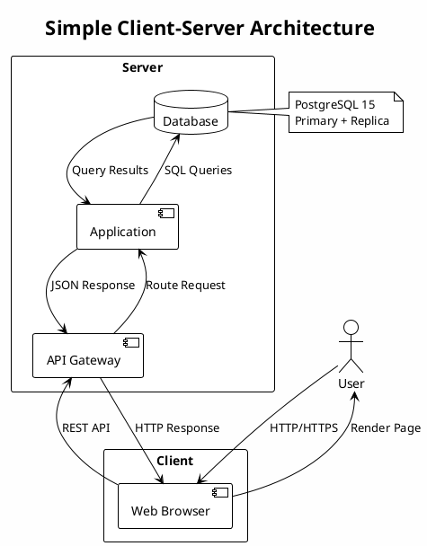

SRE tooling — Loki
Log aggregation tuned for labels, not full-text indexing of everything.

## 1. Role

**Grafana Loki** ingests log streams identified by **labels** (cluster, namespace, pod, app). It indexes labels heavily and compresses log chunks—cheaper than treating every field as indexed columns.

## 2. Core concepts

- **Promtail / Fluent Bit / OpenTelemetry** — agents that ship logs with consistent labels.
- **LogQL** — query language combining label selectors with line filters and metric queries over logs.
- **Retention & storage** — object-store backends for chunks; retention policies per tenant.

## 3. SRE practices

- Standardize **label schema** across teams so investigations (`{namespace="payments"} |= "timeout"`) stay fast.
- Correlate with traces/metrics via shared **trace IDs** or **request IDs** in log lines.
- Avoid logging secrets; scrub at the agent where possible.

## 4. Pairing

Explore logs in **Grafana** alongside Prometheus graphs for the same service and time range.

