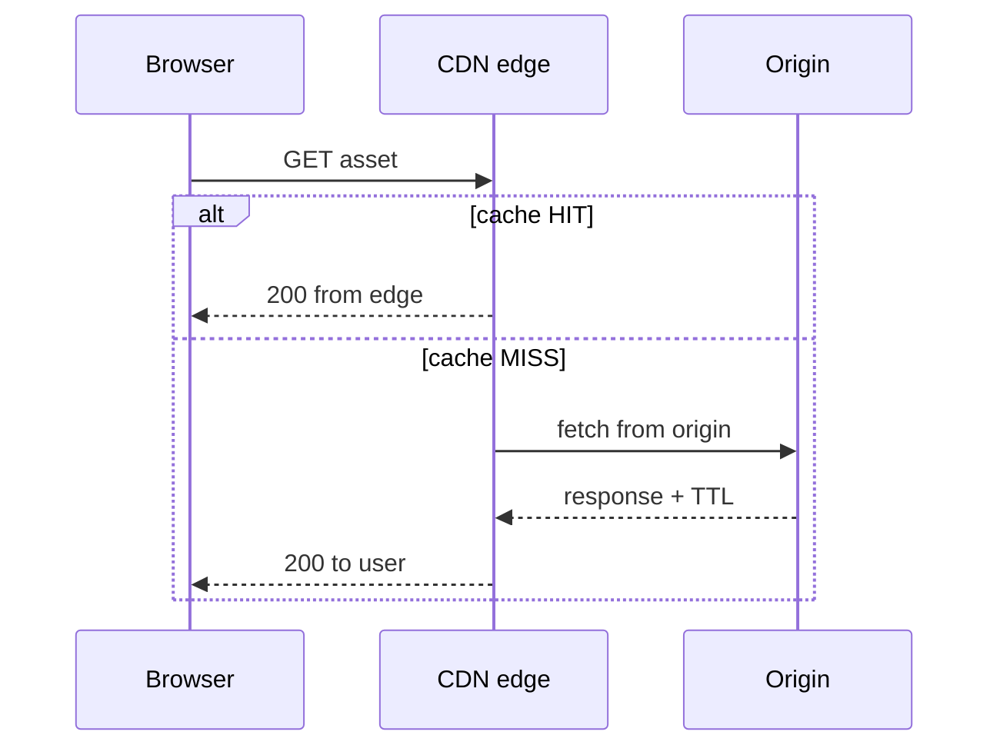
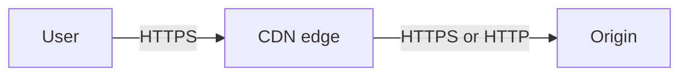

CDN — how CDNs work
A CDN is a **distributed cache** in front of your **origin**. Users talk to the nearest **PoP (Point of Presence)**; on a **miss**, the PoP fetches from origin once and stores the response for later requests.

## 1. Request flow (pull CDN)



| Term | Meaning |
|------|---------|
| **PoP / edge** | CDN server in a city/region |
| **Origin** | Your bucket, server, or load balancer |
| **Cache hit** | Edge serves without contacting origin |
| **Cache miss** | Edge fetches from origin, then caches |
| **TTL** | How long edge keeps copy before revalidating |

Same mental model as [CDN & edge caching](../sysdesign/scalable-patterns/vi-cdn-and-edge-caching.md).

## 2. DNS routing

| Method | Behavior |
|--------|----------|
| **CNAME to CDN** | `cdn.example.com` → `d111111.cloudfront.net` |
| **Anycast** | One IP; BGP routes to nearest PoP |
| **Geo DNS** | Different answers by user continent |

User does not pick a PoP — CDN DNS/network layer does.

## 3. Pull vs push

| | **Pull** (most web apps) | **Push** |
|---|--------------------------|----------|
| **How** | CDN fetches from your origin on miss | You upload files to CDN storage |
| **Origin** | S3, nginx, ALB, custom server | CDN bucket (e.g. S3 origin + OAI, or push zone) |
| **Cold start** | First visitor in region slower | Pre-upload before launch |
| **Best for** | Sites, APIs with cache headers | Large downloads, live event seeding |

Modern setups are **pull** with object storage origin (S3 + CloudFront, GCS + Cloud CDN).

## 4. Cache key

Edge stores responses under a **cache key** — not always “URL only”:

```text
Default key:  host + path + query string (provider-specific)
Custom key:   include/exclude query params, headers, cookies
```

Misconfigured keys cause:

- **Wrong content** — same URL, different users get same cached JSON
- **Low hit rate** — random query params bust cache every time

Configure **which query params** matter (`?v=3` yes, `?utm_source=` no).

## 5. TLS termination



CDN holds the **public certificate** users trust. Origin can be HTTP inside VPC (with signed requests) or HTTPS — provider docs vary (**Origin Access Control**, **signed URLs**).

## 6. Origin shield (optional)

Some CDNs add a **regional mid-tier cache** between many PoPs and origin — fewer origin hits when one file goes viral globally.

## 7. What CDN does not do

| Not CDN’s job | Where instead |
|---------------|---------------|
| Run your Java/Python API logic | App servers, serverless |
| Replace database | Postgres, MongoDB |
| Session storage | [Redis](../redis/iv-patterns-and-use-cases.md) |
| Write operations | POST always to origin |

## Next

Continue with [Cache headers & TTL](iii-cache-headers-and-ttl.md) to control what gets stored and for how long.
