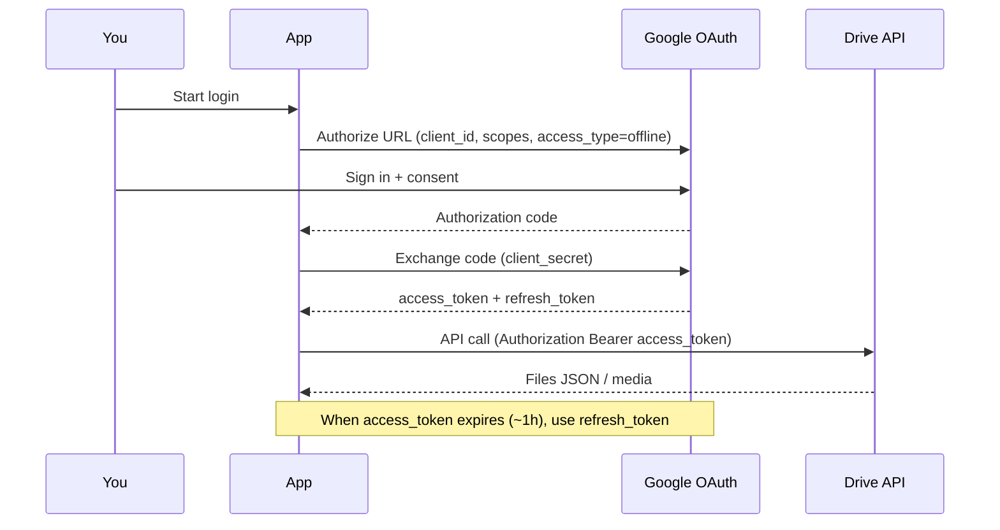

Google OAuth & Drive
How to get a **Google access token** (and **refresh token**) so your app can **list, upload, download, and manage Google Drive** files. This is the user-consent OAuth path — the usual choice for “manage *my* Drive” or a desktop/CLI tool.

Not a substitute for Google’s official docs; APIs and console UIs change. Prefer [Google Drive API](https://developers.google.com/drive) and [OAuth 2.0 for Google APIs](https://developers.google.com/identity/protocols/oauth2) when something disagrees.

Parent: [External APIs overview](i-overview.md). Secrets: [Identity & secrets](../../cybersecurity/iii-identity-access-and-secrets.md).

## 1. Pick the right credential

| Goal | Use |
|------|-----|
| Access **your** (or a user’s) personal Drive after login | **OAuth 2.0 client** + consent (this page) |
| Backend acting as itself, no browser | **Service account** (+ optional domain-wide delegation on Workspace) |
| Public metadata only | API key — **cannot** read private Drive files |

For personal Drive management, use **OAuth**. Service accounts do **not** automatically see your personal My Drive.

## 2. Google Cloud setup (once)

1. Open [Google Cloud Console](https://console.cloud.google.com/).
2. Create or select a **project**.
3. **APIs & Services → Library** → enable **Google Drive API**.
4. **APIs & Services → OAuth consent screen**
   - User type: **External** (personal Gmail) or **Internal** (Workspace-only).
   - App name, support email, developer contact.
   - Add scopes (next section).
   - Add **test users** while the app is in *Testing* (External).
5. **APIs & Services → Credentials → Create credentials → OAuth client ID**
   - Application type:
     - **Desktop app** — local scripts / CLI (simplest for personal tools).
     - **Web application** — server with redirect URI (e.g. `http://localhost:8080/oauth2callback`).
   - Download the JSON client secrets file (or copy Client ID / Client Secret).

**Never commit** `client_secret*.json` or tokens to git. Use env vars, a secrets manager, or a gitignored path.

## 3. Scopes (Drive)

Request the **minimum** scope you need:

| Scope | Access |
|-------|--------|
| `https://www.googleapis.com/auth/drive.readonly` | Read files metadata + content |
| `https://www.googleapis.com/auth/drive.file` | Only files the app creates/opens (narrower) |
| `https://www.googleapis.com/auth/drive` | Full Drive access (broad — justify in consent) |
| `https://www.googleapis.com/auth/drive.metadata.readonly` | Metadata only |

Sensitive/restricted scopes may trigger Google **verification** for production External apps. For personal Testing mode + test users, you can proceed without full verification.

## 4. OAuth flow (what the tokens are)



| Token | Lifetime | Role |
|-------|----------|------|
| **Access token** | ~1 hour | Send as `Authorization: Bearer …` to Drive |
| **Refresh token** | Long-lived (until revoked) | Get new access tokens without browser |
| **ID token** | Short | OpenID identity — **not** for Drive API calls |

Critical for offline / CLI use:

- `access_type=offline`
- `prompt=consent` on first run (helps ensure a refresh token is issued)

## 5. Desktop / local script (recommended first path)

### Install (Python)

```bash
pip install google-api-python-client google-auth-httplib2 google-auth-oauthlib
```

### Minimal authorize + list files

Save OAuth client JSON as `credentials.json` (gitignored). First run opens a browser; tokens land in `token.json`.

```python
from pathlib import Path

from google.auth.transport.requests import Request
from google.oauth2.credentials import Credentials
from google_auth_oauthlib.flow import InstalledAppFlow
from googleapiclient.discovery import build

SCOPES = ["https://www.googleapis.com/auth/drive.readonly"]
CREDENTIALS = Path("credentials.json")
TOKEN = Path("token.json")


def get_creds() -> Credentials:
    creds = None
    if TOKEN.exists():
        creds = Credentials.from_authorized_user_file(TOKEN, SCOPES)
    if not creds or not creds.valid:
        if creds and creds.expired and creds.refresh_token:
            creds.refresh(Request())
        else:
            flow = InstalledAppFlow.from_client_secrets_file(CREDENTIALS, SCOPES)
            creds = flow.run_local_server(port=0)
        TOKEN.write_text(creds.to_json())
    return creds


def main() -> None:
    service = build("drive", "v3", credentials=get_creds())
    results = (
        service.files()
        .list(pageSize=10, fields="files(id, name, mimeType)")
        .execute()
    )
    for f in results.get("files", []):
        print(f["name"], f["id"], f.get("mimeType"))


if __name__ == "__main__":
    main()
```

| File | Contents |
|------|----------|
| `credentials.json` | OAuth **client** from Cloud Console |
| `token.json` | **User** access + refresh tokens after consent |

Rotate: delete `token.json` and re-auth if scopes change or refresh fails.

## 6. Common Drive operations

| Action | API sketch |
|--------|------------|
| **List** | `files().list(q=..., fields=...)` |
| **Get metadata** | `files().get(fileId=...)` |
| **Download** | `files().get_media(fileId=...)` + `MediaIoBaseDownload` |
| **Upload** | `files().create(body=..., media_body=...)` |
| **Update / rename** | `files().update(fileId=..., body=...)` |
| **Trash / delete** | `files().update(..., trashed=True)` or `files().delete` |

Query examples for `q`:

```text
name contains 'notes' and trashed = false
'mimeType' = 'application/vnd.google-apps.folder'
'FOLDER_ID' in parents
```

Shared drives need `supportsAllDrives=True` and often `includeItemsFromAllDrives=True` on list calls.

## 7. Web app redirect flow (short)

```text
1. Redirect user to accounts.google.com/o/oauth2/v2/auth
     ?client_id=…
     &redirect_uri=https://your.app/oauth2callback
     &response_type=code
     &scope=…drive…
     &access_type=offline
     &prompt=consent
2. Google redirects to redirect_uri?code=…
3. POST https://oauth2.googleapis.com/token
     code, client_id, client_secret, redirect_uri, grant_type=authorization_code
4. Store refresh_token server-side (encrypted); use access_token for Drive calls
```

Register the **exact** redirect URI in the OAuth client. Use HTTPS in production.

## 8. Calling Drive with a raw access token

```http
GET https://www.googleapis.com/drive/v3/files?pageSize=10&fields=files(id,name)
Authorization: Bearer ya29.a0...
```

Refresh:

```http
POST https://oauth2.googleapis.com/token
Content-Type: application/x-www-form-urlencoded

client_id=…
&client_secret=…
&refresh_token=…
&grant_type=refresh_token
```

## 9. Security checklist

| Do | Don’t |
|----|-------|
| Gitignore `credentials.json` / `token.json` | Commit secrets or tokens |
| Prefer `drive.file` or `readonly` scopes | Request full `drive` “just in case” |
| Store refresh tokens encrypted at rest | Log Bearer tokens |
| Revoke in [Google Account → Security → Third-party access](https://myaccount.google.com/permissions) when done | Share client secrets in Slack |
| Separate **dev** and **prod** OAuth clients | Reuse prod client on laptops casually |

## 10. Troubleshooting

| Symptom | Likely cause |
|---------|----------------|
| `accessNotConfigured` | Drive API not enabled on the project |
| `redirect_uri_mismatch` | URI ≠ console registration |
| No `refresh_token` | Missing `access_type=offline` / `prompt=consent`, or already granted |
| `invalid_grant` | Refresh revoked, expired, or client secret rotated |
| 403 on file | Wrong scope, or file not shared with the consented account |
| Consent “App not verified” | Testing mode — add yourself as test user, or complete verification |

## Next

[GitHub OAuth](iii-github-oauth.md) and [GitLab OAuth](iv-gitlab-oauth.md) use the same authorization-code pattern for git forges. Return to [External APIs overview](i-overview.md). For putting auth in front of *your* APIs, see [API gateway authentication](../api-gateway/iv-authentication.md).
