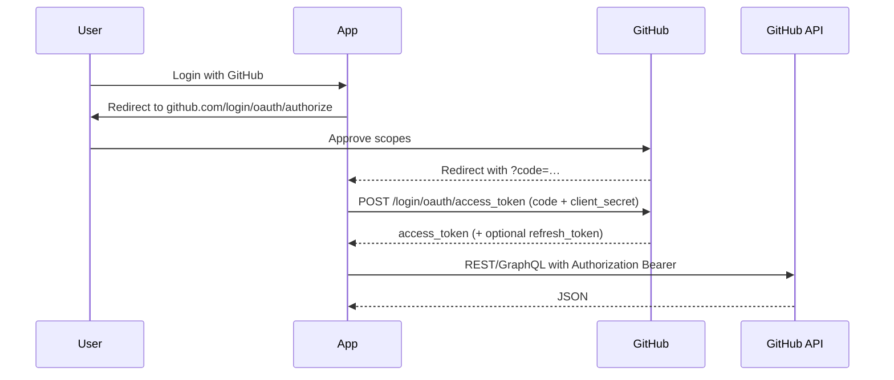

GitHub OAuth
How to register a **GitHub OAuth App** (or GitHub App), get an **access token**, and call the GitHub API — list repos, read issues, act as the user (or as an app). Use this when your product needs “Sign in with GitHub” or to automate against a user’s GitHub resources.

Official references: [Authorizing OAuth apps](https://docs.github.com/en/apps/oauth-apps/building-oauth-apps/authorizing-oauth-apps), [Scopes for OAuth apps](https://docs.github.com/en/apps/oauth-apps/building-oauth-apps/scopes-for-oauth-apps), [REST API](https://docs.github.com/en/rest).

Parent: [External APIs overview](i-overview.md). Compare: [GitLab OAuth](iv-gitlab-oauth.md), [Google OAuth & Drive](ii-google-oauth-and-drive.md).

## 1. Pick the right GitHub credential

| Goal | Use |
|------|-----|
| “Sign in with GitHub” / act as a **user** | **OAuth App** (this page) |
| Install on orgs/repos, fine-grained permissions, webhooks | **GitHub App** (preferred for products) |
| Scripts / CI as yourself | **Personal access token (PAT)** — classic or fine-grained |
| Machine user in Actions | `GITHUB_TOKEN` or a PAT/App in secrets |

OAuth Apps are simplest for learning and personal tools. Production SaaS increasingly uses **GitHub Apps**.

## 2. Create an OAuth App

1. GitHub → **Settings → Developer settings → OAuth Apps → New OAuth App**  
   (org: Organization settings → Developer settings → OAuth Apps).
2. Fill in:
   - **Application name**
   - **Homepage URL**
   - **Authorization callback URL** — must match exactly (e.g. `http://localhost:8080/callback` or `https://your.app/oauth/github/callback`)
3. Register → copy **Client ID**.
4. **Generate a new client secret** → store securely (shown once).

**Never commit** client secrets or tokens. Env vars or a secrets manager only.

## 3. Scopes (minimum)

| Scope | Typical use |
|-------|-------------|
| *(empty / `read:user`)* | Identify the user |
| `user:email` | Read private email addresses |
| `repo` | Full private repo access (broad) |
| `public_repo` | Public repos only |
| `read:org` | Read org membership |
| `workflow` | Update GitHub Actions workflow files |

Prefer the **narrowest** scope. Fine-grained PATs / GitHub Apps can be tighter than classic OAuth scopes.

## 4. Authorization code flow



### Authorize URL

```text
GET https://github.com/login/oauth/authorize
  ?client_id=YOUR_CLIENT_ID
  &redirect_uri=http://localhost:8080/callback
  &scope=read:user%20repo
  &state=RANDOM_CSRF_TOKEN
```

| Param | Why |
|-------|-----|
| `client_id` | Your OAuth App |
| `redirect_uri` | Must match registered callback |
| `scope` | Space-separated scopes |
| `state` | CSRF — verify on callback |

### Exchange code for token

```http
POST https://github.com/login/oauth/access_token
Accept: application/json
Content-Type: application/json

{
  "client_id": "…",
  "client_secret": "…",
  "code": "…",
  "redirect_uri": "http://localhost:8080/callback"
}
```

Response (shape):

```json
{
  "access_token": "gho_…",
  "token_type": "bearer",
  "scope": "read:user,repo"
}
```

### Refresh tokens (optional)

GitHub can issue **refresh tokens** when the OAuth App has **Expire user authorization tokens** enabled (user-to-server tokens expire, refresh renews). Check current docs for enablement; many older flows used non-expiring user tokens until revoked.

## 5. Call the API

```http
GET https://api.github.com/user
Authorization: Bearer gho_…
Accept: application/vnd.github+json
X-GitHub-Api-Version: 2022-11-28
```

List your repos:

```http
GET https://api.github.com/user/repos?per_page=10
Authorization: Bearer gho_…
```

GraphQL:

```http
POST https://api.github.com/graphql
Authorization: Bearer gho_…
Content-Type: application/json

{"query":"query { viewer { login } }"}
```

## 6. Minimal Python sketch (exchange + whoami)

```python
import os
import secrets
import urllib.parse
import urllib.request
import json
from http.server import BaseHTTPRequestHandler, HTTPServer

CLIENT_ID = os.environ["GITHUB_CLIENT_ID"]
CLIENT_SECRET = os.environ["GITHUB_CLIENT_SECRET"]
REDIRECT = "http://localhost:8080/callback"
STATE = secrets.token_urlsafe(16)


def exchange(code: str) -> str:
    body = json.dumps(
        {
            "client_id": CLIENT_ID,
            "client_secret": CLIENT_SECRET,
            "code": code,
            "redirect_uri": REDIRECT,
        }
    ).encode()
    req = urllib.request.Request(
        "https://github.com/login/oauth/access_token",
        data=body,
        headers={"Accept": "application/json", "Content-Type": "application/json"},
        method="POST",
    )
    with urllib.request.urlopen(req) as resp:
        return json.load(resp)["access_token"]


def whoami(token: str) -> dict:
    req = urllib.request.Request(
        "https://api.github.com/user",
        headers={
            "Authorization": f"Bearer {token}",
            "Accept": "application/vnd.github+json",
            "X-GitHub-Api-Version": "2022-11-28",
        },
    )
    with urllib.request.urlopen(req) as resp:
        return json.load(resp)


class Handler(BaseHTTPRequestHandler):
    def do_GET(self):
        if self.path.startswith("/login"):
            q = urllib.parse.urlencode(
                {
                    "client_id": CLIENT_ID,
                    "redirect_uri": REDIRECT,
                    "scope": "read:user",
                    "state": STATE,
                }
            )
            self.send_response(302)
            self.send_header("Location", f"https://github.com/login/oauth/authorize?{q}")
            self.end_headers()
            return
        if self.path.startswith("/callback"):
            qs = urllib.parse.parse_qs(urllib.parse.urlparse(self.path).query)
            assert qs.get("state", [None])[0] == STATE
            token = exchange(qs["code"][0])
            user = whoami(token)
            body = f"Logged in as {user['login']}\n".encode()
            self.send_response(200)
            self.send_header("Content-Type", "text/plain")
            self.end_headers()
            self.wfile.write(body)
            return
        self.send_error(404)


if __name__ == "__main__":
    print("Open http://localhost:8080/login")
    HTTPServer(("127.0.0.1", 8080), Handler).serve_forever()
```

Run with `GITHUB_CLIENT_ID` / `GITHUB_CLIENT_SECRET` set; open `/login`.

## 7. Device flow (CLI / headless)

For CLIs without a redirect URI, use [device authorization grant](https://docs.github.com/en/apps/oauth-apps/building-oauth-apps/authorizing-oauth-apps#device-flow):

1. `POST https://github.com/login/device/code` with `client_id` + `scope`
2. Show user the `user_code` + verification URL
3. Poll `POST https://github.com/login/oauth/access_token` until authorized

Good fit for developer tools (similar mental model to `gh auth login`).

## 8. Security checklist

| Do | Don’t |
|----|-------|
| Verify `state` on callback | Skip CSRF `state` |
| Store tokens encrypted / in secrets | Commit `gho_` / `ghp_` tokens |
| Request minimal scopes | Ask for `repo` “just in case” |
| Rotate client secret if leaked | Log full Authorization headers |
| Prefer GitHub App for multi-tenant SaaS | One org-wide PAT shared by everyone |

Revoke: GitHub → **Settings → Applications → Authorized OAuth Apps**.

## 9. Troubleshooting

| Symptom | Likely cause |
|---------|----------------|
| `redirect_uri_mismatch` / bad verification | Callback URL ≠ registered |
| `bad_verification_code` | Code reused or expired (~10 minutes) |
| 401 on API | Token missing `Bearer`, revoked, or wrong host (`api.github.com` vs Enterprise) |
| 403 / missing scopes | Re-authorize with broader scope; old token keeps old scopes |
| Enterprise Server | Use `https://HOSTNAME/login/oauth/...` and `https://HOSTNAME/api/v3/...` |

## Next

[GitLab OAuth](iv-gitlab-oauth.md) — same pattern on GitLab.com or self-managed. Overview: [External APIs](i-overview.md).
