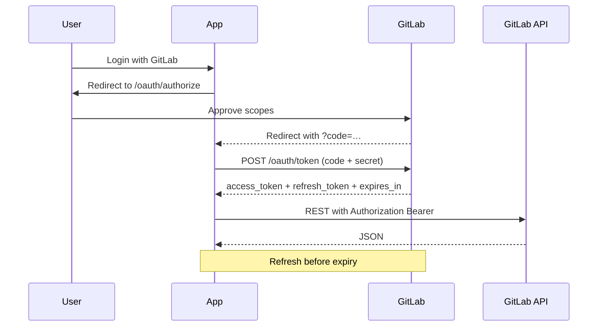

GitLab OAuth
How to create a **GitLab OAuth application**, complete the **authorization code** flow, and call the GitLab API with a Bearer token — on **GitLab.com** or **self-managed**. Use this for “Sign in with GitLab” or to automate against a user’s projects.

Official references: [OAuth 2.0 identity provider API](https://docs.gitlab.com/ee/api/oauth2.html), [REST API](https://docs.gitlab.com/ee/api/rest/), [Scopes](https://docs.gitlab.com/ee/integration/oauth_provider.html#authorized-applications).

Parent: [External APIs overview](i-overview.md). Compare: [GitHub OAuth](iii-github-oauth.md), [Google OAuth & Drive](ii-google-oauth-and-drive.md).

## 1. Pick the right GitLab credential

| Goal | Use |
|------|-----|
| Act as a **user** after browser consent | **OAuth application** (this page) |
| CI / automation as a user or bot | **Personal access token** or **project/group access token** |
| Pipelines | `CI_JOB_TOKEN` (limited) or a stored PAT/OAuth token |
| Instance-wide integrations | Instance OAuth apps (admin) |

Self-managed: replace `gitlab.com` with your instance host everywhere below.

## 2. Create an OAuth application

### User-owned (GitLab.com)

1. Avatar → **Edit profile → Applications** (or **Preferences → Applications**).
2. **Name**, **Redirect URI** (exact match, e.g. `http://localhost:8080/callback`).
3. Select **scopes** (next section).
4. **Save application** → copy **Application ID** (client id) and **Secret**.

### Group / instance

- **Group → Settings → Applications** — apps owned by the group.
- **Admin area → Applications** — instance-wide (self-managed).

Confidential apps get a **secret**. Public/native apps may use PKCE without a secret — follow GitLab’s current guidance for your app type.

**Never commit** the secret or tokens.

## 3. Scopes (minimum)

| Scope | Typical use |
|-------|-------------|
| `read_user` | Read authenticated user profile |
| `openid` / `profile` / `email` | OIDC identity (if enabled) |
| `read_api` | Read API access |
| `read_repository` | Read git repos |
| `write_repository` | Push / write repos |
| `api` | Full API access (broad) |

Prefer `read_api` or narrower scopes over `api` when possible.

## 4. Authorization code flow



### Authorize URL (GitLab.com)

```text
GET https://gitlab.com/oauth/authorize
  ?client_id=APPLICATION_ID
  &redirect_uri=http://localhost:8080/callback
  &response_type=code
  &scope=read_user+read_api
  &state=RANDOM_CSRF_TOKEN
```

Optional: `code_challenge` / `code_challenge_method=S256` for **PKCE**.

### Exchange code

```http
POST https://gitlab.com/oauth/token
Content-Type: application/json

{
  "client_id": "…",
  "client_secret": "…",
  "code": "…",
  "grant_type": "authorization_code",
  "redirect_uri": "http://localhost:8080/callback"
}
```

Response (shape):

```json
{
  "access_token": "…",
  "token_type": "bearer",
  "expires_in": 7200,
  "refresh_token": "…",
  "scope": "read_user read_api",
  "created_at": 0
}
```

Unlike many older GitHub OAuth tokens, GitLab access tokens are typically **short-lived** — plan on **refresh**.

### Refresh

```http
POST https://gitlab.com/oauth/token
Content-Type: application/json

{
  "client_id": "…",
  "client_secret": "…",
  "refresh_token": "…",
  "grant_type": "refresh_token"
}
```

Store the new refresh token if GitLab rotates it.

## 5. Call the API

```http
GET https://gitlab.com/api/v4/user
Authorization: Bearer ACCESS_TOKEN
```

List projects:

```http
GET https://gitlab.com/api/v4/projects?membership=true&per_page=10
Authorization: Bearer ACCESS_TOKEN
```

Self-managed:

```text
https://gitlab.example.com/api/v4/...
https://gitlab.example.com/oauth/authorize
https://gitlab.example.com/oauth/token
```

## 6. Minimal Python sketch (exchange + whoami)

```python
import os
import secrets
import urllib.parse
import urllib.request
import json
from http.server import BaseHTTPRequestHandler, HTTPServer

CLIENT_ID = os.environ["GITLAB_APP_ID"]
CLIENT_SECRET = os.environ["GITLAB_APP_SECRET"]
BASE = os.environ.get("GITLAB_URL", "https://gitlab.com").rstrip("/")
REDIRECT = "http://localhost:8080/callback"
STATE = secrets.token_urlsafe(16)


def exchange(code: str) -> dict:
    body = json.dumps(
        {
            "client_id": CLIENT_ID,
            "client_secret": CLIENT_SECRET,
            "code": code,
            "grant_type": "authorization_code",
            "redirect_uri": REDIRECT,
        }
    ).encode()
    req = urllib.request.Request(
        f"{BASE}/oauth/token",
        data=body,
        headers={"Content-Type": "application/json"},
        method="POST",
    )
    with urllib.request.urlopen(req) as resp:
        return json.load(resp)


def whoami(token: str) -> dict:
    req = urllib.request.Request(
        f"{BASE}/api/v4/user",
        headers={"Authorization": f"Bearer {token}"},
    )
    with urllib.request.urlopen(req) as resp:
        return json.load(resp)


class Handler(BaseHTTPRequestHandler):
    def do_GET(self):
        if self.path.startswith("/login"):
            q = urllib.parse.urlencode(
                {
                    "client_id": CLIENT_ID,
                    "redirect_uri": REDIRECT,
                    "response_type": "code",
                    "scope": "read_user read_api",
                    "state": STATE,
                }
            )
            self.send_response(302)
            self.send_header("Location", f"{BASE}/oauth/authorize?{q}")
            self.end_headers()
            return
        if self.path.startswith("/callback"):
            qs = urllib.parse.parse_qs(urllib.parse.urlparse(self.path).query)
            assert qs.get("state", [None])[0] == STATE
            tokens = exchange(qs["code"][0])
            user = whoami(tokens["access_token"])
            # Persist tokens["refresh_token"] securely in a real app
            body = f"Logged in as {user.get('username')}\n".encode()
            self.send_response(200)
            self.send_header("Content-Type", "text/plain")
            self.end_headers()
            self.wfile.write(body)
            return
        self.send_error(404)


if __name__ == "__main__":
    print("Open http://localhost:8080/login")
    HTTPServer(("127.0.0.1", 8080), Handler).serve_forever()
```

Set `GITLAB_APP_ID`, `GITLAB_APP_SECRET`, and optionally `GITLAB_URL` for self-managed.

## 7. Device / resource-owner notes

- **Resource owner password** grant exists in some configs but is discouraged / often disabled — prefer authorization code + PKCE.
- For CLIs, prefer a **PAT** or a small local redirect (`localhost`) OAuth app rather than embedding passwords.

## 8. Security checklist

| Do | Don’t |
|----|-------|
| Verify `state` (and PKCE verifier) | Trust callback without checks |
| Encrypt refresh tokens at rest | Commit Application Secret |
| Use HTTPS redirect URIs in production | Register wildcard redirects casually |
| Rotate secrets after leak | Share one group token in chat |
| Scope down (`read_api` vs `api`) | Default to full `api` scope |

Revoke: GitLab → **Preferences → Applications → Authorized applications** (user), or delete the app.

## 9. Troubleshooting

| Symptom | Likely cause |
|---------|----------------|
| `The redirect URI included is not valid` | Exact string mismatch (http/https, trailing slash, port) |
| `invalid_grant` | Code expired/reused, or redirect_uri differs between authorize and token |
| 401 on `/api/v4/user` | Wrong host, expired access token, missing refresh |
| 403 | Scope too narrow for the endpoint |
| Self-managed TLS errors | Corporate proxy / custom CA — fix trust store |

## Next

Return to [External APIs overview](i-overview.md). Side-by-side with [GitHub OAuth](iii-github-oauth.md).
