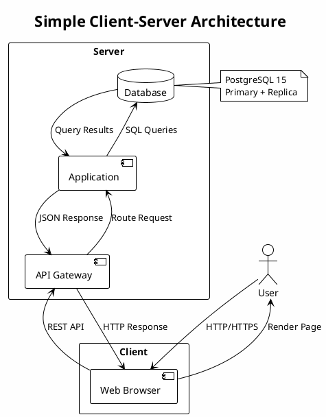

Git — overview
**Git** is a **distributed version control system (DVCS)**. You keep a full copy of project history on your machine; you **commit** snapshots, **branch** for parallel work, and **merge** (or rebase) to integrate changes.

## Map of this track

| Submenu | Focus |
|---------|--------|
| **Essentials** | Install, daily commands, branches, remotes, undo, workflows |

Start: **Essentials** → [Overview](essentials/i-overview.md).

Hosting platforms (**GitHub**, GitLab, Bitbucket) sit on top of Git — see the **GitHub** topic for PRs, Actions, and this site's contribution graph.

## Why Git

| Benefit | Explanation |
|---------|-------------|
| **History** | Every commit is a recoverable snapshot |
| **Branches** | Experiment without breaking `main` |
| **Collaboration** | Push/pull between machines and teammates |
| **Audit** | Who changed what, when, and why (messages) |

## Core objects (mental model)

```text
Working tree  →  staging (index)  →  commit  →  branch pointer
     │                │                │
  edit files      git add         git commit    main, feature/login
```

| Object | Role |
|--------|------|
| **Commit** | Snapshot + parent + author + message |
| **Branch** | Movable pointer to a commit |
| **Tag** | Fixed pointer (often for releases) |
| **Remote** | Named link to another repo (`origin`) |

## Distributed vs centralized

```text
Centralized (SVN):     one server holds history; checkout is a slice

Distributed (Git):   every clone is a full repo
  your laptop ◄────► origin (GitHub)
  teammate    ◄────► origin
```

You can commit offline; sync with **`git push`** / **`git pull`** when connected.

## Git vs GitHub

| | Git | GitHub |
|---|-----|--------|
| What | Tool (CLI) | Hosting + UI + PRs + Actions |
| Runs | Locally | Cloud |
| Required | Yes, for version control | No — alternatives: GitLab, self-host |

## Rehearsal

- What is the difference between **working tree**, **staging**, and **commit**?
- What does a **branch** point to?
- Why is Git **distributed**?


