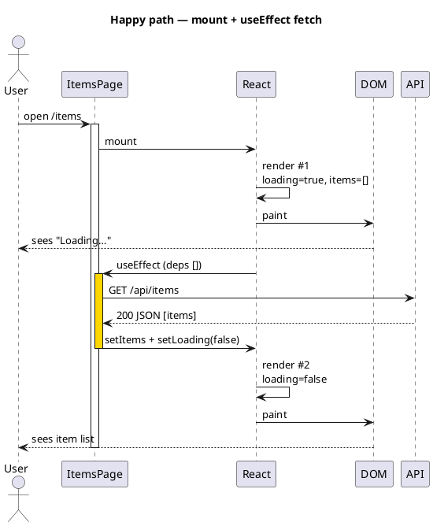
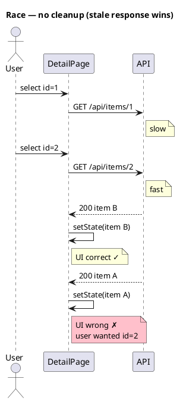
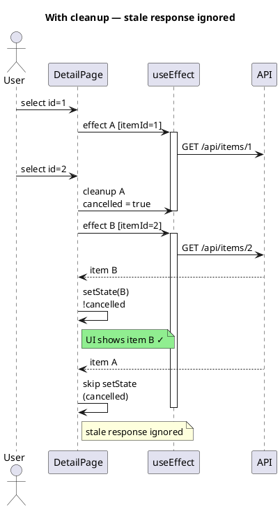
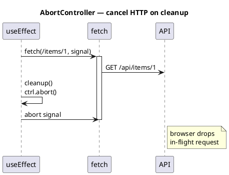
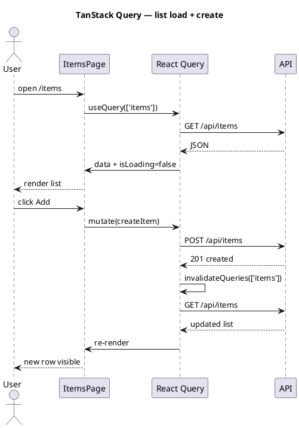

React — rendering & server requests
React turns **component functions** into **DOM nodes**. When **state** or **props** change, affected components **re-render** — then React diffs the virtual tree and updates the browser. Server data enters through **fetch** (or a library), usually in **effects** or **query hooks**.

Previous: [Project setup & structure](ii-project-setup-and-structure.md).

## 1. First paint: mount to DOM

```text
index.html (#root)
  → main.jsx createRoot(...).render(<App />)
  → App returns JSX tree
  → React creates real DOM under #root
```

```jsx
// src/main.jsx
import { createRoot } from 'react-dom/client';
import App from './App.jsx';

createRoot(document.getElementById('root')).render(<App />);
```

```jsx
// src/App.jsx
export default function App() {
  return <h1>Hello</h1>;  // becomes <h1> in the document
}
```

## 2. Re-render cycle

```text
Event (click, fetch done, timer)
  → setState / setQueryData
  → component function runs again
  → React diff vs last virtual tree
  → commit only changed DOM nodes
```

| Trigger | Example |
|---------|---------|
| **Local state** | `setCount(c => c + 1)` |
| **Parent props** | Parent re-render passes new `items` |
| **Context** | `AuthContext` user changes |
| **External store** | TanStack Query cache update |

**Important:** Re-running the component function is normal — keep it **pure** (same props/state → same JSX). Side effects belong in **`useEffect`** or event handlers, not arbitrary code during render.

## 3. Component tree example

```jsx
// pages/ItemsPage.jsx
import { useItems } from '../hooks/useItems';
import { ItemRow } from '../components/ItemRow';

export function ItemsPage() {
  const { items, loading, error } = useItems();

  if (loading) return <p>Loading…</p>;
  if (error) return <p role="alert">Error: {error.message}</p>;

  return (
    <ul>
      {items.map(item => (
        <ItemRow key={item.id} item={item} />
      ))}
    </ul>
  );
}
```

```text
ItemsPage
  ├── loading branch → <p>
  ├── error branch   → <p>
  └── list branch    → <ul>
        └── ItemRow × N
```

Each **`key`** on list items helps React match rows across updates.

## 4. Server requests — API layer

Keep HTTP in **`src/api/`** — components call functions, not raw URLs everywhere.

```javascript
// src/api/client.js
const BASE = import.meta.env.VITE_API_URL ?? 'http://localhost:8080';

export async function api(path, options = {}) {
  const res = await fetch(`${BASE}${path}`, {
    headers: {
      'Content-Type': 'application/json',
      ...options.headers,
    },
    ...options,
  });
  if (!res.ok) {
    const body = await res.json().catch(() => ({}));
    throw new ApiError(res.status, body.message ?? res.statusText);
  }
  return res.status === 204 ? null : res.json();
}

export class ApiError extends Error {
  constructor(status, message) {
    super(message);
    this.status = status;
  }
}
```

```javascript
// src/api/items.js
import { api } from './client';

export function getItems() {
  return api('/api/items');
}

export function createItem(payload) {
  return api('/api/items', { method: 'POST', body: JSON.stringify(payload) });
}
```

**Vite env:** define **`VITE_API_URL`** in **`.env`** — only `VITE_*` vars are exposed to the client.

## 5. Loading data with a custom hook

```jsx
// src/hooks/useItems.js
import { useEffect, useState } from 'react';
import { getItems } from '../api/items';

export function useItems() {
  const [items, setItems] = useState([]);
  const [loading, setLoading] = useState(true);
  const [error, setError] = useState(null);

  useEffect(() => {
    let cancelled = false;
    setLoading(true);
    getItems()
      .then(data => { if (!cancelled) setItems(data); })
      .catch(err => { if (!cancelled) setError(err); })
      .finally(() => { if (!cancelled) setLoading(false); });
    return () => { cancelled = true; };  // ignore stale response on unmount
  }, []);

  return { items, loading, error };
}
```

## 6. `useEffect` + fetch — timeline (why data stays correct)

**Render** draws UI from state **now**. **`useEffect`** runs **after** that paint — it is where async fetch belongs. Understanding the order explains bugs like “wrong user’s data flashed on screen.”

### 6.1 Happy path (single mount)

```text
Time ───────────────────────────────────────────────────────────────►

1. Mount ItemsPage
2. Render #1     loading=true  →  DOM shows "Loading…"
3. Paint         user sees spinner
4. useEffect     runs once (deps [])
5. fetch start   GET /api/items
6. Response OK   setItems(data), setLoading(false)
7. Render #2     loading=false →  DOM shows list
8. Paint         user sees items
```



**Takeaway:** First paint uses **initial state** (`loading: true`, `items: []`). Data appears only after **async** work completes and triggers a **second render**.

See [PlantUML sequence diagrams](../../plantuml/iii-sequence-diagrams.md) for syntax and rendering tools.

### 6.2 Race condition — improper data without cleanup

User opens **Item detail id=1**, then quickly switches to **id=2**. Two fetches run; if **response #1 arrives last**, naive code shows **wrong item**.

```text
User selects id=1     →  fetch /api/items/1  (slow)
User selects id=2     →  fetch /api/items/2  (fast)
Response #2 arrives   →  setState(item B)     ✓ correct
Response #1 arrives   →  setState(item A)     ✗ WRONG — stale
```



### 6.3 Correct pattern — effect cleanup + dependency

Re-run effect when **`itemId`** changes; **cancel** or **ignore** the previous request.

```jsx
// hooks/useItem.js
import { useEffect, useState } from 'react';
import { getItem } from '../api/items';

export function useItem(itemId) {
  const [item, setItem] = useState(null);
  const [loading, setLoading] = useState(true);
  const [error, setError] = useState(null);

  useEffect(() => {
    let cancelled = false;
    setLoading(true);
    setError(null);

    getItem(itemId)
      .then(data => {
        if (!cancelled) setItem(data);  // only if this effect is still current
      })
      .catch(err => {
        if (!cancelled) setError(err);
      })
      .finally(() => {
        if (!cancelled) setLoading(false);
      });

    return () => { cancelled = true; };  // runs before next effect when itemId changes
  }, [itemId]);  // re-fetch when user picks a different id

  return { item, loading, error };
}
```

```text
User id=1 → effect A starts fetch 1
User id=2 → cleanup A (cancelled=true) → effect B starts fetch 2
Response 1 → cancelled → ignore
Response 2 → setState(item B) → user sees correct data
```



### 6.4 AbortController (alternative)

Same idea — **abort** the HTTP request on cleanup so the browser drops the in-flight call:

```jsx
useEffect(() => {
  const ctrl = new AbortController();
  setLoading(true);

  fetch(`/api/items/${itemId}`, { signal: ctrl.signal })
    .then(r => r.json())
    .then(setItem)
    .catch(err => {
      if (err.name !== 'AbortError') setError(err);
    })
    .finally(() => setLoading(false));

  return () => ctrl.abort();
}, [itemId]);
```



### 6.5 Rules so users never see improper data

| Rule | Why |
|------|-----|
| **No fetch in render body** | Runs every render → duplicate requests, loops |
| **`useEffect` for load-on-mount / id change** | Runs after paint, controlled by dependency array |
| **`[itemId]` deps** | New id → cleanup old effect → new fetch |
| **`cancelled` or `abort()` in cleanup** | Late responses do not call `setState` |
| **Match UI to request** | Optional: store `requestId` and ignore if `requestId !== latest` |
| **Loading state per navigation** | `setLoading(true)` when id changes so old list does not flash |
| **TanStack Query** | Library handles staleness, keys, and cancellation for you |

**Strict Mode (dev):** React 18 may **mount → unmount → remount** in development to expose missing cleanup. Your cleanup must prevent double-fetch side effects from corrupting state.

## 7. TanStack Query (recommended at scale)

**[TanStack Query](https://tanstack.com/query)** (`@tanstack/react-query`) is a library for **server state** in React — data that lives on your API, not in the UI. It was formerly called **React Query**; TanStack is the umbrella project (same org as TanStack Table, Router, etc.).

Official docs: [tanstack.com/query](https://tanstack.com/query)

### What it solves

Manual **`useEffect` + `fetch`** forces you to write loading/error state, cleanup, refetch-after-mutation, deduping, and cache-by-key yourself. TanStack Query provides a **client-side cache** keyed by **`queryKey`** so components declare *what* data they need and the library handles *how* to fetch and keep it fresh.

| Piece | Role |
|-------|------|
| **`useQuery`** | Read server data — fetch, cache, expose `data`, `isLoading`, `error` |
| **`useMutation`** | Writes (POST/PUT/DELETE), then refresh related queries |
| **`queryKey`** | Cache identity — e.g. `['items']`, `['item', id]` |
| **`queryFn`** | Your API function (`getItems`, `getItem(id)`) |
| **`invalidateQueries`** | Mark cache stale and refetch after a mutation |

Use it for **remote data** (lists, profiles, settings). Keep **`useState`** for UI-only state (modal open, form typing).

### vs manual `useEffect`

| Manual `useEffect` | TanStack Query |
|--------------------|----------------|
| You own cleanup, deps, loading flags | Staleness, deduping, refetch built in |
| Good for one simple load | Better when many screens share the same API data |
| Full control, more boilerplate | Convention + cache layer |

### Setup (once per app)

```text
npm install @tanstack/react-query
```

Wrap the app in **`QueryClientProvider`** (in `main.jsx` next to your router/auth providers). See the [Quick Start](https://tanstack.com/query/latest/docs/framework/react/quick-start) guide on the site.

### Example

```jsx
import { useQuery, useMutation, useQueryClient } from '@tanstack/react-query';
import { getItems, createItem } from '../api/items';

export function ItemsPage() {
  const qc = useQueryClient();
  const { data: items = [], isLoading, error } = useQuery({
    queryKey: ['items'],
    queryFn: getItems,
  });

  const create = useMutation({
    mutationFn: createItem,
    onSuccess: () => qc.invalidateQueries({ queryKey: ['items'] }),
  });

  if (isLoading) return <p>Loading…</p>;
  if (error) return <p role="alert">{error.message}</p>;

  return (
    <>
      <ul>{items.map(i => <li key={i.id}>{i.name}</li>)}</ul>
      <button onClick={() => create.mutate({ name: 'New' })}>Add</button>
    </>
  );
}
```

Query handles **cache**, **refetch**, and **deduping** — less boilerplate than §5–§6. It also reduces stale-response bugs: queries are tied to **keys**, and in-flight requests for obsolete keys are abandoned or ignored.

**When to adopt:** multiple components need the same API data, you want background refetch (“stale-while-revalidate”), or manual `useEffect` fetch logic is spreading across the codebase. For a one-screen prototype, `useEffect` is still fine.

## 8. Request flow (end to end)

```text
User opens /items
  → ItemsPage mounts
  → useQuery calls getItems()
  → fetch GET /api/items (+ auth header if configured)
  → JSON → cache → re-render with data
User clicks Add
  → mutation POST /api/items
  → onSuccess → invalidate → refetch list → UI updates
```



Backend is often [Spring Boot REST](../../java/springboot/iv-rest-controllers.md), FastAPI, or Node — React only sees HTTP + JSON.

## 9. Mutations and optimistic UI (preview)

```jsx
create.mutate(
  { name: 'Draft' },
  {
    onMutate: async () => {
      await qc.cancelQueries({ queryKey: ['items'] });
      // optionally patch cache before server responds
    },
  }
);
```

Use when the UI should feel instant; roll back on error.

## Next

Continue with [Authentication](iv-authentication.md) for tokens, cookies, and protected routes.
