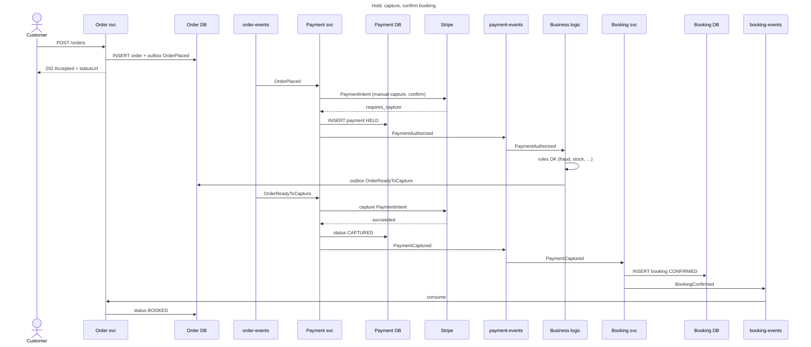
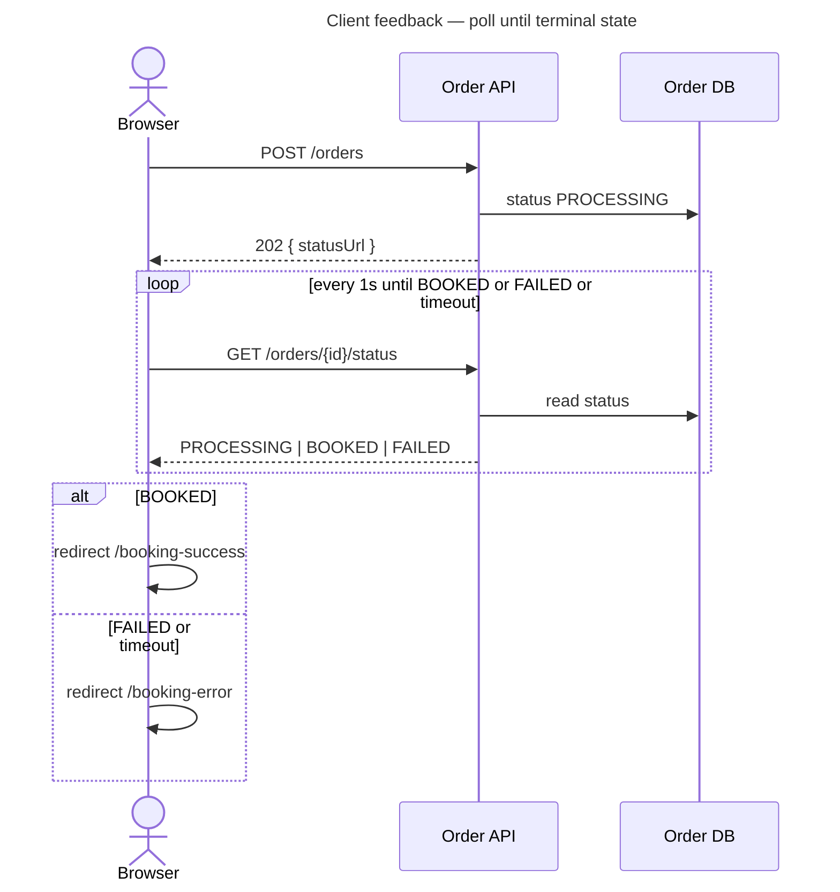

Kafka example — Spring Boot + Stripe hold & capture
End-to-end **event-driven checkout**: the **Order service** writes Postgres + an **outbox** row; Kafka drives the **Payment service**, which **holds** funds on a card with Stripe (`capture_method: manual`). **Business logic** in the Order service reads `PaymentAuthorized` from `payment-events` and, when rules pass, triggers **capture**. The **Booking service** consumes `PaymentCaptured` and inserts a confirmed row into **`bookings`**.

This example ties together [Transactional outbox](vi-patterns-and-integration.md#2-transactional-outbox), [Sequential pipelines](viii-sequential-pipelines-and-sagas.md), and [Checkout idempotency](../sysdesign/examples/vi-ecommerce-checkout-idempotency.md).

**Prerequisites:** [Install & local dev](ii-install-and-local-dev.md) (Kafka on `localhost:9092`), a [Stripe test account](https://dashboard.stripe.com/test/apikeys) (`sk_test_…`).

## 1. Scenario

| Step | Who | Action |
|------|-----|--------|
| 1 | Customer | `POST /orders` with card `paymentMethodId` |
| 2 | Order service | Save order `PENDING`; outbox `OrderPlaced` |
| 3 | Outbox relay | Publish to `order-events` |
| 4 | Payment service | Stripe **authorize / hold** (manual capture) |
| 5 | Payment service | Publish `PaymentAuthorized` to `payment-events` |
| 6 | Business logic (Order svc) | Consume `PaymentAuthorized`; apply rules (fraud, inventory, etc.) |
| 7 | Business logic (Order svc) | Outbox `OrderReadyToCapture` |
| 8 | Payment service | Stripe **capture** held funds |
| 9 | Payment service | Publish `PaymentCaptured` |
| 10 | Booking service | Consume `PaymentCaptured`; `INSERT` into `bookings` |
| 11 | Booking service | Publish `BookingConfirmed` to `booking-events` |
| 12 | Order service | Update order status → `BOOKED` (client poll sees terminal state) |



**Why hold first?** You verify stock and pick the order before taking money. If the order is cancelled, **release** the hold (`PaymentIntent.cancel()`) instead of refunding a capture.

**Why not wait in `POST /orders`?** Payment and booking run over Kafka — often **seconds** later. Holding the HTTP connection open is fragile (timeouts, mobile retries). Return **`202 Accepted`** immediately, then let the **browser poll** a status URL until `BOOKED` or `FAILED`.

## 2. Project layout

Three Spring Boot apps — same repo, separate deployables:

```text
checkout-kafka-stripe/
  docker-compose.yml          # Kafka + Postgres (order, payment, booking DBs)
  order-service/
    pom.xml
    src/main/java/com/example/order/
      OrderApplication.java
      web/OrderController.java
      app/OrderService.java
      kafka/PaymentEventListener.java
      outbox/OutboxRelay.java
      events/OrderPlaced.java
    src/main/resources/application.yml
  booking-service/
    pom.xml
    src/main/java/com/example/booking/
      BookingApplication.java
      kafka/PaymentEventListener.java
      app/BookingService.java
      app/BookingRepository.java
    src/main/resources/application.yml
  payment-service/
    pom.xml
    src/main/java/com/example/payment/
      PaymentApplication.java
      stripe/StripePaymentGateway.java
      kafka/PaymentEventListeners.java
      app/PaymentService.java
      events/OrderPlaced.java
    src/main/resources/application.yml
```

Create topics (dev):

```text
docker exec -it <kafka-container> /opt/kafka/bin/kafka-topics.sh \
  --bootstrap-server localhost:9092 \
  --create --topic order-events --partitions 3 --replication-factor 1

docker exec -it <kafka-container> /opt/kafka/bin/kafka-topics.sh \
  --bootstrap-server localhost:9092 \
  --create --topic booking-events --partitions 3 --replication-factor 1
```

Use **`orderId`** as the Kafka **record key** on every message so all events for one order stay on one partition.



## 3. Dependencies

**Both services** — core stack:

```xml
<dependencies>
  <dependency>
    <groupId>org.springframework.boot</groupId>
    <artifactId>spring-boot-starter-web</artifactId>
  </dependency>
  <dependency>
    <groupId>org.springframework.boot</groupId>
    <artifactId>spring-boot-starter-data-jpa</artifactId>
  </dependency>
  <dependency>
    <groupId>org.springframework.kafka</groupId>
    <artifactId>spring-kafka</artifactId>
  </dependency>
  <dependency>
    <groupId>org.postgresql</groupId>
    <artifactId>postgresql</artifactId>
  </dependency>
</dependencies>
```

**Payment service only** — Stripe Java SDK:

```xml
<dependency>
  <groupId>com.stripe</groupId>
  <artifactId>stripe-java</artifactId>
  <version>28.2.0</version>
</dependency>
```

## 4. Event contracts

```json
{
  "eventId": "evt_01HXYZ",
  "type": "OrderPlaced",
  "orderId": "ord_42",
  "customerId": "cus_9",
  "totalCents": 4999,
  "currency": "usd",
  "paymentMethodId": "pm_card_visa",
  "idempotencyKey": "550e8400-e29b-41d4-a716-446655440000"
}
```

```json
{
  "eventId": "evt_01HABC",
  "type": "OrderReadyToCapture",
  "orderId": "ord_42"
}
```

```json
{
  "eventId": "evt_01HDEF",
  "type": "PaymentAuthorized",
  "orderId": "ord_42",
  "customerId": "cus_9",
  "stripePaymentIntentId": "pi_3P…",
  "amountCents": 4999
}
```

```json
{
  "eventId": "evt_01HGHI",
  "type": "PaymentCaptured",
  "orderId": "ord_42",
  "customerId": "cus_9",
  "stripePaymentIntentId": "pi_3P…"
}
```

```json
{
  "eventId": "evt_01HJKL",
  "type": "BookingConfirmed",
  "orderId": "ord_42",
  "bookingId": "bkg_7"
}
```

```json
{
  "eventId": "evt_01HMNO",
  "type": "PaymentFailed",
  "orderId": "ord_42",
  "reason": "card_declined"
}
```

```sql
CREATE TABLE bookings (
  id          UUID PRIMARY KEY DEFAULT gen_random_uuid(),
  order_id    VARCHAR UNIQUE NOT NULL,
  customer_id VARCHAR NOT NULL,
  status      VARCHAR NOT NULL,  -- CONFIRMED
  created_at  TIMESTAMPTZ NOT NULL DEFAULT now()
);
```

## 5. Order service

### `application.yml`

```yaml
spring:
  datasource:
    url: jdbc:postgresql://localhost:5432/orderdb
    username: order
    password: order
  kafka:
    bootstrap-servers: localhost:9092
    consumer:
      group-id: order-service
      key-deserializer: org.apache.kafka.common.serialization.StringDeserializer
      value-deserializer: org.apache.kafka.common.serialization.StringDeserializer
    producer:
      key-serializer: org.apache.kafka.common.serialization.StringSerializer
      value-serializer: org.apache.kafka.common.serialization.StringSerializer

outbox:
  topic: order-events
  poll-interval-ms: 500

payment-events:
  topic: payment-events

booking-events:
  topic: booking-events
```

Orders table includes a **`status`** column the client polls: `PROCESSING` → `BOOKED` | `FAILED`.

```java
// Compile: javac --release 22 …
package com.example.order.app;

import com.example.order.outbox.OutboxRepository;
import com.fasterxml.jackson.databind.ObjectMapper;
import org.springframework.stereotype.Service;
import org.springframework.transaction.annotation.Transactional;

@Service
public class OrderService {

  private final OrderRepository orderRepo;
  private final OutboxRepository outboxRepo;
  private final ObjectMapper json;

  public OrderService(OrderRepository orderRepo, OutboxRepository outboxRepo, ObjectMapper json) {
    this.orderRepo = orderRepo;
    this.outboxRepo = outboxRepo;
    this.json = json;
  }

  @Transactional
  public Order create(CreateOrderRequest req) {
    Order order = orderRepo.save(Order.pending(req));
    outboxRepo.save(OutboxEvent.orderPlaced(json, order, req));
    return order;
  }

  @Transactional
  public void markReadyToCapture(String orderId) {
    Order order = orderRepo.findById(orderId).orElseThrow();
    order.markReadyToShip();
    outboxRepo.save(OutboxEvent.orderReadyToCapture(json, order));
  }
}
```

```java
package com.example.order.kafka;

import com.example.order.app.OrderService;
import com.fasterxml.jackson.databind.JsonNode;
import com.fasterxml.jackson.databind.ObjectMapper;
import org.apache.kafka.clients.consumer.ConsumerRecord;
import org.springframework.kafka.annotation.KafkaListener;
import org.springframework.stereotype.Component;

@Component
public class PaymentEventListener {

  private final OrderService orders;
  private final ObjectMapper json;

  public PaymentEventListener(OrderService orders, ObjectMapper json) {
    this.orders = orders;
    this.json = json;
  }

  @KafkaListener(topics = "${payment-events.topic}", groupId = "order-service")
  public void onPaymentEvent(ConsumerRecord<String, String> record) throws Exception {
    JsonNode root = json.readTree(record.value());
    String type = root.get("type").asText();
    String orderId = root.get("orderId").asText();

    switch (type) {
      case "PaymentAuthorized" -> {
        if (rulesAllowCapture(orderId)) orders.markReadyToCapture(orderId);
      }
      case "PaymentFailed" -> orders.markFailed(orderId, root.get("reason").asText());
      default -> { /* PaymentCaptured — booking service handles next step */ }
    }
  }

  @KafkaListener(topics = "${booking-events.topic}", groupId = "order-service")
  public void onBookingEvent(ConsumerRecord<String, String> record) throws Exception {
    JsonNode root = json.readTree(record.value());
    String type = root.get("type").asText();
    String orderId = root.get("orderId").asText();

    if ("BookingConfirmed".equals(type)) {
      orders.markBooked(orderId, root.get("bookingId").asText());
    } else if ("BookingFailed".equals(type)) {
      orders.markFailed(orderId, root.get("reason").asText());
    }
  }

  private boolean rulesAllowCapture(String orderId) {
    return true;  // replace with real checks
  }
}
```

```java
package com.example.order.web;

import com.example.order.app.CreateOrderRequest;
import com.example.order.app.Order;
import com.example.order.app.OrderService;
import org.springframework.http.HttpStatus;
import org.springframework.web.bind.annotation.*;

@RestController
@RequestMapping("/orders")
public class OrderController {

  private final OrderService orders;

  public OrderController(OrderService orders) {
    this.orders = orders;
  }

  @PostMapping
  @ResponseStatus(HttpStatus.ACCEPTED)
  public OrderAcceptedResponse create(@RequestBody CreateOrderRequest req) {
    Order order = orders.create(req);
    return OrderAcceptedResponse.processing(order.getId());
  }

  @GetMapping("/{orderId}/status")
  public OrderStatusResponse status(@PathVariable String orderId) {
    return orders.getStatus(orderId);
  }
}
```

`POST /orders` returns **`202 Accepted`** — not `201` — because booking is **not** done yet:

```json
{
  "orderId": "ord_42",
  "status": "PROCESSING",
  "statusUrl": "/orders/ord_42/status"
}
```

Poll `GET /orders/{orderId}/status` until a **terminal** state:

```json
{ "orderId": "ord_42", "status": "BOOKED", "bookingId": "bkg_7" }
```

```json
{ "orderId": "ord_42", "status": "FAILED", "reason": "card_declined" }
```

| `status` | Meaning | Client action |
|----------|---------|---------------|
| `PROCESSING` | Pipeline still running | Keep polling |
| `BOOKED` | Row in `bookings`; payment captured | Redirect to **success** page |
| `FAILED` | Hold/capture/booking failed | Redirect to **error** page with `reason` |

### Browser — poll, then redirect

After `POST /orders`, the **frontend** polls `statusUrl` every 1–2 s (cap total wait ~30 s):

```javascript
async function checkout(formData) {
  const create = await fetch("/orders", {
    method: "POST",
    headers: { "Content-Type": "application/json" },
    body: JSON.stringify(formData),
  });
  if (create.status !== 202) {
    window.location.href = "/booking-error?reason=invalid_request";
    return;
  }
  const { orderId, statusUrl } = await create.json();
  const deadline = Date.now() + 30_000;

  while (Date.now() < deadline) {
    const res = await fetch(statusUrl);
    const body = await res.json();
    if (body.status === "BOOKED") {
      window.location.href = `/booking-success?orderId=${orderId}`;
      return;
    }
    if (body.status === "FAILED") {
      window.location.href = `/booking-error?reason=${encodeURIComponent(body.reason)}`;
      return;
    }
    await new Promise((r) => setTimeout(r, 1000));
  }
  window.location.href = "/booking-error?reason=timeout";
}
```

Same pattern with **HTMX** (`hx-trigger="every 2s"`) or **SSE** if you prefer push over poll — see [Checkout idempotency §6](../sysdesign/examples/vi-ecommerce-checkout-idempotency.md) for `202` semantics.

### Outbox relay

```java
package com.example.order.outbox;

import org.springframework.beans.factory.annotation.Value;
import org.springframework.kafka.core.KafkaTemplate;
import org.springframework.scheduling.annotation.Scheduled;
import org.springframework.stereotype.Component;
import org.springframework.transaction.annotation.Transactional;

@Component
public class OutboxRelay {

  private final OutboxRepository outboxRepo;
  private final KafkaTemplate<String, String> kafka;
  private final String topic;

  public OutboxRelay(
      OutboxRepository outboxRepo,
      KafkaTemplate<String, String> kafka,
      @Value("${outbox.topic}") String topic) {
    this.outboxRepo = outboxRepo;
    this.kafka = kafka;
    this.topic = topic;
  }

  @Scheduled(fixedDelayString = "${outbox.poll-interval-ms}")
  @Transactional
  public void publishPending() {
    for (OutboxEvent row : outboxRepo.findUnpublished(50)) {
      kafka.send(topic, row.aggregateId(), row.payload());
      row.markPublished();
    }
  }
}
```

The HTTP handler **never** calls `kafka.send()` inside the same `@Transactional` as the order insert — only the relay does.

## 6. Payment service — Stripe hold

### `application.yml`

```yaml
spring:
  datasource:
    url: jdbc:postgresql://localhost:5432/paymentdb
    username: payment
    password: payment
  kafka:
    bootstrap-servers: localhost:9092
    consumer:
      group-id: payment-service
      key-deserializer: org.apache.kafka.common.serialization.StringDeserializer
      value-deserializer: org.apache.kafka.common.serialization.StringDeserializer
      enable-auto-commit: false
    producer:
      key-serializer: org.apache.kafka.common.serialization.StringSerializer
      value-serializer: org.apache.kafka.common.serialization.StringSerializer

stripe:
  secret-key: ${STRIPE_SECRET_KEY:sk_test_…}
```

### Stripe gateway — authorize (hold) and capture

```java
package com.example.payment.stripe;

import com.stripe.Stripe;
import com.stripe.model.PaymentIntent;
import com.stripe.param.PaymentIntentCaptureParams;
import com.stripe.param.PaymentIntentCreateParams;
import org.springframework.beans.factory.annotation.Value;
import org.springframework.stereotype.Component;

@Component
public class StripePaymentGateway {

  public StripePaymentGateway(@Value("${stripe.secret-key}") String secretKey) {
    Stripe.apiKey = secretKey;
  }

  /** Hold funds on the card — does not settle until capture(). */
  public PaymentIntent authorizeHold(
      long amountCents,
      String currency,
      String paymentMethodId,
      String idempotencyKey) throws Exception {

    PaymentIntentCreateParams params = PaymentIntentCreateParams.builder()
        .setAmount(amountCents)
        .setCurrency(currency)
        .setPaymentMethod(paymentMethodId)
        .setConfirm(true)
        .setCaptureMethod(PaymentIntentCreateParams.CaptureMethod.MANUAL)
        .build();

    return PaymentIntent.create(params, requestOptions(idempotencyKey));
  }

  /** Capture a previously authorized PaymentIntent. */
  public PaymentIntent capture(String paymentIntentId, String idempotencyKey) throws Exception {
    PaymentIntent intent = PaymentIntent.retrieve(paymentIntentId);
    return intent.capture(PaymentIntentCaptureParams.builder().build(), requestOptions(idempotencyKey));
  }

  /** Release hold if order cancelled before capture. */
  public PaymentIntent cancelHold(String paymentIntentId) throws Exception {
    PaymentIntent intent = PaymentIntent.retrieve(paymentIntentId);
    return intent.cancel();
  }

  private static com.stripe.net.RequestOptions requestOptions(String idempotencyKey) {
    return com.stripe.net.RequestOptions.builder()
        .setIdempotencyKey(idempotencyKey)
        .build();
  }
}
```

| Stripe call | `PaymentIntent` status after success | Money movement |
|-------------|--------------------------------------|----------------|
| `authorizeHold()` with `MANUAL` | `requires_capture` | Funds **held** on card |
| `capture()` | `succeeded` | Funds **captured** (settled) |
| `cancel()` | `canceled` | Hold **released** |

Use Stripe [test cards](https://docs.stripe.com/testing#cards) (`4242…`) and test `paymentMethodId` values from the Stripe Dashboard or Elements.

### Kafka listeners

```java
package com.example.payment.kafka;

import com.example.payment.app.PaymentService;
import com.example.payment.events.OrderPlaced;
import com.example.payment.events.OrderReadyToCapture;
import com.fasterxml.jackson.databind.ObjectMapper;
import org.apache.kafka.clients.consumer.ConsumerRecord;
import org.springframework.kafka.annotation.KafkaListener;
import org.springframework.kafka.support.Acknowledgment;
import org.springframework.stereotype.Component;

@Component
public class PaymentEventListeners {

  private final PaymentService payments;
  private final ObjectMapper json;

  public PaymentEventListeners(PaymentService payments, ObjectMapper json) {
    this.payments = payments;
    this.json = json;
  }

  @KafkaListener(topics = "order-events", groupId = "payment-service")
  public void onOrderEvent(ConsumerRecord<String, String> record, Acknowledgment ack) throws Exception {
    var root = json.readTree(record.value());
    String type = root.get("type").asText();
    switch (type) {
      case "OrderPlaced" -> payments.onOrderPlaced(json.treeToValue(root, OrderPlaced.class));
      case "OrderReadyToCapture" ->
          payments.onOrderReadyToCapture(json.treeToValue(root, OrderReadyToCapture.class));
      default -> { /* ignore unknown types */ }
    }
    ack.acknowledge();
  }
}
```

Enable manual ack in config (see [Acks & how they work](ix-acks-and-how-they-work.md)):

```java
@Configuration
public class KafkaConsumerConfig {

  @Bean
  KafkaListenerContainerFactory<ConcurrentMessageListenerContainer<String, String>>
      kafkaListenerContainerFactory(
          ConsumerFactory<String, String> consumerFactory,
          DefaultErrorHandler errorHandler) {
    var factory = new ConcurrentKafkaListenerContainerFactory<String, String>();
    factory.setConsumerFactory(consumerFactory);
    factory.getContainerProperties().setAckMode(ContainerProperties.AckMode.MANUAL);
    factory.setCommonErrorHandler(errorHandler);
    return factory;
  }

  @Bean
  DefaultErrorHandler defaultErrorHandler(KafkaTemplate<String, String> template) {
    var recoverer = new DeadLetterPublishingRecoverer(template,
        (record, ex) -> new TopicPartition(record.topic() + ".DLT", record.partition()));
    return new DefaultErrorHandler(recoverer, new FixedBackOff(1000L, 3L));
  }
}
```

### Payment domain logic (idempotent)

```java
package com.example.payment.app;

import com.example.payment.events.*;
import com.example.payment.stripe.StripePaymentGateway;
import com.fasterxml.jackson.databind.ObjectMapper;
import com.stripe.model.PaymentIntent;
import org.springframework.kafka.core.KafkaTemplate;
import org.springframework.stereotype.Service;
import org.springframework.transaction.annotation.Transactional;

@Service
public class PaymentService {

  private final PaymentRepository paymentRepo;
  private final ProcessedEventRepository processedEvents;
  private final StripePaymentGateway stripe;
  private final KafkaTemplate<String, String> kafka;
  private final ObjectMapper json;

  public PaymentService(
      PaymentRepository paymentRepo,
      ProcessedEventRepository processedEvents,
      StripePaymentGateway stripe,
      KafkaTemplate<String, String> kafka,
      ObjectMapper json) {
    this.paymentRepo = paymentRepo;
    this.processedEvents = processedEvents;
    this.stripe = stripe;
    this.kafka = kafka;
    this.json = json;
  }

  @Transactional
  public void onOrderPlaced(OrderPlaced event) throws Exception {
    if (processedEvents.exists(event.eventId())) return;

    if (paymentRepo.findByOrderId(event.orderId()).isPresent()) {
      processedEvents.save(event.eventId());
      return;
    }

    PaymentIntent intent = stripe.authorizeHold(
        event.totalCents(),
        event.currency(),
        event.paymentMethodId(),
        event.idempotencyKey());

    paymentRepo.save(Payment.held(event.orderId(), event.customerId(), intent.getId(), event.totalCents()));
    publish(new PaymentAuthorized(
        event.eventId() + ":auth",
        event.orderId(),
        event.customerId(),
        intent.getId(),
        event.totalCents()));
    processedEvents.save(event.eventId());
  }

  @Transactional
  public void onOrderReadyToCapture(OrderReadyToCapture event) throws Exception {
    if (processedEvents.exists(event.eventId())) return;

    Payment payment = paymentRepo.findByOrderId(event.orderId()).orElseThrow();
    if (payment.status() == PaymentStatus.CAPTURED) {
      processedEvents.save(event.eventId());
      return;
    }

    stripe.capture(payment.stripePaymentIntentId(), "capture:" + event.orderId());
    payment.markCaptured();
    publish(new PaymentCaptured(
        event.eventId() + ":cap",
        event.orderId(),
        payment.customerId(),
        payment.stripePaymentIntentId()));
    processedEvents.save(event.eventId());
  }

  private void publish(Object event) throws Exception {
    String payload = json.writeValueAsString(event);
    String orderId = json.readTree(payload).get("orderId").asText();
    kafka.send("payment-events", orderId, payload);
  }
}
```

Idempotency layers match [Checkout idempotency](../sysdesign/examples/vi-ecommerce-checkout-idempotency.md):

| Layer | Key |
|-------|-----|
| Kafka consumer | `eventId` in `processed_events` |
| Payment row | `orderId` unique |
| Booking row | `order_id` unique |
| Stripe | `Idempotency-Key` header on create/capture |

## 7. Booking service — after `PaymentCaptured`

Only run booking creation **after** money is captured — same sequential rule as [Sequential pipelines](viii-sequential-pipelines-and-sagas.md): do not insert a `CONFIRMED` booking on `PaymentAuthorized` (hold only).

### `application.yml`

```yaml
spring:
  datasource:
    url: jdbc:postgresql://localhost:5432/bookingdb
    username: booking
    password: booking
  kafka:
    bootstrap-servers: localhost:9092
    consumer:
      group-id: booking-service
      key-deserializer: org.apache.kafka.common.serialization.StringDeserializer
      value-deserializer: org.apache.kafka.common.serialization.StringDeserializer
    producer:
      key-serializer: org.apache.kafka.common.serialization.StringSerializer
      value-serializer: org.apache.kafka.common.serialization.StringSerializer

payment-events:
  topic: payment-events

booking-events:
  topic: booking-events
```

### Kafka listener + domain logic

```java
package com.example.booking.kafka;

import com.example.booking.app.BookingService;
import com.example.booking.events.PaymentCaptured;
import com.fasterxml.jackson.databind.JsonNode;
import com.fasterxml.jackson.databind.ObjectMapper;
import org.apache.kafka.clients.consumer.ConsumerRecord;
import org.springframework.kafka.annotation.KafkaListener;
import org.springframework.stereotype.Component;

@Component
public class PaymentEventListener {

  private final BookingService bookings;
  private final ObjectMapper json;

  public PaymentEventListener(BookingService bookings, ObjectMapper json) {
    this.bookings = bookings;
    this.json = json;
  }

  @KafkaListener(topics = "${payment-events.topic}", groupId = "booking-service")
  public void onPaymentEvent(ConsumerRecord<String, String> record) throws Exception {
    JsonNode root = json.readTree(record.value());
    if (!"PaymentCaptured".equals(root.get("type").asText())) return;

    bookings.confirmBooking(json.treeToValue(root, PaymentCaptured.class));
  }
}
```

```java
package com.example.booking.app;

import com.example.booking.events.PaymentCaptured;
import org.springframework.stereotype.Service;
import org.springframework.transaction.annotation.Transactional;

@Service
public class BookingService {

  private final BookingRepository bookingRepo;
  private final ProcessedEventRepository processedEvents;
  private final KafkaTemplate<String, String> kafka;
  private final ObjectMapper json;

  public BookingService(
      BookingRepository bookingRepo,
      ProcessedEventRepository processedEvents,
      KafkaTemplate<String, String> kafka,
      ObjectMapper json) {
    this.bookingRepo = bookingRepo;
    this.processedEvents = processedEvents;
    this.kafka = kafka;
    this.json = json;
  }

  @Transactional
  public void confirmBooking(PaymentCaptured event) throws Exception {
    if (processedEvents.exists(event.eventId())) return;

    if (bookingRepo.findByOrderId(event.orderId()).isPresent()) {
      processedEvents.save(event.eventId());
      return;
    }

    Booking booking = bookingRepo.save(Booking.confirmed(event.orderId(), event.customerId()));
    publish(new BookingConfirmed(event.eventId() + ":bkg", event.orderId(), booking.getId()));
    processedEvents.save(event.eventId());
  }

  private void publish(BookingConfirmed event) throws Exception {
    kafka.send("booking-events", event.orderId(), json.writeValueAsString(event));
  }
}
```

On Stripe decline, Payment service publishes **`PaymentFailed`** (instead of only retrying to DLT) so the Order read model can reach `FAILED`:

```java
catch (StripeException ex) {
  publish(new PaymentFailed(event.eventId() + ":fail", event.orderId(), ex.getCode()));
  processedEvents.save(event.eventId());
}
```

| Event on `payment-events` | Booking service action |
|---------------------------|------------------------|
| `PaymentAuthorized` | **Ignore** — funds held, not settled |
| `PaymentCaptured` | `INSERT INTO bookings … status = CONFIRMED` |

Order service and Booking service use **different consumer groups** on the same topic — each filters the event types it cares about.

## 8. Run locally

```text
# 1. Infrastructure
docker compose up -d          # Kafka + Postgres
export STRIPE_SECRET_KEY=sk_test_…

# 2. Order service (port 8080)
cd order-service && ./mvnw spring-boot:run

# 3. Payment service (port 8081)
cd payment-service && ./mvnw spring-boot:run -Dspring-boot.run.arguments=--server.port=8081

# 4. Booking service (port 8082)
cd booking-service && ./mvnw spring-boot:run -Dspring-boot.run.arguments=--server.port=8082
```

**Happy path:**

```http
POST http://localhost:8080/orders
Content-Type: application/json

{
  "customerId": "cus_9",
  "totalCents": 4999,
  "currency": "usd",
  "paymentMethodId": "pm_card_visa",
  "idempotencyKey": "550e8400-e29b-41d4-a716-446655440000"
}
```

Watch `order-events` — relay publishes `OrderPlaced`. Payment service holds funds and emits `PaymentAuthorized` on `payment-events`.

**Business logic** in the Order service consumes `PaymentAuthorized`, runs your rules, and outboxes `OrderReadyToCapture`. Payment service captures and emits `PaymentCaptured`. Booking service inserts into `bookings` and emits `BookingConfirmed`. Order service sets status **`BOOKED`** — the client poll sees it and redirects to the success page.

Poll until terminal:

```http
GET http://localhost:8080/orders/ord_42/status
```

```json
{ "orderId": "ord_42", "status": "BOOKED", "bookingId": "bkg_7" }
```

Verify in DB:

```sql
SELECT order_id, customer_id, status FROM bookings WHERE order_id = 'ord_42';
-- ord_42 | cus_9 | CONFIRMED
```

## 9. Failure handling

| Failure | Behavior |
|---------|----------|
| Stripe decline on hold | Listener throws → retries → [DLT](vi-patterns-and-integration.md#6-dead-letter-queue-dlq); order stays `PENDING` |
| Order cancelled before capture | Call `cancelHold()`; publish `PaymentHoldReleased` |
| Duplicate `OrderPlaced` | `processed_events` + `paymentRepo.findByOrderId` — no second hold |
| Capture after already captured | Stripe returns same intent; local `CAPTURED` check skips |
| Duplicate `PaymentCaptured` | `processed_events` + unique `order_id` on `bookings` — no second row |

```java
// Order cancellation handler (sketch)
@Transactional
public void cancelOrder(String orderId) throws Exception {
  orderRepo.findById(orderId).ifPresent(order -> {
    order.cancel();
    outboxRepo.save(OutboxEvent.orderCancelled(json, order));
  });
}

// Payment service listens for OrderCancelled → stripe.cancelHold()
```

## 10. What to add for production

| Item | Why |
|------|-----|
| **Schema registry** (Avro/JSON Schema) | Evolve `OrderPlaced` without breaking consumers |
| **Separate outbox relay** deployment | Scale relay independently of HTTP |
| **Stripe webhooks** | Reconcile `payment_intent.succeeded` if HTTP to Stripe timed out |
| **DLT alerts + replay runbook** | Poison messages after retry exhaustion |
| **Correlation-id** in logs and Kafka headers | Trace one checkout across services |

## 11. Rehearsal questions

- Why use **manual capture** instead of immediate `capture_method: automatic`?
- Why must Booking service wait for **`PaymentCaptured`**, not `PaymentAuthorized`?
- Why return **`202`** + poll instead of blocking `POST /orders` until `BOOKED`?
- What breaks if Payment and Booking both consume `OrderPlaced` from different groups?
- Client retries `POST /orders` with the same `idempotencyKey` — what must the Order API return?
- Stripe capture HTTP times out but succeeded — how do webhooks help?

**Related:** [Patterns & integration](vi-patterns-and-integration.md), [Producers & consumers](iv-producers-and-consumers.md), [Checkout saga](../sysdesign/examples/ii-ecommerce-checkout-saga.md), [Spring Boot REST](../java/springboot/iv-rest-controllers.md).
