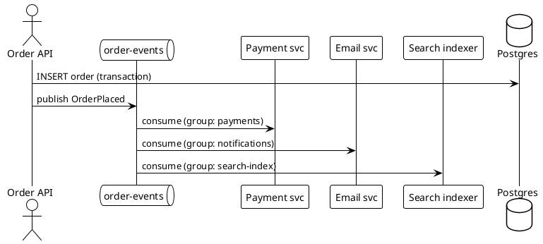

Kafka — overview
**Apache Kafka** is a **distributed event log** — producers append **records** to **topics**; consumers read at their own pace. It is built for **high throughput**, **durability**, and **replay**, making it the default backbone for **event-driven microservices**, **CDC pipelines**, and **stream processing**.

Kafka is **not** a database for ad-hoc queries — pair it with [Postgres](../postgres/i-overview.md) (system of record), [OpenSearch](../sysdesign/scalable-patterns/v-search-systems.md) (search read models), or stream processors. For low-latency cache, see [Redis](../redis/i-overview.md).

Diagram syntax: [PlantUML sequence diagrams](../plantuml/iii-sequence-diagrams.md).

## Map of this track

| Part | Focus |
|------|--------|
| **I — Overview** | Role in the stack, vocabulary, when to use Kafka |
| **II — Install & local dev** | Docker Compose, CLI tools, first produce/consume |
| **III — Core concepts** | Brokers, topics, partitions, offsets, replication |
| **IV — Producers & consumers** | Publish/subscribe flow, keys, serializers |
| **V — Consumer groups & delivery** | Scaling consumers, offsets, at-least-once |
| **IX — Acks & how they work** | Producer `acks`, consumer offset commit, Spring manual ack |
| **VI — Patterns & integration** | Outbox, CDC, event-driven, Spring Kafka |
| **VII — Operations** | Retention, compaction, monitoring, pitfalls |
| **VIII — Sequential pipelines & sagas** | A→B→C on success only; not parallel consumer groups |
| **Example — Spring Boot + Stripe** | Hold & capture via Kafka — full checkout walkthrough |

## What problem Kafka solves

```text
Without Kafka:
  Service A ──HTTP──► Service B     (tight coupling, no replay, spikes drop traffic)

With Kafka:
  Service A ──publish──► topic ◄──consume── Service B
                              ◄──consume── Service C (same event, many subscribers)
```

| Need | Why Kafka |
|------|-----------|
| **Decouple** services | Producers do not know consumers |
| **Buffer spikes** | Log absorbs bursts; consumers catch up |
| **Replay** | Re-read history for new service or bug fix |
| **Audit trail** | Ordered, durable append log |
| **Many subscribers** | One topic, independent consumer groups |

## Core vocabulary

| Term | Meaning |
|------|---------|
| **Broker** | Kafka server that stores topic data |
| **Cluster** | Multiple brokers for scale and fault tolerance |
| **Topic** | Named stream of records (like a table name, not a queue) |
| **Partition** | Ordered, immutable sub-stream inside a topic — unit of parallelism |
| **Offset** | Position of a record within a partition (0, 1, 2, …) |
| **Producer** | Client that appends records |
| **Consumer** | Client that reads records |
| **Consumer group** | Set of consumers that share work — each partition → one consumer in group |
| **Retention** | How long (or how large) data stays on disk before deletion/compaction |

## When Kafka fits

| Good fit | Poor default |
|----------|--------------|
| Domain events (`OrderPlaced`, `PaymentCaptured`) | Request/response where caller needs instant answer in same HTTP call |
| CDC from [Postgres](../postgres/i-overview.md) to search/analytics | Primary OLTP store |
| Fan-out to many services | Single consumer job queue with one worker (SQS/Rabbit may be simpler) |
| Event sourcing / audit log | Tiny app with one monolith and no scale |
| Stream processing (Flink, ksqlDB, Kafka Streams) | Session cache — use [Redis](../redis/i-overview.md) |

**Rule:** Kafka holds **events**; your database holds **current state**.

## Kafka vs Redis Streams / message queues

| | **Kafka** | **Redis Streams / Pub-sub** | **SQS / RabbitMQ** |
|---|-----------|----------------------------|---------------------|
| **Retention** | Days/weeks/forever (configurable) | Usually short / memory-bound | Until ack (queue) |
| **Replay** | Yes — reset offset | Limited | No (typical queue) |
| **Throughput** | Very high, disk-sequential | High in RAM | Moderate |
| **Ordering** | Per **partition** | Per stream | Per queue (often) |
| **Ops complexity** | Cluster, ZooKeeper/KRaft | Simpler | Managed service easiest |

## End-to-end picture (preview)



See [Patterns & integration](vi-patterns-and-integration.md) and [Order search CDC](../sysdesign/examples/viii-order-search-cdc.md).

## Next

Continue with [Install & local dev](ii-install-and-local-dev.md) to run a cluster locally and produce your first message. **Worked example:** [Spring Boot + Stripe hold & capture](examples.md).
