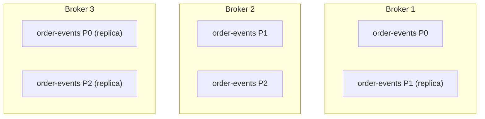
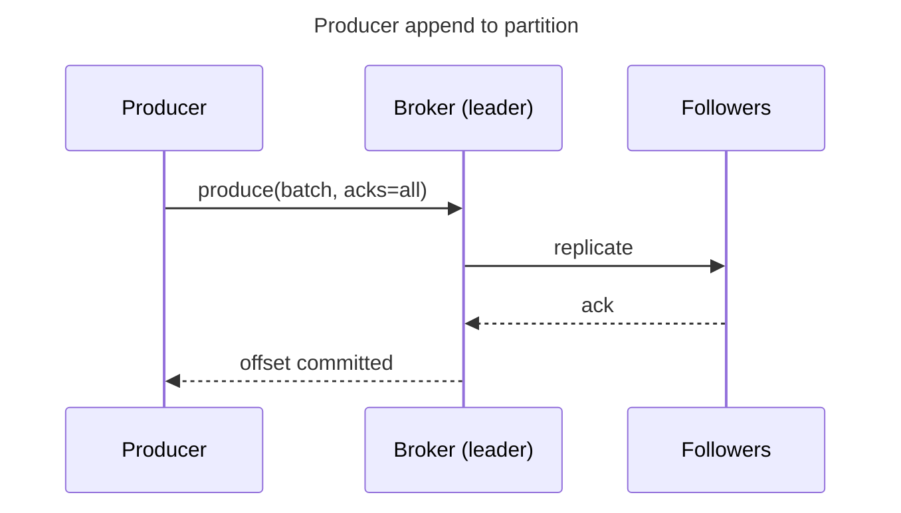
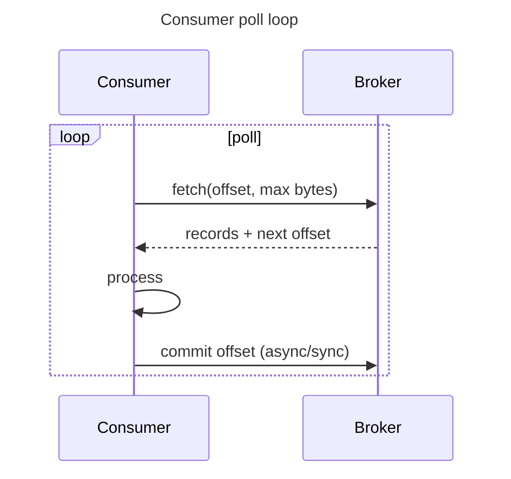

Kafka — core concepts & architecture
Kafka stores each **topic** as one or more **partitions** — append-only logs on disk. **Producers** choose a partition; **consumers** track **offsets** per partition. **Replication** keeps copies on multiple brokers for durability.

Previous: [Install & local dev](ii-install-and-local-dev.md).

## 1. Cluster topology



| Role | Meaning |
|------|---------|
| **Leader partition** | Broker that handles reads/writes for that partition |
| **Follower replica** | Copies data from leader — failover candidate |
| **ISR** (in-sync replicas) | Replicas caught up enough to be promoted |

Production topics usually **`replication-factor: 3`** and **`min.insync.replicas: 2`** — tolerate one broker loss without losing acknowledged writes.

## 2. Topic and partition

```text
topic: order-events
  partition 0:  [0][1][2][3][4]…  ← offsets
  partition 1:  [0][1][2]…
  partition 2:  [0][1][2][3]…
```

| Concept | Detail |
|---------|--------|
| **Append-only** | New records only at the end — no in-place update |
| **Offset** | Monotonic id **within** a partition (not global across topic) |
| **Ordering** | Guaranteed **per partition** — not across whole topic |
| **Parallelism** | More partitions → more consumers in one group (up to partition count) |

**Choose partition count** at topic creation (hard to shrink later). Start with throughput estimate — often 6–24 for medium services; increase when consumer lag grows and CPU allows.

## 3. Record structure

```text
Key:    "ord_42"          (optional — routes to partition)
Value:  { JSON payload }
Headers: correlation-id, content-type (optional metadata)
Timestamp: broker or producer time
Offset:  assigned by broker
```

**Partition key:** same key → same partition → ordering for that entity (e.g. all events for `orderId=42` stay ordered).

```text
hash(key) % numPartitions  →  partition index
```

No key → round-robin or sticky partitioner (batching).

## 4. Producer write path



| `acks` | Behavior |
|--------|----------|
| **`0`** | Fire-and-forget — fastest, may lose data |
| **`1`** | Leader ack — follower loss can lose unreplicated data |
| **`all`** | ISR ack — durable default for important events — [full acks guide](ix-acks-and-how-they-work.md) |

## 5. Consumer read path

Consumers **pull** — Kafka does not push to apps.



| Term | Meaning |
|------|---------|
| **poll()** | Client library call — returns batch of records |
| **committed offset** | “Safe to skip up to here” on restart |
| **lag** | Difference between log end and consumer offset — key metric |

## 6. Log retention

| Policy | Behavior |
|--------|----------|
| **Time retention** | `retention.ms` — delete after 7 days (default-ish) |
| **Size retention** | `retention.bytes` per partition |
| **Compaction** | Keep latest record per key — changelog topics (`__consumer_offsets`, config) |

Event topics: usually **delete** retention. **Compacted** topics for “current state per key” snapshots.

## 7. KRaft vs ZooKeeper (metadata)

Older clusters used **ZooKeeper** for broker metadata. New deployments use **KRaft** — Kafka’s own Raft quorum for controller metadata. As an app developer, both look the same: **`bootstrap.servers`** to the cluster.

## 8. Mental model vs database

| | **Postgres row** | **Kafka record** |
|---|------------------|------------------|
| **Mutability** | UPDATE / DELETE | Append; “change” = new event |
| **Query** | SQL | Sequential read by offset |
| **Truth** | Current state | History of what happened |
| **Join** | Native | Done in consumer / stream processor |

Rebuild **current state** by consuming events (or read Postgres and use Kafka for propagation only).

## Next

Continue with [Producers & consumers](iv-producers-and-consumers.md) — client code and message flow.
