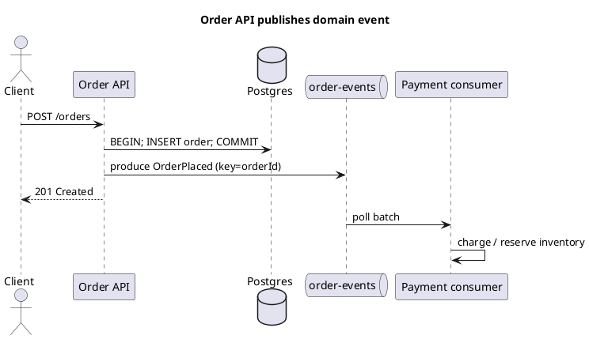

Kafka — producers & consumers
**Producers** serialize records and send batches to brokers. **Consumers** poll, deserialize, and process — then **commit offsets**. This part covers client configuration and a typical request-to-event flow.

Previous: [Core concepts](iii-core-concepts-and-architecture.md). Diagram reference: [PlantUML sequences](../plantuml/iii-sequence-diagrams.md).

## 1. End-to-end: HTTP → Kafka → handler



**Important:** commit the database **before** or **in the same outbox transaction** as the event — never announce success to Kafka if the order row failed (see [Transactional outbox](vi-patterns-and-integration.md)).

## 2. Producer configuration (essentials)

| Property | Purpose |
|----------|---------|
| **`bootstrap.servers`** | `host1:9092,host2:9092` |
| **`key.serializer` / `value.serializer`** | String, JSON, Avro |
| **`acks`** | `all` for durability — see [Acks & how they work](ix-acks-and-how-they-work.md) |
| **`enable.idempotence`** | `true` — dedupe retries (exactly-once **produce** to partition) |
| **`compression.type`** | `lz4` or `zstd` — less network/disk |

## 3. Java producer example

```java
Properties props = new Properties();
props.put(ProducerConfig.BOOTSTRAP_SERVERS_CONFIG, "localhost:9092");
props.put(ProducerConfig.KEY_SERIALIZER_CLASS_CONFIG, StringSerializer.class);
props.put(ProducerConfig.VALUE_SERIALIZER_CLASS_CONFIG, StringSerializer.class);
props.put(ProducerConfig.ACKS_CONFIG, "all");
props.put(ProducerConfig.ENABLE_IDEMPOTENCE_CONFIG, true);

try (KafkaProducer<String, String> producer = new KafkaProducer<>(props)) {
  String payload = """
      {"type":"OrderPlaced","orderId":"ord_42","totalCents":4999}
      """;
  ProducerRecord<String, String> record =
      new ProducerRecord<>("order-events", "ord_42", payload);
  producer.send(record, (meta, ex) -> {
    if (ex != null) log.error("send failed", ex);
    else log.info("offset={} partition={}", meta.offset(), meta.partition());
  });
}
```

| Choice | Why |
|--------|-----|
| **Key = orderId** | All events for one order land in one partition — ordered processing |
| **Async callback** | `send()` is non-blocking — handle failures in callback or flush on shutdown |

## 4. Consumer configuration (essentials)

| Property | Purpose |
|----------|---------|
| **`group.id`** | Consumer group name — required for scalable consumption |
| **`auto.offset.reset`** | `earliest` (read from start) or `latest` (only new) when no offset |
| **`enable.auto.commit`** | `false` in production — commit after successful processing ([acks deep dive](ix-acks-and-how-they-work.md)) |
| **`max.poll.records`** | Batch size per poll — tune with processing time |

## 5. Java consumer example

```java
Properties props = new Properties();
props.put(ConsumerConfig.BOOTSTRAP_SERVERS_CONFIG, "localhost:9092");
props.put(ConsumerConfig.GROUP_ID_CONFIG, "payment-service");
props.put(ConsumerConfig.KEY_DESERIALIZER_CLASS_CONFIG, StringDeserializer.class);
props.put(ConsumerConfig.VALUE_DESERIALIZER_CLASS_CONFIG, StringDeserializer.class);
props.put(ConsumerConfig.ENABLE_AUTO_COMMIT_CONFIG, false);
props.put(ConsumerConfig.AUTO_OFFSET_RESET_CONFIG, "earliest");

try (KafkaConsumer<String, String> consumer = new KafkaConsumer<>(props)) {
  consumer.subscribe(List.of("order-events"));
  while (running) {
    ConsumerRecords<String, String> records = consumer.poll(Duration.ofMillis(500));
    for (ConsumerRecord<String, String> rec : records) {
      process(rec);  // idempotent — safe on redelivery
    }
    consumer.commitSync();  // after whole batch processed
  }
}
```

## 6. Serialization choices

| Format | Pros | Cons |
|--------|------|------|
| **JSON** | Human-readable, easy start | No schema enforcement, larger payloads |
| **Avro + Schema Registry** | Compact, evolution rules | Extra infrastructure |
| **Protobuf** | Compact, strong typing | Schema management discipline |

Production event buses almost always adopt a **schema registry** once multiple teams publish.

## 7. Headers and correlation

```java
new ProducerRecord<>("order-events", null, orderId, json, List.of(
    new RecordHeader("correlation-id", correlationId.getBytes()),
    new RecordHeader("event-type", "OrderPlaced".getBytes())
));
```

Consumers propagate **`correlation-id`** to logs and downstream HTTP — traces a single user action across services.

## 8. Error handling on produce

```text
Transient (broker down, not enough replicas)  → retry with backoff
Serialization error                           → fix code, do not retry same payload
Record too large                              → split event or increase max.message.bytes
```

Enable **idempotent producer** so retries do not create duplicate records at the broker (still need idempotent consumers for end-to-end).

## Next

Continue with [Consumer groups & delivery](v-consumer-groups-and-delivery.md) — scaling, rebalancing, and semantics.
