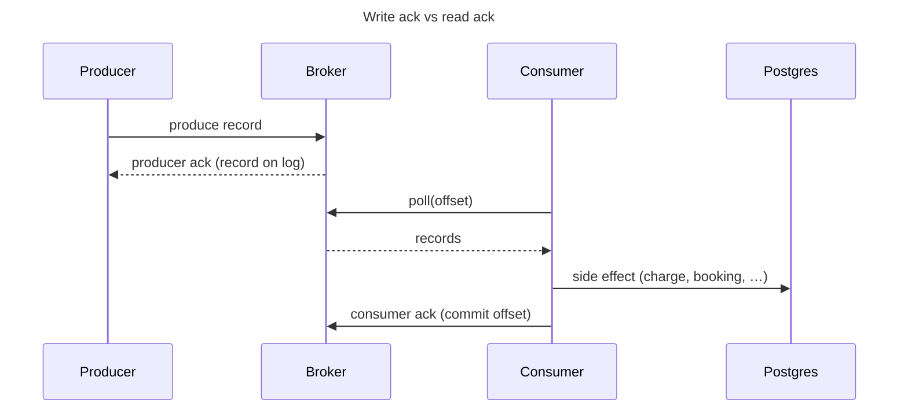
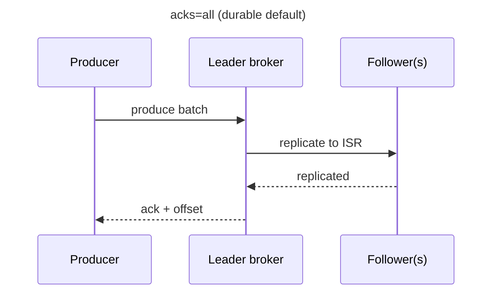
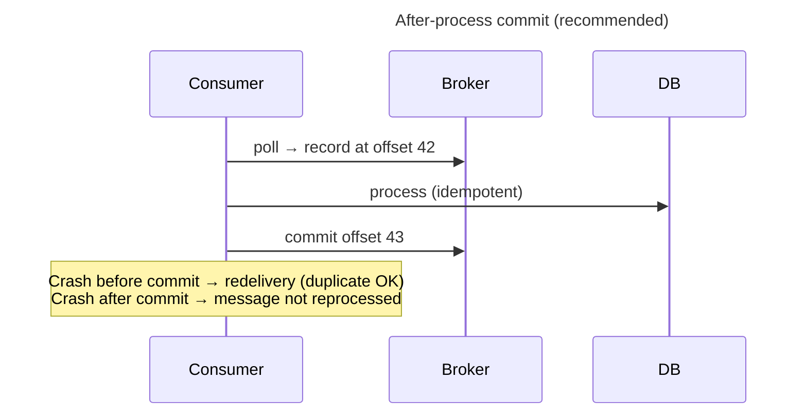
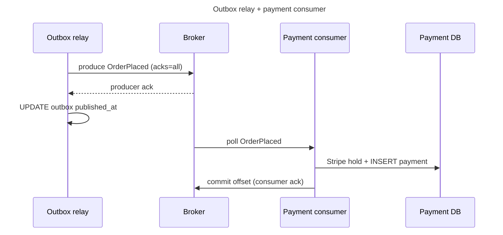

Kafka — acks & how they work
**Ack** (acknowledgment) in Kafka answers two different questions:

1. **Producer → broker:** “Did you persist my record?”
2. **Consumer → broker:** “I finished processing up to this offset — don’t send it again.”

Confusing these is a common source of lost messages or surprise duplicates. This note goes deeper than the summaries in [Producers & consumers](iv-producers-and-consumers.md) and [Consumer groups & delivery](v-consumer-groups-and-delivery.md).

Previous: [Consumer groups & delivery](v-consumer-groups-and-delivery.md).

## 1. Two acks, one pipeline



| Ack type | Who sends it | Who receives it | What it means |
|----------|--------------|-----------------|---------------|
| **Producer ack** | Broker (leader) | Producer | Record is stored per `acks` config |
| **Consumer ack** | Consumer | Broker | Offset committed — restart skips processed records |

Both are required for reliable event-driven systems. Producer ack without consumer commit → consumers may never see the message or may reprocess. Consumer commit without producer ack → you may ack processing of a message that was never durably written.

## 2. Producer acks — `acks`

When a producer calls `send()`, the client waits for the broker to respond based on **`acks`**:



| `acks` | Waits for | Speed | Durability | Typical use |
|--------|-----------|-------|------------|-------------|
| **`0`** | Nothing | Fastest | May lose records silently | Metrics, logs where loss is OK |
| **`1`** | Leader wrote to its log | Fast | Lost if leader dies before replication | Dev only |
| **`all`** (or `-1`) | All **in-sync replicas** (ISR) | Slower | Strongest — production default for domain events | `OrderPlaced`, payments, outbox relay |

Java / Spring producer:

```java
props.put(ProducerConfig.ACKS_CONFIG, "all");
props.put(ProducerConfig.ENABLE_IDEMPOTENCE_CONFIG, true);  // safe retries on producer
```

### Related broker settings

| Setting | Role |
|---------|------|
| **`min.insync.replicas`** | Minimum followers that must ack before leader responds to `acks=all` |
| **`replication.factor`** | Total copies of each partition (production: **3**) |

If ISR shrinks below `min.insync.replicas`, producers with `acks=all` **fail the write** rather than accept a risky ack — prefer temporary produce errors over silent data loss.

### Waiting for the producer ack

`send()` is async by default. The outbox relay often blocks until ack before marking a row published:

```java
kafka.send(topic, key, payload).get();  // wait for broker ack
outboxRow.markPublished();
```

See [Transactional outbox](vi-patterns-and-integration.md#2-transactional-outbox) — relay marks `published_at` **after** broker ack, not before.

## 3. Consumer ack — offset commit

Kafka does **not** delete a message when you “ack” it like SQS. The log **retains** records; the consumer advances its **offset** — a bookmark per `(group, topic, partition)`.

```text
Partition log:  [0] [1] [2] [3] [4] [5]
                      ↑
              committed offset = 3
              → on restart, fetch from offset 3
```

**Consumer ack** = **commit offset** — tell the broker “everything before this position is done.”



### Delivery semantics — where you commit

| Pattern | Commit timing | Guarantee | Risk |
|---------|---------------|-----------|------|
| **At-most-once** | Before process | May **lose** messages | Handler never runs if crash after commit |
| **At-least-once** | After process | May **duplicate** | Safe if handler is idempotent |
| **Exactly-once** | Transactions + idempotent stores | No dup/loss (complex) | Kafka Streams / EOS configs — not free in plain consumers |

**Default recommendation:** at-least-once + **idempotent consumer** ([§4 in Consumer groups](v-consumer-groups-and-delivery.md#4-delivery-semantics)).

### Auto commit vs manual commit

| `enable.auto.commit` | Behavior |
|----------------------|----------|
| **`true`** (default in raw clients) | Commits on a timer — may commit **before** your handler finishes → **at-most-once** risk |
| **`false`** (production) | You commit after successful processing |

```java
props.put(ConsumerConfig.ENABLE_AUTO_COMMIT_CONFIG, false);
// …
for (ConsumerRecord<String, String> rec : records) {
  process(rec);
}
consumer.commitSync();  // ack whole batch — blocks until broker confirms commit
```

| Commit API | Tradeoff |
|------------|----------|
| **`commitSync()`** | Simple; blocks until broker acks the commit |
| **`commitAsync()`** | Higher throughput; must handle errors in callback |
| **Per-record commit** | Safer on partial batch failure; slower |

## 4. Spring Kafka — `Acknowledgment`

Spring wraps manual consumer ack in `Acknowledgment`:

```java
@KafkaListener(topics = "order-events", groupId = "payment-service")
public void onOrderEvent(ConsumerRecord<String, String> record, Acknowledgment ack) {
  paymentService.process(record);  // throws → no ack → redelivery / retry / DLT
  ack.acknowledge();
}
```

Enable manual mode:

```java
factory.getContainerProperties().setAckMode(ContainerProperties.AckMode.MANUAL);
```

| `AckMode` | When offset commits |
|-----------|---------------------|
| **`BATCH`** | After entire poll batch succeeds (default when not MANUAL) |
| **`MANUAL`** | When you call `ack.acknowledge()` |
| **`MANUAL_IMMEDIATE`** | Commit immediately on each `acknowledge()` |
| **`RECORD`** | One record at a time — slowest, safest per message |

With `@RetryableTopic` or `DefaultErrorHandler` + DLT, the framework commits (or publishes to DLT) **after** retries are exhausted — so poison messages do not block the partition forever ([DLQ runbook](vi-patterns-and-integration.md#6-dead-letter-queue-dlq)).

## 5. End-to-end: both acks in checkout



| Step | Ack type | Failure if missing |
|------|----------|-------------------|
| Relay publishes outbox row | Producer ack | Row may never reach Kafka; relay retries |
| Payment handler finishes | Consumer ack | Same event redelivered → need idempotency |
| Payment handler throws | No consumer ack | Retry → DLT after N attempts |

## 6. Common mistakes

| Mistake | Symptom |
|---------|---------|
| **`acks=0`** for money / order events | Silent message loss on broker trouble |
| **`enable.auto.commit=true`** + slow handler | Message lost mid-processing |
| **Commit before DB transaction** | Offset advanced but side effect rolled back |
| **`kafka.send()` in same `@Transactional` as DB** without outbox | Broker ack and DB commit can diverge on crash |
| **Assuming producer ack = consumer processed** | Downstream never ran — need separate consumer commit + monitoring lag |

## 7. Quick config checklist

| Component | Production starting point |
|-----------|---------------------------|
| **Producer** | `acks=all`, `enable.idempotence=true`, `retries` > 0 |
| **Topic** | `replication.factor=3`, `min.insync.replicas=2` |
| **Consumer** | `enable.auto.commit=false`, commit **after** process |
| **Handler** | Idempotent on natural key or `eventId` |
| **Poison messages** | Retry + DLT; commit offset after routing to DLT |

## 8. Rehearsal questions

- What happens if the producer uses `acks=1` and the leader broker dies before followers replicate?
- Why is at-least-once + idempotent handler preferred over at-most-once for payments?
- Consumer crashes after `process()` but before `commitSync()` — is the message lost or redelivered?
- How is Spring’s `ack.acknowledge()` different from the producer’s `acks=all`?

## Next

Continue with [Patterns & integration](vi-patterns-and-integration.md) — outbox, CDC, and Spring Kafka wiring. **Worked example:** [Spring Boot + Stripe hold & capture](examples.md) (manual ack in Payment service).
