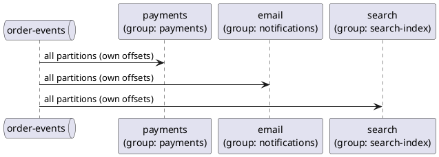
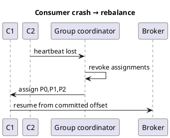

Kafka — consumer groups & delivery
A **consumer group** is a set of consumers sharing one **`group.id`**. Kafka assigns each **partition** to at most **one** consumer in the group — that is how you scale horizontally without duplicate processing **within** the group.

Previous: [Producers & consumers](iv-producers-and-consumers.md).

## 1. One group, many consumers

```plantuml
@startuml
!theme plain
queue "order-events" as T {
  card "P0" as p0
  card "P1" as p1
  card "P2" as p2
}

participant "Consumer A\n(group: payments)" as CA
participant "Consumer B\n(group: payments)" as CB

p0 --> CA
p1 --> CB
p2 --> CA
@enduml
```

Topic **`order-events`** has 3 partitions; group **`payments`** has 2 consumer instances — one consumer may handle 2 partitions, the other 1. Add a **third** consumer → ideally one partition each.

| Rule | Detail |
|------|--------|
| **Consumers ≤ partitions** | Extra consumers sit idle |
| **Different groups** | Independent — `payments` and `email` both read every message |
| **Same group** | Each message to **one** member only |

## 2. Fan-out to multiple services



Each service maintains **its own offset** per partition — slow email does not block payments.

**Not sequential pipelines:** if **Shipping must run only after Payment succeeds**, do not put both on the same topic with different groups — they start **in parallel**. Use [Sequential pipelines & sagas](viii-sequential-pipelines-and-sagas.md) (choreographed chain or orchestrator).

## 3. Rebalance

When a consumer **joins**, **leaves**, or **crashes**, the group **rebalances** — partitions reassigned.



| Practice | Why |
|----------|-----|
| **`max.poll.interval.ms`** | Processing must finish before next poll — or consumer kicked |
| **Graceful shutdown** | `consumer.wakeup()` + commit — faster rebalance |
| **Cooperative rebalance** | Newer protocol — less stop-the-world (client support) |

## 4. Delivery semantics

| Guarantee | Meaning | How |
|-----------|---------|-----|
| **At-most-once** | May lose messages | Commit offset **before** process |
| **At-least-once** | May duplicate | Commit **after** process; **idempotent** handler |
| **Exactly-once** | No dup/loss (end-to-end) | Transactions + idempotent consumers — complex |

**Default recommendation:** **at-least-once** + **idempotent consumer** (natural key upsert, `INSERT … ON CONFLICT`, or store processed event ids).

```text
process(record):
  if alreadyProcessed(record.id): return
  applySideEffect(record)
  markProcessed(record.id)
  commit offset
```

## 5. Offset commit strategies

| Strategy | When |
|----------|------|
| **`commitSync()`** after batch | Simple; blocks until broker ack |
| **`commitAsync()`** | Higher throughput; handle callback errors |
| **Per-record** | Safer on partial batch failure — slower |

If you crash **after** process but **before** commit → redelivery (duplicate). If **before** process but **after** commit → message lost. Design for **after-process commit**.

## 6. Consumer lag

```text
lag = log end offset − committed consumer offset   (per partition)
```

| Lag | Interpretation |
|-----|----------------|
| **Low / stable** | Healthy |
| **Growing** | Consumers slower than producers — add consumers (if partitions allow) or optimize handler |
| **Spike then drain** | Burst — OK if temporary |

Monitor with **kafka-consumer-groups.sh --describe**, Prometheus exporters, or AKHQ.

## 7. Reading from the beginning vs latest

| `auto.offset.reset` | Use |
|---------------------|-----|
| **`earliest`** | New group must replay history (reindex search) |
| **`latest`** | Only new events (metrics, alerts) |

Existing groups use **committed offsets** — reset only when you explicitly change group id or use admin tools to reset offsets (dangerous in production).

## 8. Partition key design (recap)

```text
Same customerId key  →  same partition  →  ordered events per customer
Random key           →  spread load      →  no cross-message order guarantee
```

Hot keys → one partition overloaded (“hot partition”) — split domain or salt keys with care.

## Next

Continue with [Acks & how they work](ix-acks-and-how-they-work.md) — producer and consumer acknowledgments in depth. Then [Patterns & integration](vi-patterns-and-integration.md) — outbox, CDC, Spring Kafka.
