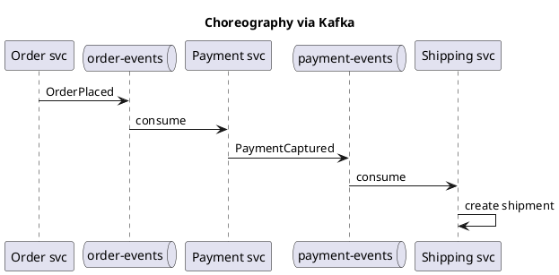
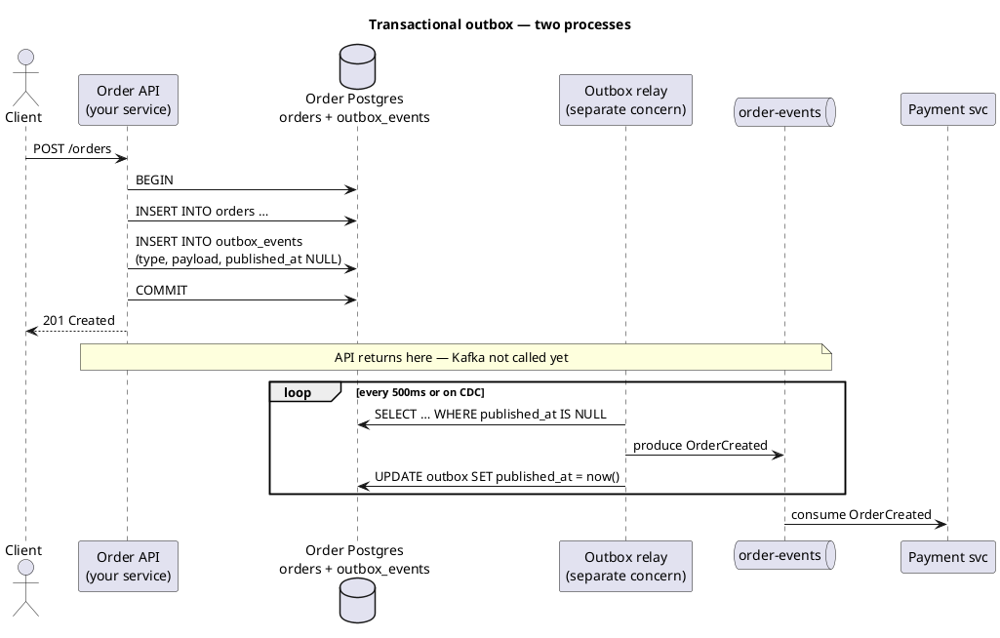
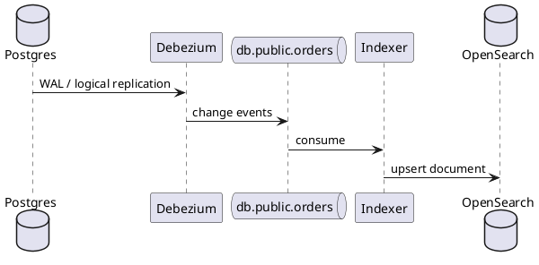
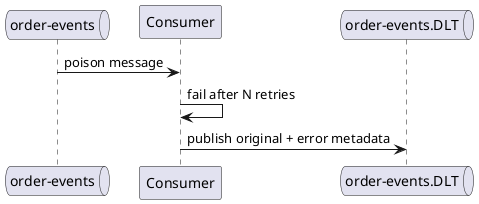

Kafka — patterns & integration
Kafka sits in the middle of **event-driven** architectures: **transactional outbox**, **CDC**, **sagas**, and **read-model projection**. This part ties Kafka to patterns elsewhere in SWE101 and shows **Spring Kafka** integration.

Previous: [Consumer groups & delivery](v-consumer-groups-and-delivery.md).

## 1. Event-driven microservices



No central orchestrator — each service reacts to events. Tradeoffs: [Checkout choreography](../sysdesign/examples/iii-ecommerce-checkout-choreography.md) vs saga orchestrator.

**Strict A → B → C on success only?** Parallel consumer groups on one topic are the wrong tool — see [Sequential pipelines & sagas](viii-sequential-pipelines-and-sagas.md).

## 2. Transactional outbox

**Problem:** DB commit and Kafka send are two systems — one can succeed without the other.

**Fix:** your **application service** (e.g. **Order API**) writes the business row **and** an **`outbox_events` row** in **one database transaction**. A separate process — the **outbox relay** — reads unpublished rows and calls `kafka.send`. The HTTP handler **never** talks to Kafka directly.

### Who is who?

| Component | What it is | Talks to Kafka? |
|-----------|------------|-----------------|
| **Order API** (or any domain service) | **Your** Spring Boot / service — handles `POST /orders` | **No** — only SQL in a transaction |
| **Order DB** (Postgres) | That service’s database — `orders` + `outbox_events` tables | No |
| **Outbox relay** | Background publisher — **not** in the request path | **Yes** — producer only |
| **Kafka** | Event bus | — |
| **Downstream consumers** | Payment, email, search, … | Consume only |

The relay is **logically separate** from the API even if you deploy it different ways (below).

### Request path vs relay path



### What the Order API does (your code)

```java
// Order API — same JVM as REST controllers, but no KafkaTemplate in this transaction
@Transactional
public Order createOrder(CreateOrderRequest req) {
  Order order = orderRepo.save(Order.pending(req));
  outboxRepo.save(OutboxEvent.builder()
      .aggregateId(order.getId())
      .type("OrderCreated")
      .payload(toJson(order))
      .build());
  return order;  // COMMIT writes both rows atomically
}
```

**Wrong:** `kafka.send()` inside `@Transactional` without outbox — broker ack and DB commit can still diverge on crash.

### What the outbox relay does

Reads **its service’s** `outbox_events` table and publishes. **Yes — this is often a second deployable**, but not always.

| Relay deployment | Description | When |
|------------------|-------------|------|
| **Separate microservice** | Small `outbox-relay` app (or one relay per domain DB) polls Postgres, produces to Kafka | Clear separation, scale relay independently |
| **`@Scheduled` in same Order API app** | Second thread pool in the **same** Spring Boot JAR | Small teams, low volume — simplest start |
| **Dedicated worker process** | Same repo, different `main()` / k8s Deployment | Middle ground — separate pod, shared code |
| **Debezium CDC** | No polling — connector reads Postgres **WAL**, streams `outbox_events` inserts to Kafka | Near real-time; more ops ([CDC](viii-order-search-cdc.md) style) |

```text
Typical microservice layout:

  order-service/          ← your API (HTTP + outbox INSERT)
  order-outbox-relay/     ← optional separate service (poll + Kafka producer)

  Both connect to the SAME Order Postgres — relay only needs SELECT/UPDATE on outbox_events.
```

### Relay implementation sketch (polling service)

```java
// Can live in order-outbox-relay OR @Scheduled in order-service
@Scheduled(fixedDelay = 500)
public void publishPendingEvents() {
  List<OutboxEvent> batch = outboxRepo.findUnpublished(100);
  for (OutboxEvent e : batch) {
    kafka.send("order-events", e.getAggregateId(), e.getPayload())
        .get();  // wait for broker ack
    outboxRepo.markPublished(e.getId());
  }
}
```

| Step | Owner |
|------|--------|
| Insert `orders` + `outbox_events` | **Order API** (your service) |
| Poll / CDC / read WAL | **Outbox relay** (separate service, scheduler, or Debezium) |
| `kafka.produce` | **Outbox relay** only |
| `UPDATE published_at` | **Outbox relay** after successful ack |

### One outbox per service database

Payment service has **its own** `outbox_events` in **Payment DB** when it publishes `PaymentCaptured`. Order relay only reads Order DB — not a global shared outbox table for the whole company (unless you deliberately centralize, which is uncommon).

### Failure behavior

| Crash when | Result |
|------------|--------|
| Before `COMMIT` | No order, no outbox row — client retries |
| After `COMMIT`, before relay runs | Row sits in outbox; relay publishes later |
| After Kafka send, before `markPublished` | Duplicate on Kafka — **idempotent consumers** |

Deep dive: [Transactional outbox example](../sysdesign/examples/v-ecommerce-checkout-transactional-outbox.md).

## 3. CDC (Change Data Capture)

Stream **database row changes** to Kafka without the app calling `producer.send` for every column.



Example: [Order search CDC](../sysdesign/examples/viii-order-search-cdc.md).

| | **Domain events (outbox)** | **CDC** |
|---|---------------------------|---------|
| **Payload** | Explicit `OrderPlaced` schema | Row before/after |
| **Coupling** | App owns event shape | Any SQL change flows |
| **Use** | Bounded context integration | Search/analytics sync |

## 4. Idempotent consumers (required)

At-least-once delivery means **duplicates**. Handlers must be safe to run twice:

```java
@Transactional
public void onOrderPlaced(OrderPlaced e) {
  if (processedEvents.exists(e.eventId())) return;
  paymentGateway.charge(e.orderId(), e.totalCents());
  processedEvents.save(e.eventId());
}
```

## 5. Spring Kafka

```text
# build.gradle / pom.xml
implementation 'org.springframework.kafka:spring-kafka'
```

**Producer:**

```java
@Service
public class OrderEventPublisher {
  private final KafkaTemplate<String, String> kafka;

  public void orderPlaced(String orderId, String json) {
    kafka.send("order-events", orderId, json);
  }
}
```

**Consumer:**

```java
@Component
public class PaymentListener {

  @KafkaListener(topics = "order-events", groupId = "payment-service")
  public void handle(ConsumerRecord<String, String> record) {
    OrderPlaced event = parse(record.value());
    process(event);  // idempotent
  }
}
```

| Feature | Spring support |
|---------|----------------|
| **`@KafkaListener`** | Declarative consumers |
| **Error handlers** | `DefaultErrorHandler` + DLQ topic |
| **Retry** | `@RetryableTopic` or manual backoff |
| **Transactions** | `ChainedKafkaTransactionManager` + DB — advanced |

Pair with [Spring Boot REST](../java/springboot/iv-rest-controllers.md) — HTTP writes DB + outbox; Kafka drives async side effects.

## 6. Dead letter queue (DLQ)



The consumer **commits the offset** on the main topic after routing to DLT — the poison message will **not** block the partition forever.

### What is stored in the DLT

| Part | Contents |
|------|----------|
| **Value** | Original record payload (unchanged) |
| **Key** | Original partition key (e.g. `orderId`) |
| **Headers** | Error metadata — exception type, message, stack trace snippet, original topic/partition/offset, consumer group |

Spring `@RetryableTopic` and `DefaultErrorHandler` + `DeadLetterPublishingRecoverer` both follow this pattern. Check app logs during retries for the same exception before the record reaches DLT.

### Runbook after retries are exhausted

```text
1. Alert fires          → DLT topic has new messages (monitor count / lag)
2. Inspect DLT record   → read headers + payload; find correlation-id in logs
3. Classify root cause  → bug, bad data, or transient outage that outlasted backoff
4. Fix                  → deploy code, repair data, or restore downstream dependency
5. Replay or skip       → republish to main topic only when safe; otherwise compensate manually
```

| Root cause | Fix | Replay? |
|------------|-----|---------|
| **Bug in handler** (NPE, wrong schema parse) | Deploy fixed code | **Yes** — replay from DLT |
| **Bad payload** (invalid amount, missing field) | Fix upstream producer or patch data | Republish **corrected** event; do not replay poison as-is |
| **Downstream down too long** (DB, payment API) | Restore dependency; tune retry count/backoff if needed | **Yes** once dependency is healthy |
| **Business rejection** (card declined) | Not a poison message — publish a **failure** event instead | **No** DLT replay; handle in domain flow |

**Do not** auto-replay DLT → main topic on a timer without fixing the cause — you will loop the same failure and fill DLT again.

### Replay from DLT

After the fix is deployed, republish the original payload to the **main topic** (same key preserves per-order ordering):

```bash
# Read one DLT record (local Docker — see Install & local dev)
docker exec -it <kafka-container> /opt/kafka/bin/kafka-console-consumer.sh \
  --bootstrap-server localhost:9092 \
  --topic order-events.DLT \
  --from-beginning --max-messages 1

# Republish to the main topic (key = orderId)
docker exec -it <kafka-container> /opt/kafka/bin/kafka-console-producer.sh \
  --bootstrap-server localhost:9092 \
  --topic order-events \
  --property parse.key=true \
  --property key.separator=:
# then type:  ord_42:{"type":"OrderPlaced",...}
```

In production, prefer a **controlled replay tool** — a one-off consumer on DLT that publishes to the main topic (or a dedicated `order-events-replay` topic), with rate limits and an audit log of what was replayed.

```java
// Minimal replay listener — run only during an approved replay window
@KafkaListener(topics = "order-events.DLT", groupId = "dlt-replay-admin")
public void replay(ConsumerRecord<String, String> dlt) {
  kafka.send("order-events", dlt.key(), dlt.value());  // handler must be idempotent (§4)
}
```

Because delivery is **at-least-once**, replay is safe only when the handler checks an **idempotency key** (`eventId`) — see [§4 Idempotent consumers](#4-idempotent-consumers-required).

### Monitoring

| Signal | Action |
|--------|--------|
| **DLT message count** rises | Page on-call; triage within SLA |
| **Consumer lag** on main topic stalls then drops | Likely poison routed to DLT — check DLT around same timestamp |
| **App error logs** during retries | Same stack trace as DLT headers — use `correlation-id` to trace the order |

See [Operations checklist](vii-operations-and-pitfalls.md) — “DLQ for poison messages” and lag alerts.

## 7. Kafka vs job queue

| Use **Kafka** when | Use **SQS / Rabbit / Redis queue** when |
|--------------------|----------------------------------------|
| Many subscribers, replay, log retention | Single worker pool, task ack, simpler ops |
| Event sourcing / analytics pipeline | Delayed job, priority queue (with plugins) |
| High volume ordered streams | Low volume background jobs |

[Redis Streams](../redis/iv-patterns-and-use-cases.md) fits lighter in-memory streaming.

## 8. Schema evolution

Events live a long time — version fields and compatible changes:

```json
{
  "schemaVersion": 2,
  "type": "OrderPlaced",
  "orderId": "ord_42",
  "totalCents": 4999,
  "currency": "USD"
}
```

Add fields (optional); avoid breaking renames without dual-write period.

## Next

Continue with [Operations](vii-operations-and-pitfalls.md) — retention, sizing, and production checklist.
