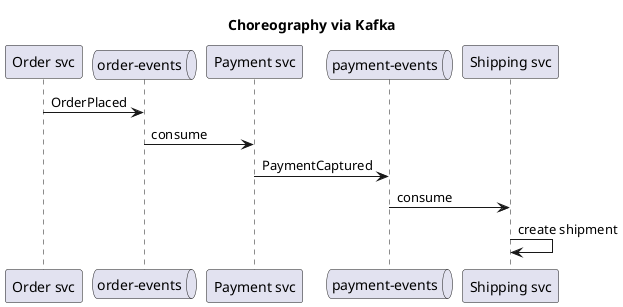
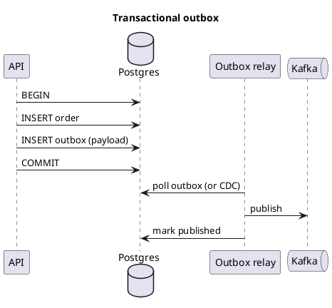
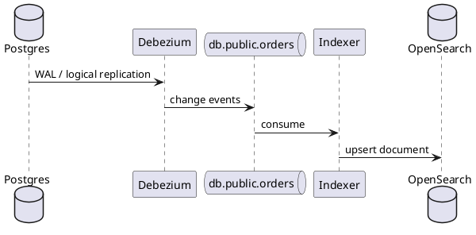
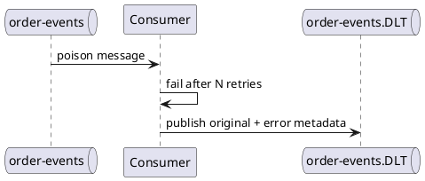

Kafka — patterns & integration
Kafka sits in the middle of **event-driven** architectures: **transactional outbox**, **CDC**, **sagas**, and **read-model projection**. This part ties Kafka to patterns elsewhere in SWE101 and shows **Spring Kafka** integration.

Previous: [Consumer groups & delivery](v-consumer-groups-and-delivery.md).

## 1. Event-driven microservices



No central orchestrator — each service reacts to events. Tradeoffs: [Checkout choreography](../sysdesign/examples/iii-ecommerce-checkout-choreography.md) vs saga orchestrator.

## 2. Transactional outbox

**Problem:** DB commit and Kafka send are two systems — one can succeed without the other.

**Fix:** write the event to an **`outbox` table** in the **same DB transaction** as the business row; a relay publishes to Kafka.



Deep dive: [Transactional outbox example](../sysdesign/examples/v-ecommerce-checkout-transactional-outbox.md).

## 3. CDC (Change Data Capture)

Stream **database row changes** to Kafka without the app calling `producer.send` for every column.



Example: [Order search CDC](../sysdesign/examples/viii-order-search-cdc.md).

| | **Domain events (outbox)** | **CDC** |
|---|---------------------------|---------|
| **Payload** | Explicit `OrderPlaced` schema | Row before/after |
| **Coupling** | App owns event shape | Any SQL change flows |
| **Use** | Bounded context integration | Search/analytics sync |

## 4. Idempotent consumers (required)

At-least-once delivery means **duplicates**. Handlers must be safe to run twice:

```java
@Transactional
public void onOrderPlaced(OrderPlaced e) {
  if (processedEvents.exists(e.eventId())) return;
  paymentGateway.charge(e.orderId(), e.totalCents());
  processedEvents.save(e.eventId());
}
```

## 5. Spring Kafka

```text
# build.gradle / pom.xml
implementation 'org.springframework.kafka:spring-kafka'
```

**Producer:**

```java
@Service
public class OrderEventPublisher {
  private final KafkaTemplate<String, String> kafka;

  public void orderPlaced(String orderId, String json) {
    kafka.send("order-events", orderId, json);
  }
}
```

**Consumer:**

```java
@Component
public class PaymentListener {

  @KafkaListener(topics = "order-events", groupId = "payment-service")
  public void handle(ConsumerRecord<String, String> record) {
    OrderPlaced event = parse(record.value());
    process(event);  // idempotent
  }
}
```

| Feature | Spring support |
|---------|----------------|
| **`@KafkaListener`** | Declarative consumers |
| **Error handlers** | `DefaultErrorHandler` + DLQ topic |
| **Retry** | `@RetryableTopic` or manual backoff |
| **Transactions** | `ChainedKafkaTransactionManager` + DB — advanced |

Pair with [Spring Boot REST](../java/springboot/iv-rest-controllers.md) — HTTP writes DB + outbox; Kafka drives async side effects.

## 6. Dead letter queue (DLQ)



Fix the bug or bad payload offline; replay from DLT after correction.

## 7. Kafka vs job queue

| Use **Kafka** when | Use **SQS / Rabbit / Redis queue** when |
|--------------------|----------------------------------------|
| Many subscribers, replay, log retention | Single worker pool, task ack, simpler ops |
| Event sourcing / analytics pipeline | Delayed job, priority queue (with plugins) |
| High volume ordered streams | Low volume background jobs |

[Redis Streams](../redis/iv-patterns-and-use-cases.md) fits lighter in-memory streaming.

## 8. Schema evolution

Events live a long time — version fields and compatible changes:

```json
{
  "schemaVersion": 2,
  "type": "OrderPlaced",
  "orderId": "ord_42",
  "totalCents": 4999,
  "currency": "USD"
}
```

Add fields (optional); avoid breaking renames without dual-write period.

## Next

Continue with [Operations](vii-operations-and-pitfalls.md) — retention, sizing, and production checklist.
