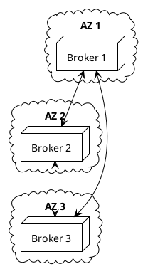

Kafka — operations & pitfalls
Running Kafka in production means planning **disk**, **replication**, **monitoring**, and **upgrade** paths. This part is a checklist — not a full SRE runbook.

Previous: [Patterns & integration](vi-patterns-and-integration.md).

## 1. Production cluster sketch

| Setting | Typical production |
|---------|-------------------|
| **Brokers** | 3+ across availability zones |
| **Replication factor** | 3 |
| **`min.insync.replicas`** | 2 |
| **`acks`** | `all` for critical producers |

## 2. Disk and retention

Kafka is **disk-sequential** — throughput scales with fast SSDs and enough space for retention.

| Knob | Effect |
|------|--------|
| **`retention.ms`** | How long events remain |
| **`retention.bytes`** | Cap per partition |
| **Compaction** | Changelog topics — latest key wins |

**Pitfall:** disk full → broker read-only → cluster instability. Alert at 70–80% disk.

## 3. Key metrics

| Metric | Why |
|--------|-----|
| **Consumer lag** | Processing falling behind |
| **Under-replicated partitions** | Replica not catching up — risk if leader dies |
| **Offline partitions** | No leader — data unavailable |
| **Request latency (produce/fetch)** | Broker overload |
| **Active controller** | Metadata leader health (KRaft quorum) |

## 4. Topic design pitfalls

| Mistake | Consequence |
|---------|-------------|
| **Too few partitions** | Cannot scale consumers; hot spots |
| **Too many partitions** | File handles, longer rebalance, metadata overhead |
| **No message key** | Lost ordering per entity |
| **Giant messages** | Default max ~1 MB — bad for huge blobs (use S3 + reference) |
| **Unbounded topic** | Disk cost — set retention deliberately |

## 5. Consumer pitfalls

| Mistake | Consequence |
|---------|-------------|
| **Slow handler + auto commit** | Rebalance loops, duplicates |
| **Not idempotent** | Duplicate charges, duplicate emails |
| **Same `group.id` for dev and prod** | Dev consumer steals prod partitions |
| **Processing > `max.poll.interval.ms`** | Kicked from group |

## 6. Producer pitfalls

| Mistake | Consequence |
|---------|-------------|
| **`acks=0` for money events** | Silent loss |
| **No idempotence + aggressive retry** | Duplicate records (mitigated by idempotent producer) |
| **Publishing before DB commit** | Consumers see events for rolled-back transactions |

## 7. Security (preview)

| Layer | Practice |
|-------|----------|
| **Network** | Private VPC, no public brokers |
| **Auth** | SASL (SCRAM) or mTLS |
| **ACLs** | Per-service produce/consume permissions |
| **Encryption** | TLS in transit; optional at-rest disk encryption |

Local dev uses `PLAINTEXT`; production never should.

## 8. Upgrades and compatibility

- Upgrade **brokers** before or with **client** library compatibility matrix in mind.
- Test **rebalance** behavior on staging when changing consumer code.
- **KRaft** migration from ZooKeeper is an ops project — plan with vendor docs.

## 9. Managed Kafka

| Option | Tradeoff |
|--------|----------|
| **Self-hosted** (Strimzi, on VMs/K8s) | Control, ops burden |
| **Confluent Cloud / MSK / Aiven** | Cost, less broker toil |

Many teams start local (Docker) → managed service for production.

## 10. Checklist before go-live

| Item | Done? |
|------|-------|
| Replication factor ≥ 3, `min.insync.replicas` ≥ 2 | |
| Consumer idempotency + after-process offset commit | |
| Outbox or CDC for DB + Kafka consistency | |
| DLQ for poison messages | |
| Lag and disk alerts | |
| Schema/version strategy for events | |
| Runbook for reset offsets (who approves) | |

## Track complete

Return to [Kafka overview](i-overview.md). **Sequential workflows:** [Sequential pipelines & sagas](viii-sequential-pipelines-and-sagas.md). Related: [System design examples](../sysdesign/examples/i-overview.md), [PlantUML](../plantuml/i-overview.md).
