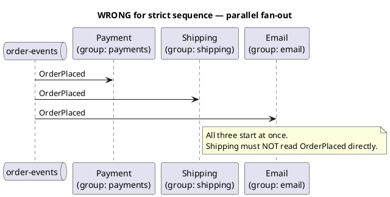
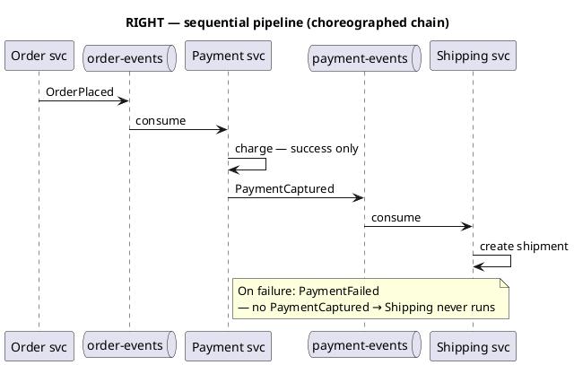
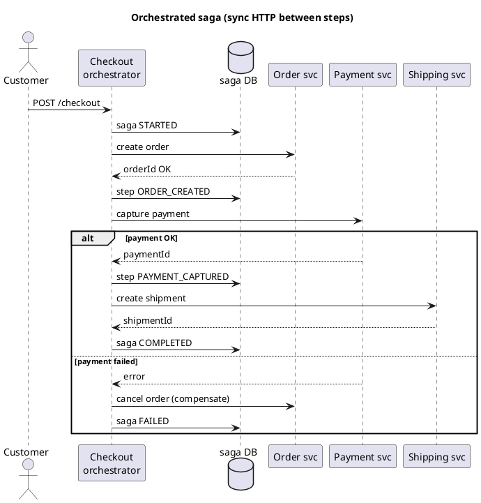
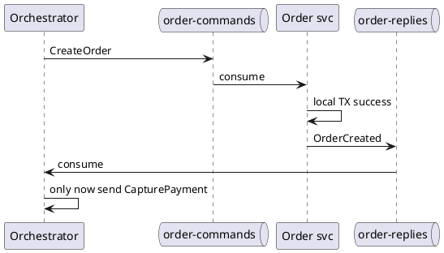
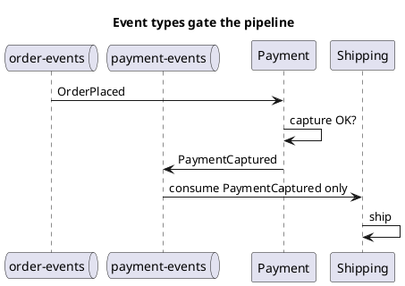
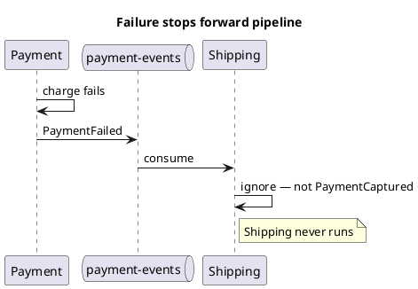

Kafka — sequential pipelines & sagas
**Multiple consumer groups on one topic** means **parallel** reactions to the **same** event — payment, email, and search all start when `OrderPlaced` lands. That is **not** “run B only after A succeeds.”

For **strict sequence** — step 2 starts only after step 1 **completes successfully** — use a **pipeline** or **saga**: either a central **orchestrator**, or a **chain** where each service publishes the **next** event only on success.

Previous: [Patterns & integration](vi-patterns-and-integration.md). Theory: [Checkout saga](../sysdesign/examples/ii-ecommerce-checkout-saga.md), [Distributed transactions](../sysdesign/scalable-patterns/vii-distributed-transactions.md).

## 1. Parallel vs sequential (do not confuse)





| Goal | Pattern |
|------|---------|
| **Same event, many independent handlers** | One topic, **different consumer groups** ([Part V](v-consumer-groups-and-delivery.md)) |
| **A → B → C, success only** | **Pipeline topics** or **orchestrator** (this note) |

## 2. Three ways to implement sequence

| Approach | How sequence is enforced | Best when |
|----------|--------------------------|-----------|
| **A — Orchestrator** | One service owns state machine; calls participants (HTTP) or sends **commands** in order | Clear workflow, compensations, visibility |
| **B — Choreographed chain** | Each service consumes **previous** event; publishes **next** only on success | Loosely coupled; team owns one step |
| **C — Single worker** | One consumer processes all stages in code | Prototypes only — no independent scaling |

**Do not** put payment, shipping, and inventory in **different groups on `order-events`** and expect order — they run in parallel.

## 3. Approach A — Orchestrator (recommended for strict control)

A **Checkout / workflow service** stores saga state and drives steps. Participants do not call each other.



Kafka optional: orchestrator publishes **domain events** for **observers** (email, analytics) **after** saga completes — those use parallel groups on `checkout-completed`, not on the critical path.

Full example: [E-commerce checkout saga](../sysdesign/examples/ii-ecommerce-checkout-saga.md).

### Orchestrator with Kafka commands (async sequence)

Same logic, async handoff — **one consumer group per command topic**, orchestrator consumes **replies**:

```text
Topics:
  checkout-commands     → orchestrator produces: StartCheckout, CompensatePayment
  order-commands        → order svc consumes
  order-replies         → orchestrator consumes: OrderCreated | OrderFailed
  payment-commands      → payment svc consumes
  payment-replies       → orchestrator consumes
```



**Rule:** orchestrator advances state **only** on success reply; on failure, run **compensations** and stop the forward chain.

## 4. Approach B — Choreographed chain (Kafka-native pipeline)

Each stage has **one job** and publishes to the **next topic** only after its work succeeds.

```text
order-events          payment-events         shipping-events
OrderPlaced    →      PaymentCaptured   →    ShipmentCreated
     │                      │
     └── PaymentFailed (terminal / compensate)
```

### Payment service — publish next step only on success

```java
@Component
public class PaymentPipelineListener {

  private final PaymentService payments;
  private final KafkaTemplate<String, String> kafka;

  @KafkaListener(topics = "order-events", groupId = "payment-pipeline")
  @Transactional
  public void onOrderPlaced(ConsumerRecord<String, String> record) {
    OrderPlaced e = parse(record.value());
    if (alreadyProcessed(e.eventId())) return;

    try {
      PaymentResult result = payments.capture(e.orderId(), e.totalCents());
      markProcessed(e.eventId());

      // SUCCESS → unlock next stage
      kafka.send("payment-events", e.orderId(), json(new PaymentCaptured(
          e.eventId(), e.orderId(), result.paymentId()
      )));
    } catch (PaymentException ex) {
      markProcessed(e.eventId());  // or separate idempotency key
      // FAILURE → do NOT publish PaymentCaptured
      kafka.send("payment-events", e.orderId(), json(new PaymentFailed(
          e.eventId(), e.orderId(), ex.getMessage()
      )));
      // optional: trigger compensation consumer on payment-failures topic
    }
  }
}
```

### Shipping service — listens to **payment-events**, not order-events

```java
@KafkaListener(topics = "payment-events", groupId = "shipping-pipeline")
public void onPaymentEvent(ConsumerRecord<String, String> record) {
  DomainEvent e = parse(record.value());
  if (e instanceof PaymentFailed) return;  // stop — previous step did not succeed
  if (!(e instanceof PaymentCaptured captured)) return;

  shipping.createShipment(captured.orderId());  // idempotent
}
```



| Topic | Who produces | Who consumes (forward path) |
|-------|--------------|----------------------------|
| `order-events` | Order API | Payment pipeline only |
| `payment-events` | Payment (after success/fail) | Shipping (success types only), notifications (fail) |
| `shipping-events` | Shipping | Fulfillment, email |

**Ordering:** use **partition key** = `orderId` on every message so all steps for one order stay ordered on one partition.

## 5. Failure, retries, and “do not skip ahead”

| Situation | What to do |
|-----------|------------|
| **Transient error** (timeout) | Retry same consumer; idempotent handler |
| **Permanent failure** (card declined) | Publish **failure** event; **do not** publish success event for next stage |
| **Duplicate delivery** | Idempotency table keyed by `eventId` |
| **Partial success** (charged but DB not updated) | Reconcile job; design **idempotent** charge with idempotency key |



### Compensating transactions (saga rollback)

If shipping fails after payment succeeded, publish **`ShipmentFailed`** → **compensation consumer** refunds payment and cancels order. See [Checkout saga § compensations](../sysdesign/examples/ii-ecommerce-checkout-saga.md).

## 6. Spring Kafka — retries without skipping the chain

```java
@KafkaListener(topics = "order-events", groupId = "payment-pipeline")
@RetryableTopic(
    attempts = "4",
    backoff = @Backoff(delay = 1000, multiplier = 2),
    dltStrategy = DltStrategy.FAIL_ON_ERROR
)
public void onOrderPlaced(OrderPlaced e) {
  payments.capture(e);  // throws → retry; after exhaustion → DLT, no PaymentCaptured
}
```

**DLT** = poison or exhausted retries — human fix; **no** automatic advance to shipping.

## 7. Anti-patterns

| Anti-pattern | Why it breaks sequence |
|--------------|------------------------|
| Payment + Shipping both on `order-events`, different groups | Parallel start |
| Shipping consumes `OrderPlaced` | Runs before payment |
| Publish `PaymentCaptured` before DB commit | Next step runs on ghost success |
| No failure event type | Downstream cannot distinguish skip vs lag |

## 8. Quick decision guide

```text
Need strict A → B → C with rollback?
  ├── Few services, need visibility     → Orchestrator (HTTP or command/reply topics)
  ├── Teams own one step each           → Choreographed chain (separate topics + event types)
  └── Same event to many side effects   → Parallel consumer groups (not the pipeline)

Need synchronous answer to user?
  └── HTTP orchestrator or workflow engine (Temporal, Camunda) — Kafka for async tail
```

Related: [Workflow engine checkout](../sysdesign/examples/x-ecommerce-checkout-workflow-engine.md).

## Track complete

Return to [Kafka overview](i-overview.md) or [Consumer groups](v-consumer-groups-and-delivery.md) for parallel fan-out.
