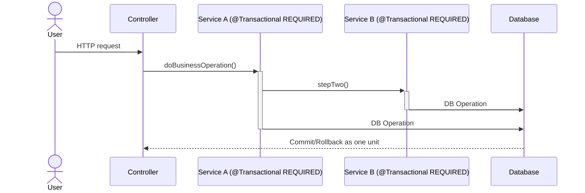
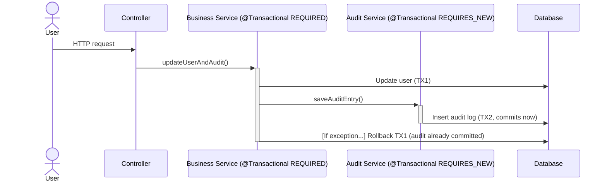

Spring Boot — Part V
Map tables with JPA entities, reduce boilerplate via **`JpaRepository`**, and place **`@Transactional`** where business boundaries belong.

## 1. Entity basics (Jakarta Persistence)
```java
// Compile: javac --release 22 …
package com.example.demo.domain;

import jakarta.persistence.*;
import java.util.UUID;

@Entity
@Table(name = "orders")
public class OrderEntity {

  @Id
  @GeneratedValue
  private UUID id;

  @Column(nullable = false, length = 120)
  private String customerEmail;

  @Enumerated(EnumType.STRING)
  @Column(nullable = false, length = 32)
  private OrderStatus status;

  protected OrderEntity() {} // JPA

  public OrderEntity(String customerEmail, OrderStatus status) {
    this.customerEmail = customerEmail;
    this.status = status;
  }

  public UUID getId() {
    return id;
  }

  public OrderStatus getStatus() {
    return status;
  }

  public void markPaid() {
    this.status = OrderStatus.PAID;
  }
}

enum OrderStatus {
  NEW,
  PAID,
  CANCELLED
}
```

**`ddl-auto`** (`validate`, `update`, `none`) belongs in YAML — **`none`** + migrations (Flyway/Liquibase) is typical in production.

## 2. Repository interface
Spring Data JPA implements the interface at runtime:

```java
// Compile: javac --release 22 …
package com.example.demo.persistence;

import com.example.demo.domain.OrderEntity;
import com.example.demo.domain.OrderStatus;
import java.util.List;
import java.util.UUID;
import org.springframework.data.jpa.repository.JpaRepository;

public interface OrderRepository extends JpaRepository<OrderEntity, UUID> {

  List<OrderEntity> findByStatus(OrderStatus status);
}
```

Derived query methods (`findBy…`) translate to JPQL — keep them readable; complex reporting queries often belong in **`@Query`** or native SQL.

## 3. Service-layer transactions
Put **`@Transactional`** on **use-case** methods so one call ≡ one business transaction:

```java
// Compile: javac --release 22 …
package com.example.demo.service;

import com.example.demo.domain.OrderEntity;
import com.example.demo.domain.OrderStatus;
import com.example.demo.persistence.OrderRepository;
import java.util.UUID;
import org.springframework.stereotype.Service;
import org.springframework.transaction.annotation.Transactional;

@Service
public class OrderService {

  private final OrderRepository orders;

  public OrderService(OrderRepository orders) {
    this.orders = orders;
  }

  @Transactional(readOnly = true)
  public OrderEntity get(UUID id) {
    return orders.findById(id).orElseThrow(() -> new IllegalArgumentException("unknown order"));
  }

  @Transactional
  public OrderEntity placeOrder(String email) {
    OrderEntity o = new OrderEntity(email, OrderStatus.NEW);
    return orders.save(o);
  }

  @Transactional
  public void markPaid(UUID id) {
    OrderEntity o = get(id);
    o.markPaid(); // dirty checking persists at flush/commit
  }
}
```

## 4. Rollback behavior
- **Unchecked** exceptions (`RuntimeException` subclasses) → rollback **by default**.
- **Checked** exceptions → **commit** unless you set **`rollbackFor`**:

```java
// Compile: javac --release 22 …
@Transactional(rollbackFor = Exception.class)
public void importOrders(InputStream csv) throws IOException {
  // IOException now triggers rollback
}
```

## 5. Propagation patterns & rollbacks: When to use REQUIRES_NEW?

| Value                     | Typical use                                                                              |
|---------------------------|------------------------------------------------------------------------------------------|
| **`REQUIRED`** (default)  | Join caller’s transaction or start a new one; most business logic and data operations    |
| **`REQUIRES_NEW`**        | Always starts a new tx — useful for audit logging or side records that **must persist** even if the outer transaction rolls back (e.g., you want an audit trail of attempted changes, including failed ones) |
| **`NOT_SUPPORTED`**       | Suspend tx — unusual; sometimes needed for integrations that fail inside a transaction   |

**Best practice:**  
- For almost all business/service/database methods, stick with the default (**`REQUIRED`**).
- Use **`REQUIRES_NEW`** **sparingly** — mostly for *secondary actions* like audit or notification events that should be saved independently, regardless of whether the main transaction commits or rolls back.
- **Rollback:** By default, Spring only rolls back on unchecked exceptions inside any transaction (including `REQUIRES_NEW`). You rarely want your audit log to roll back just because the business operation failed — **that’s the main use for `REQUIRES_NEW`**.

**Example:** Audit entries should usually be saved with `REQUIRES_NEW` to guarantee persistence, even if the original business transaction fails and rolls back.

### Pitfall: Full rollback with multiple service calls

If your controller coordinates several service calls and you want **all** of them to roll back as a unit if any one fails (i.e., you want *atomicity*), make sure:
- The controller method itself is annotated with `@Transactional` *or*
- There is a service "orchestrator" method annotated with `@Transactional` that invokes all needed services

**Why?**  
If each service runs in its own transaction (e.g., each has `REQUIRES_NEW`, or you don't have a shared transaction at the top), you can’t roll back **everything** if something fails—some changes may persist even when others fail.

**Best practice for full rollback:**  
- Ensure a single outer transaction covers all needed service calls (`REQUIRED`, the default), and only use `REQUIRES_NEW` for actions that *must* commit regardless of outcome.

**Example:**
```java
// All-or-nothing flow: a rollback in one service undoes all changes
@Transactional  // at controller or service orchestrator level
public void placeOrderAndSendInvoice(...) {
  orderService.placeOrder(...);   // runs in shared tx
  invoiceService.sendInvoice(...); // runs in same tx
  // if any throws, all is rolled back
}
```

**Avoid:**  
Using `REQUIRES_NEW` on main service methods when you want truly atomic multi-step operations. `REQUIRES_NEW` isolates transactions and prevents full rollback.

```java
// Compile: javac --release 22 …

// Example 1: Service method with default REQUIRED propagation calling another REQUIRED transactional method.
// Both participate in the same transaction. If an exception is thrown and not handled inside either, the entire transaction is rolled back.
@Transactional  // default is Propagation.REQUIRED
public void doBusinessOperation() {
  serviceA.stepOne();           // @Transactional(REQUIRED)
  serviceB.stepTwo();           // @Transactional(REQUIRED)
  // If either step throws (and isn't caught), everything rolls back: one transaction for all.
}

// Example 2: Outer @Transactional(REQUIRED) calls inner @Transactional(REQUIRES_NEW). 
// The inner REQUIRES_NEW method runs in a separate transaction, which commits or rolls back independently of the outer transaction.
@Transactional  // default REQUIRED
public void updateUserAndAudit(String user) {
  userService.updateUser(user);       // runs in the current transaction
  auditService.saveAuditEntry("edit"); // runs in a new, independent transaction
  // If updateUser fails & throws, user changes roll back—BUT audit log may still be committed!
}

@Transactional(propagation = Propagation.REQUIRES_NEW)
public void saveAuditEntry(String action) {
  // commits even if outer business tx rolls back (when exceptions handled carefully)
}
```

Notes for clarity:
- If you call a @Transactional method in another service, and both use Propagation.REQUIRED (the default), the callee joins the caller's transaction—commit or rollback affects both together.
- If the inner method uses Propagation.REQUIRES_NEW, it suspends the caller's transaction and uses its own, committing changes regardless of what happens to the outer transaction (unless an unhandled exception in the audit method itself causes it to roll back).
- This behavior allows you to, for example, persist an audit event even if the main business operation fails and is rolled back.

**Mermaid sequence diagrams:**

<details>
<summary>REQUIRED &rarr; REQUIRED (Single Transaction)</summary>


</details>

<details>
<summary>REQUIRED &rarr; REQUIRES_NEW (Nested, Independent Transactions)</summary>


</details>

## 6. Pitfalls
- **`@Transactional`** uses Spring AOP (Aspect-Oriented Programming) proxies to manage transactions. These proxies only work on public methods called from outside the class. If you put **`@Transactional`** on a **`private`** method or you call a transactional method from within the same class (like `this.markPaid()`), the proxy is bypassed, so the transaction won't start as expected.

  - **AOP proxies**
    - They are Spring's way of adding extra behavior (like starting or committing a transaction) "around" your code, typically by wrapping your beans.
  - **Self-invocation**
    - When a method in the class calls another method in the same class using `this` the call doesn't go through the proxy, the transactional logic doesn't kick in.
  - To ensure transactions work, put `@Transactional` on **public methods** and call them from other beans (services, controllers), not from inside the same bean.
  - **Keep boundaries coarse**
    - Try to annotate larger, public business methods with `@Transactional`, not lots of tiny methods. This results in fewer, clearer transaction boundaries and less confusion about where a transaction actually starts and ends.
- **`readOnly = true`** hints Hibernate/JDBC drivers for optimizations — pair with **`@Transactional`** on query-heavy service methods.
