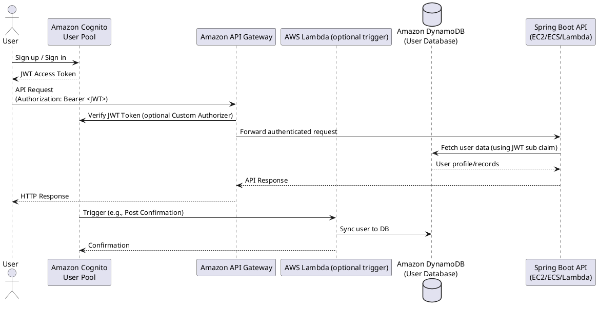

Spring Boot — Security basics
Add **Spring Security** to protect HTTP endpoints, expose a minimal login or JWT flow, and lock down Actuator in production.

**Java baseline:** **Java SE 22** (`javac --release 22`); examples target **Spring Boot 3.x**.

## 1. Dependency

**Maven:**

```xml
<dependency>
  <groupId>org.springframework.boot</groupId>
  <artifactId>spring-boot-starter-security</artifactId>
</dependency>
```

**Gradle (`build.gradle.kts`):**

```kotlin
dependencies {
  implementation("org.springframework.boot:spring-boot-starter-security")
}
```

Boot auto-configures a **filter chain** when this starter is on the classpath — every request passes through it before your controller runs.

## 2. Stateless API with JWT (sketch)

For REST APIs, prefer **stateless** sessions: validate a bearer token on each request.

```java
// Compile: javac --release 22 …
package com.example.demo.config;

import org.springframework.context.annotation.Bean;
import org.springframework.context.annotation.Configuration;
import org.springframework.security.config.Customizer;
import org.springframework.security.config.annotation.web.builders.HttpSecurity;
import org.springframework.security.config.http.SessionCreationPolicy;
import org.springframework.security.web.SecurityFilterChain;

@Configuration
public class SecurityConfig {

  @Bean
  SecurityFilterChain api(HttpSecurity http) throws Exception {
    return http
        .csrf(csrf -> csrf.disable()) // common for pure JSON APIs; revisit if you use cookies
        .sessionManagement(sm -> sm.sessionCreationPolicy(SessionCreationPolicy.STATELESS))
        .authorizeHttpRequests(auth -> auth
            .requestMatchers("/actuator/health").permitAll()
            .requestMatchers("/api/public/**").permitAll()
            .anyRequest().authenticated())
        .oauth2ResourceServer(oauth2 -> oauth2.jwt(Customizer.withDefaults()))
        .build();
  }
}
```

- **`oauth2ResourceServer().jwt()`** validates JWTs when **`spring-boot-starter-oauth2-resource-server`** is present and **`spring.security.oauth2.resourceserver.jwt.issuer-uri`** (or JWK set) is configured.
- Issue tokens with your IdP (e.g., AWS Cognito, Auth0, Keycloak, or Google Cloud Identity Platform) or a dedicated auth service. 
- **AWS Example:** With **AWS Cognito**, users authenticate via Cognito's hosted UI or a custom UI, and Cognito issues JWT access tokens. In Spring Boot, set `spring.security.oauth2.resourceserver.jwt.issuer-uri` to your Cognito user pool's issuer URL (like `https://cognito-idp.{region}.amazonaws.com/{userPoolId}`) to enable JWT validation. You can also use **AWS API Gateway** to validate Cognito tokens and forward only authenticated requests to your backend service.



How do I connect Cognito to my user database list?
- **Option 1:** Use Cognito's built-in user pool to manage users (Cognito stores and manages all accounts).
  - *Pros:* No infrastructure or sync to maintain; easy integration with AWS ecosystem; managed security and scaling.
  - *Cons:* Vendor lock-in (migrating users out can be difficult and may require data export/egress costs); limited customization for attributes/storage; users live only in Cognito.
- **Option 2:** Sync users with your custom user database (e.g., DynamoDB, RDS) using Cognito Triggers (AWS Lambda functions).
  - *Pros:* Full control over user records; easy integration with custom logic or legacy systems; can use AWS managed databases.
  - *Cons:* Adds operational complexity (must maintain triggers and handle sync edge cases); still some vendor lock-in via triggers; data egress cost if migrating large datasets outside AWS; potential for out-of-sync states.
- **Option 3:** Use Cognito federation to external identity providers (Google, SAML, etc.).
  - *Pros:* Your app supports multiple login providers; avoids storing passwords in Cognito; users stay in their provider's database.
  - *Cons:* Complexity in managing multiple IdPs and attribute mapping; risk of vendor lock-in to AWS federation patterns; user profile sync may require extra handling.

**Summary:**  
For simple projects inside AWS, Cognito User Pools are easy and safe. Custom databases (via triggers) offer more freedom with extra work, but create risks of lock-in or data egress costs. Federated logins support bring-your-own-identity but can tie your solution to AWS if not carefully architected.
When building for long-term or multi-cloud flexibility, consider the impact of data migration, possible costs to extract user records, and dependency on AWS-specific features.
  
If your service needs to look up user records, use the `sub` (subject) claim in the JWT token from Cognito as the unique user identifier to query your user database.
- **Google Cloud Example:** With **Google Cloud Identity Platform** or **Firebase Authentication**, Google issues JWTs (ID or access tokens) after users log in. Set your Spring Boot application's `issuer-uri` to your Identity Platform's issuer (e.g., `https://securetoken.google.com/{project-id}` for Firebase) to validate these tokens. You can optionally use **Google Cloud Endpoints** to perform JWT validation before requests reach your service.
- In this pattern, Spring Boot focuses on **validating** JWTs, not minting them.

## 3. Development-only HTTP Basic

For local demos without an IdP, an in-memory user is enough — **never** ship hard-coded passwords:

```java
// Compile: javac --release 22 …
import org.springframework.context.annotation.Bean;
import org.springframework.context.annotation.Configuration;
import org.springframework.context.annotation.Profile;
import org.springframework.security.config.Customizer;
import org.springframework.security.config.annotation.web.builders.HttpSecurity;
import org.springframework.security.core.userdetails.User;
import org.springframework.security.core.userdetails.UserDetailsService;
import org.springframework.security.provisioning.InMemoryUserDetailsManager;
import org.springframework.security.web.SecurityFilterChain;

@Configuration
@Profile("dev")
class DevSecurityConfig {

  @Bean
  SecurityFilterChain devChain(HttpSecurity http) throws Exception {
    return http
        .authorizeHttpRequests(auth -> auth.anyRequest().authenticated())
        .httpBasic(Customizer.withDefaults())
        .build();
  }

  @Bean
  UserDetailsService users() {
    return new InMemoryUserDetailsManager(
        User.withUsername("dev").password("{noop}dev").roles("USER").build());
  }
}
```

**`{noop}`** is a password prefix for the delegating encoder — acceptable only in **`dev`** profiles.

## 4. Method-level authorization

After authentication, restrict by role on service methods:

```java
// Compile: javac --release 22 …
import org.springframework.security.access.prepost.PreAuthorize;
import org.springframework.stereotype.Service;

@Service
public class AdminService {

  @PreAuthorize("hasRole('ADMIN')")
  public void purgeStaleData() {
    // ...
  }
}
```

Enable with **`@EnableMethodSecurity`** on a **`@Configuration`** class.

## 5. Production checklist

| Risk | Mitigation |
|------|------------|
| Open **`/actuator/env`** or **`prometheus`** | Restrict with Security + network policy — see **Part VI (Testing & operations)** |
| CSRF on cookie sessions | Keep CSRF enabled for browser forms; disable only for token APIs by design |
| Secrets in **`application.yml`** | Env vars / secret manager — see **Part II (YAML & external config)** |
| Missing HTTPS | Terminate TLS at ingress or embedded connector in prod |

## 6. Related notes

- **REST controllers** — [REST controllers](iv-rest-controllers.md) (validation, Problem Details)
- **YAML & profiles** — [YAML & external config](ii-yaml-and-external-config.md)
- **Testing** — use **`@SpringBootTest`** + **`@AutoConfigureMockMvc`** with **`@WithMockUser`** or test JWT fixtures; **`@WebMvcTest`** alone does not load the full security chain unless configured. See [Testing & operations](vi-testing-and-operations.md) for details.
