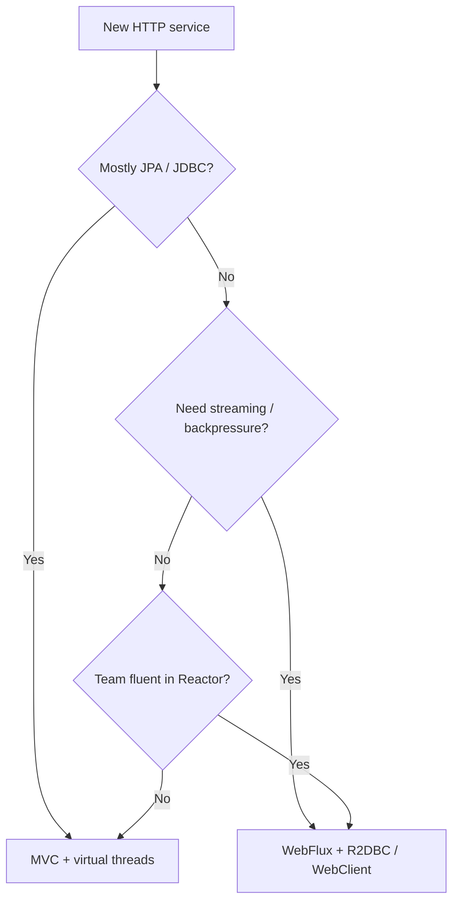

Spring Boot — Part XII: WebFlux & reactive APIs
Build **non-blocking** HTTP services on **Project Reactor** (`Mono`, `Flux`) with the embedded **Netty** server — an alternative to servlet **MVC** + Tomcat.

**Java baseline:** **Java SE 17+** (Boot 3.x minimum); examples use **Java SE 22** (`javac --release 22`) and **Spring Boot 3.x**. Blocking REST with **`@RestController`** is [REST controllers](iv-rest-controllers.md); scaling blocking code with **virtual threads** is [Virtual threads](xi-virtual-threads.md).

## 1. MVC vs WebFlux

| | **Spring MVC** (`starter-web`) | **WebFlux** (`starter-webflux`) |
|--|-------------------------------|--------------------------------|
| **Server** | Tomcat, Jetty, Undertow (Servlet) | **Netty** by default (reactive) |
| **Controller style** | Blocking methods, `List`, `ResponseEntity` | **`Mono<T>`**, **`Flux<T>`** return types |
| **Thread model** | One thread per request (or virtual thread) | Small event-loop + worker pool; **no thread per request** |
| **Typical data access** | **JDBC**, JPA (`starter-data-jpa`) | **R2DBC**, reactive drivers, `WebClient` |
| **Mental model** | Call stack blocks until DB/HTTP returns | Compose **publishers**; I/O resumes on completion |

WebFlux is **not** “MVC but faster by default.” It pays off when the **whole stack** can stay non-blocking — HTTP in, reactive client/DB out. 

A `Mono` or `Flux` **must not wrap blocking code** like **JDBC queries**; doing so just blocks a worker thread and loses WebFlux's benefits.  
**Examples of blocking JDBC calls** (these always block, even if "read-only"):
- `jdbcTemplate.query("SELECT ...")`
- `Statement.executeQuery()`, `PreparedStatement.executeUpdate()`
- Any JDBC call that reads/writes to a relational DB (MySQL, Postgres)  
These all wait for the DB/network and block the thread.

By contrast, non-blocking options are:
- **R2DBC** (`r2dbc-postgresql`, `r2dbc-mysql`): native async drivers for SQL DBs
- **Reactive MongoDB** or Cassandra drivers
- `WebClient` for non-blocking HTTP

**Example: Non-blocking DB and HTTP access**

```java
import org.springframework.web.bind.annotation.*;
import reactor.core.publisher.Mono;
import org.springframework.web.reactive.function.client.WebClient;
import org.springframework.r2dbc.core.DatabaseClient;

@RestController
public class ExampleController {
    private final DatabaseClient db;
    private final WebClient webClient = WebClient.create();

    public ExampleController(DatabaseClient db) {
        this.db = db;
    }

    @GetMapping("/customer/{id}")
    public Mono<Customer> getCustomer(@PathVariable Long id) {
        // Non-blocking R2DBC query
        return db.sql("SELECT id, name FROM customers WHERE id = :id")
                 .bind("id", id)
                 .map((row, meta) -> new Customer(row.get("id", Long.class), row.get("name", String.class)))
                 .one();
    }

    @GetMapping("/proxy/{userId}")
    public Mono<String> proxyCall(@PathVariable String userId) {
        // Non-blocking HTTP call with WebClient
        return webClient
            .get()
            .uri("https://api.example.com/users/{id}", userId)
            .retrieve()
            .bodyToMono(String.class);
    }
}

record Customer(Long id, String name) {}
```

**Principle:** In WebFlux, every I/O path (DB, HTTP) must be non-blocking to truly scale. If you need to call blocking code, consider standard MVC or isolate it on a bounded thread pool using `Schedulers.boundedElastic()`, but this is a workaround, not the intended reactive model.

## 2. When to choose WebFlux

| Choose **WebFlux** | Stay on **MVC** (± virtual threads) |
|--------------------|--------------------------------------|
| Streaming / SSE / NDJSON with **backpressure** | CRUD REST + **JPA** + familiar stack |
| Very high **concurrent connections**, mostly waiting on I/O | Team knows blocking code; libraries are JDBC/`javax`/`jakarta` blocking |
| Gateway / BFF calling other services via **`WebClient`** only | Heavy use of **`@Transactional`** JPA in-request |
| Greenfield on **R2DBC** or reactive Mongo/Cassandra | Mixed ecosystem — most Java libs are still blocking |

**Default for new Boot apps in this course:** **MVC** (+ **virtual threads** on 3.2+ if you need concurrency). Reach for WebFlux when you have a **clear reactive** requirement, not because MVC “doesn’t scale.”

## 3. Dependency & runtime

**Maven:**

```xml
<dependency>
  <groupId>org.springframework.boot</groupId>
  <artifactId>spring-boot-starter-webflux</artifactId>
</dependency>
```

**Gradle (`build.gradle.kts`):**

```kotlin
dependencies {
  implementation("org.springframework.boot:spring-boot-starter-webflux")
}
```

Do **not** add **`spring-boot-starter-web`** on the same classpath unless you know you need **both** stacks (see §8). Boot picks **Netty** as the reactive server.

Reactive core types come from **Reactor**:

- **`Mono<T>`** — 0 or 1 item (single JSON object, `void` delete)
- **`Flux<T>`** — 0..N items (streams, lists, server-sent events)

## 4. Reactive controller

Same mapping annotations as MVC; return types are publishers:

```java
// Compile: javac --release 22 …
package com.example.demo.web;

import com.example.demo.service.CustomerService;
import jakarta.validation.Valid;
import java.util.UUID;
import org.springframework.http.HttpStatus;
import org.springframework.web.bind.annotation.*;
import reactor.core.publisher.Flux;
import reactor.core.publisher.Mono;

@RestController
@RequestMapping("/api/customers")
public class CustomerController {

  private final CustomerService customers;

  public CustomerController(CustomerService customers) {
    this.customers = customers;
  }

  @GetMapping("/{id}")
  public Mono<CustomerResponse> get(@PathVariable UUID id) {
    return customers.findById(id);
  }

  @GetMapping
  public Flux<CustomerResponse> search(@RequestParam(required = false) String q) {
    return customers.search(q == null ? "" : q);
  }

  @PostMapping
  @ResponseStatus(HttpStatus.CREATED)
  public Mono<CustomerResponse> create(@Valid @RequestBody Mono<CreateCustomerRequest> body) {
    return body.flatMap(customers::register);
  }

  @DeleteMapping("/{id}")
  public Mono<Void> delete(@PathVariable UUID id) {
    return customers.deleteIfExists(id);
  }
}

public record CreateCustomerRequest(String name, String email) {}
public record CustomerResponse(UUID id, String name, String email) {}
```

- **`@Valid @RequestBody Mono<…>`** — validate after the body is parsed into the publisher.
- Status codes: **`@ResponseStatus`**, **`ServerResponse`** in router style, or **`Mono<ResponseEntity<T>>`** when you need dynamic status.

### Streaming example (SSE-style)

```java
// Compile: javac --release 22 …
@GetMapping(value = "/events", produces = MediaType.TEXT_EVENT_STREAM_VALUE)
public Flux<ServerSentEvent<String>> events() {
  return Flux.interval(Duration.ofSeconds(1))
      .map(i -> ServerSentEvent.<String>builder().data("tick-" + i).build())
      .take(10);
}
```

**Backpressure:** slow clients slow the stream; Reactor propagates demand — a key reason to pick WebFlux over “block in a loop” MVC.

## 5. `WebClient` (reactive HTTP client)

Use **`WebClient`** instead of blocking **`RestTemplate`** / **`RestClient`** in reactive services:

```java
// Compile: javac --release 22 …
package com.example.demo.service;

import org.springframework.stereotype.Service;
import org.springframework.web.reactive.function.client.WebClient;
import reactor.core.publisher.Mono;

@Service
public class InventoryClient {

  private final WebClient http;

  public InventoryClient(WebClient.Builder builder) {
    this.http = builder.baseUrl("https://inventory.internal").build();
  }

  public Mono<StockDto> fetchStock(String sku) {
    return http.get()
        .uri("/api/stock/{sku}", sku)
        .retrieve()
        .bodyToMono(StockDto.class);
  }
}

public record StockDto(String sku, int quantity) {}
```

Compose multiple calls without blocking threads:

```java
public Mono<OrderDetailsDto> load(UUID orderId) {
  Mono<OrderDto> order = orders.findById(orderId);
  return order.flatMap(o ->
      inventory.fetchStock(o.sku())
          .zipWith(tracking.fetch(o.id()))
          .map(t -> OrderDetailsDto.from(o, t.getT1(), t.getT2())));
}
```

## 6. Data layer: not JPA

**`spring-boot-starter-data-jpa`** is **blocking**. In a WebFlux app, typical choices:

| Store | Starter / API |
|-------|----------------|
| **PostgreSQL, MySQL, …** | **`spring-boot-starter-data-r2dbc`** + **`R2dbcRepository`** |
| **MongoDB** | **`spring-boot-starter-data-mongodb-reactive`** |
| **Redis** | **`spring-boot-starter-data-redis-reactive`** |

```java
// Compile: javac --release 22 …
public interface CustomerRepository extends R2dbcRepository<CustomerEntity, UUID> {

  Flux<CustomerEntity> findByNameContainingIgnoreCase(String name);
}
```

Transactions: **`TransactionalOperator`** (reactive) or explicit `databaseClient.inTransaction()` — not **`@Transactional`** on blocking JPA repos. For complex domain logic that needs JPA, **MVC + virtual threads** is usually simpler.

## 7. Router functions (optional style)

Functional routing instead of annotated controllers:

```java
// Compile: javac --release 22 …
@Configuration
public class CustomerRoutes {

  @Bean
  public RouterFunction<ServerResponse> routes(CustomerHandler handler) {
    return RouterFunctions.route()
        .GET("/api/customers/{id}", handler::get)
        .GET("/api/customers", handler::search)
        .POST("/api/customers", handler::create)
        .build();
  }
}
```

Same reactive contracts — pick annotations or routers; don’t mix styles without reason.

## 8. Pitfalls

- **Never block on the event loop:** no **`Thread.sleep`**, JDBC, or **`.block()`** / **`.blockOptional()`** in reactive chains (except tests). Offload rare blocking work with **`Schedulers.boundedElastic()`** — a escape hatch, not the default.
- **Don’t mix stacks casually:** **`starter-web` + `starter-webflux`** together runs **two** server stacks; use one primary model per service.
- **Debugging is harder:** stack traces span operators; logging needs **reactor-hooks** / context propagation for trace IDs.
- **Ecosystem gap:** many enterprise libs (SAML, legacy SDKs) are blocking — wrap at the edge or stay on MVC.
- **Testing:** use **`@WebFluxTest`** + **`WebTestClient`**, not **`MockMvc`**.

```java
// Compile: javac --release 22 …
@WebFluxTest(CustomerController.class)
class CustomerControllerTest {

  @Autowired WebTestClient client;
  @MockBean CustomerService customers;

  @Test
  void getReturns200() {
    UUID id = UUID.randomUUID();
    when(customers.findById(id)).thenReturn(Mono.just(new CustomerResponse(id, "Ada", "a@b.c")));

    client.get().uri("/api/customers/{id}", id)
        .exchange()
        .expectStatus().isOk()
        .expectBody()
        .jsonPath("$.name").isEqualTo("Ada");
  }
}
```

## 9. MVC + WebFlux decision summary



## 10. Related notes

- **Blocking REST** — [REST controllers](iv-rest-controllers.md)
- **Blocking JDBC & transactions** — [JPA & @Transactional](v-jpa-and-transactional.md)
- **Virtual threads (blocking scale-up)** — [Virtual threads](xi-virtual-threads.md)
- **YAML & profiles** — [YAML & external config](ii-yaml-and-external-config.md)
- **Security on reactive chains** — [Security basics & filter chain](x-security-basics-and-filter-chain.md)
