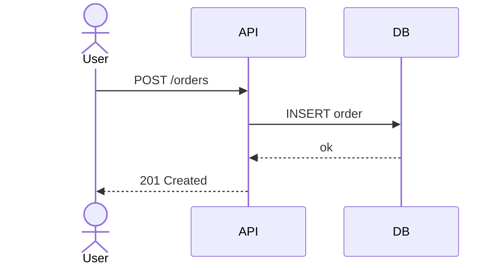

Mermaid — overview
**Mermaid** turns **text** into **diagrams** inside Markdown — flowcharts, sequence diagrams, class diagrams, state machines, ER models, Gantt charts, and more. Engineers use it in **READMEs**, **GitHub wikis**, **RFCs**, and **docs sites** because many viewers render it **natively** with no Java install or build step.

For system-design vocabulary (services, caches, queues), see [Core building blocks](../sysdesign/i-core-building-blocks.md). For Git workflow when diagrams live in repos, see [Git essentials](../git/essentials/i-overview.md).

## Map of this track

| Part | Focus |
|------|--------|
| **I — Overview** | What Mermaid is, diagram types, when to use it |
| **II — Install & toolchain** | GitHub preview, VS Code, CLI, live editor |
| **III — Sequence diagrams** | Actors, messages, alt/opt/loop, notes |
| **IV — Flowcharts & architecture** | Nodes, subgraphs, deployment-style layouts |
| **V — Class, state & ER** | Domain models, lifecycles, table relationships |
| **VI — Docs, repos & CI** | Markdown fences, modular files, `@mermaid-js/mermaid-cli` |

## Why text-based diagrams

| Benefit | What it means in practice |
|---------|---------------------------|
| **Diffable** | PRs show what changed in the architecture, not a binary PNG |
| **Zero build on GitHub** | Fenced ` ```mermaid ` blocks render in READMEs and issues |
| **Fast to edit** | Rename a service in one line instead of dragging boxes |
| **Portable** | Same source works in GitHub, Notion, MkDocs, Docusaurus, many wikis |
| **Composable** | Split large designs across files; include via docs build or copy |

## Diagram types engineers reach for

| Type | Keyword | Typical use |
|------|---------|-------------|
| **Flowchart** | `flowchart TD` / `LR` | Decision trees, pipelines, service deps |
| **Sequence** | `sequenceDiagram` | API flows, auth, retries, error paths |
| **Class** | `classDiagram` | Domain models, ORM sketches |
| **State** | `stateDiagram-v2` | Order status, job lifecycle |
| **ER** | `erDiagram` | Table relationships before migrations |
| **Gantt** | `gantt` | Release timelines, migration windows |
| **Git graph** | `gitGraph` | Branching strategy docs |

Mermaid also supports **mindmap**, **timeline**, **journey**, **pie**, and **C4** (via configuration) — this track focuses on types most common in **application and system design** docs.

## Mental model

```text
Markdown or .mmd source (text)
      ↓
Mermaid parser (JS) — browser, CLI, or docs plugin
      ↓
SVG (or PNG via CLI)
      ↓
Rendered inline in GitHub / static site / exported asset
```

| Piece | Role |
|-------|------|
| **Source** | Fenced block in `.md` or standalone `.mmd` file |
| **Mermaid engine** | Parses text, lays out shapes |
| **Renderer** | GitHub, VS Code preview, `@mermaid-js/mermaid-cli`, docs framework |

## Mermaid vs other options

| Tool | Strength | Trade-off |
|------|----------|-----------|
| **Mermaid** | Native GitHub rendering; low setup | Layout less tunable than canvas tools |
| **draw.io / Excalidraw** | Freeform whiteboarding | Binary or JSON canvas — harder to diff |
| **ASCII / SVG in notes** | Zero tooling | Manual layout for complex diagrams |

**Rule of thumb:** use **Mermaid** for README, RFC, and docs-site diagrams that should render with **no build step**.

## Minimal example

````markdown

````

Paste into a README — GitHub renders the sequence diagram on save.

## When Mermaid fits

| Good fit | Poor default |
|----------|--------------|
| README and RFC diagrams in GitHub | Pixel-perfect marketing diagrams |
| Quick flowcharts in a single Markdown file | Deep UML with many `alt`/`par` fragments and includes |
| Docs sites with Mermaid plugin | Diagrams that must match strict UML tooling exports |
| Onboarding sketches next to code | Auto-generated diagrams from live cloud inventory alone |

## Next

Continue with [Install & toolchain](ii-install-and-toolchain.md) to preview locally, export SVG, and pin versions in CI.
