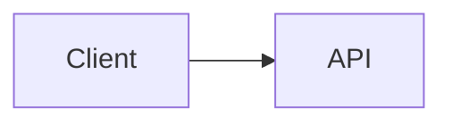

Mermaid — Part II
How to **preview** Mermaid in the editor, render with the **CLI**, use the **live editor**, and pin versions for **reproducible CI** output.

## 1. GitHub (zero install)

GitHub renders fenced Mermaid in:

| Surface | Support |
|---------|---------|
| **README.md** | Yes |
| **Issues / PR descriptions** | Yes |
| **Wiki pages** | Yes (when Mermaid enabled for the org/repo) |
| **`.md` in repo** | Preview tab in the web UI |

Syntax: wrap source in a fenced code block with language **`mermaid`**:

````markdown

````

No Java, no CLI — commit and push. For private repos, confirm org policy allows Mermaid rendering.

## 2. VS Code

Install **Markdown Preview Mermaid Support** (bierner.markdown-mermaid) or use built-in preview in recent VS Code builds with Mermaid enabled.

| Setting | Suggestion |
|---------|------------|
| **Markdown: Mermaid Theme** | `default`, `dark`, or `forest` — match your docs site |
| **Preview sync** | Open preview side-by-side while editing `.md` |

**Standalone `.mmd` files:** some extensions preview `.mmd` directly; others require wrapping in Markdown for preview.

## 3. Live editor (quick experiments)

[Mermaid Live Editor](https://mermaid.live) — paste source, tweak layout, export SVG/PNG, share permalink.

| Use | Caution |
|-----|---------|
| Prototype syntax before committing | Permalinks are public — no secrets or internal hostnames |
| Copy SVG into slides | Pin the Mermaid version if slides must stay stable |

## 4. CLI (`@mermaid-js/mermaid-cli`)

For **CI**, **static PNG/SVG assets**, or **validation** without a browser:

```bash
npm install -D @mermaid-js/mermaid-cli
npx mmdc -i docs/diagrams/checkout.mmd -o docs/diagrams/checkout.svg
npx mmdc -i docs/diagrams/ -o out/ -e svg
```

| Flag | Meaning |
|------|---------|
| **`-i`** | Input `.mmd` file or directory |
| **`-o`** | Output file or directory |
| **`-e svg`** / **`-e png`** | Output format |
| **`-c config.json`** | Theme, security level, font overrides |
| **`-p puppeteer-config.json`** | Headless Chrome args in CI |

Exit code **non-zero** on syntax errors — use in CI to block broken diagrams.

### Pin the CLI version

```json
{
  "devDependencies": {
    "@mermaid-js/mermaid-cli": "11.4.0"
  }
}
```

Lockfile + pinned version keeps CI and local renders aligned when Mermaid releases layout changes.

## 5. Project layout (suggested)

```text
docs/
  architecture/
    context.mmd
    sequences/
      checkout.mmd
      auth.mmd
  README.md          ← embeds or links to rendered SVG
out/
  diagrams/          ← gitignored OR committed for static sites
```

| Choice | When |
|--------|------|
| **Inline in `.md` only** | GitHub-native audience; smallest repo |
| **`.mmd` + inline include in docs build** | Docusaurus/MkDocs assemble pages |
| **`.mmd` + committed `.svg`** | Audiences without Mermaid renderer |
| **Split by scenario** | `checkout-happy.mmd`, `checkout-payment-fail.mmd` |

Mermaid has no first-class **`!include`** in core syntax — reuse fragments via:

- **Docs framework** includes (Docusaurus partials, MkDocs snippets)
- **Build script** that concatenates shared preamble (theme/init) before `mmdc`
- **Copy shared node IDs** in a `fragments/` folder and document the pattern

For large multi-file UML trees, prefer [PlantUML](../plantuml/vi-docs-repos-and-ci.md) `!include`.

## 6. Configuration file (optional)

`mermaid.config.json`:

```json
{
  "theme": "neutral",
  "flowchart": { "htmlLabels": true, "curve": "basis" },
  "sequence": { "mirrorActors": false }
}
```

Pass to CLI: `npx mmdc -i diagram.mmd -o diagram.svg -c mermaid.config.json`

## 7. Troubleshooting

| Symptom | Fix |
|---------|-----|
| **GitHub shows code block, not diagram** | Check fence is ` ```mermaid ` not ` ```markdown `; no typo in opening fence |
| **Parse error on `&` or `#`** | Quote labels or escape; avoid raw HTML in strict mode |
| **CLI fails in CI** | Install Chromium deps for Puppeteer; use official `mermaid-cli` Docker image |
| **Different output locally vs GitHub** | Pin `@mermaid-js/mermaid-cli` to match GitHub's Mermaid version (check GitHub changelog) |
| **Huge diagram clipped** | Split into subgraphs or multiple files |

## Next

Continue with [Sequence diagrams](iii-sequence-diagrams.md) — the most common diagram type for API and event flows.
