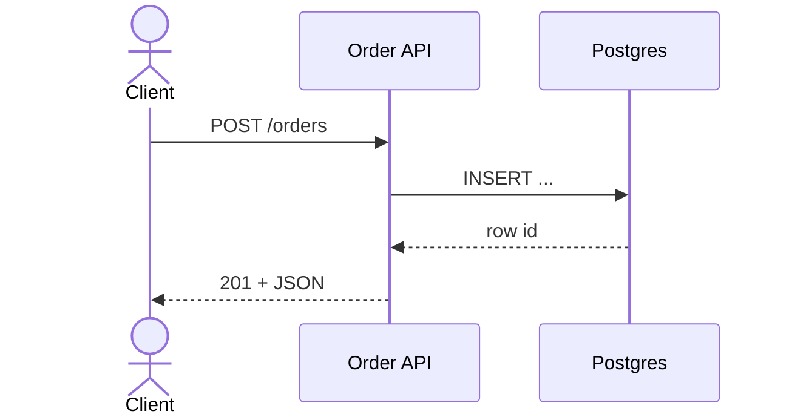
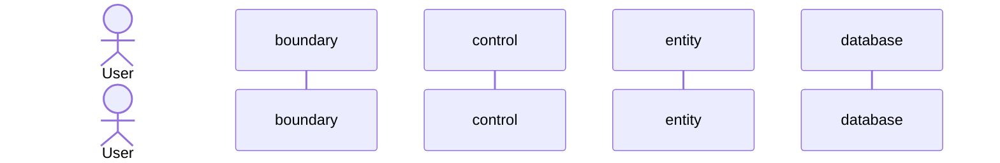
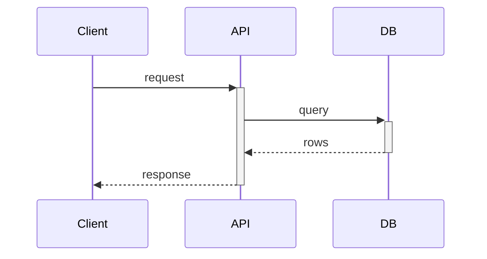
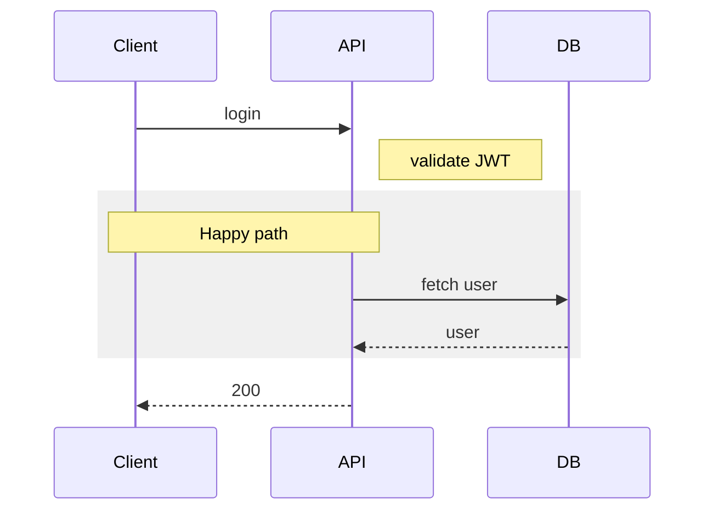
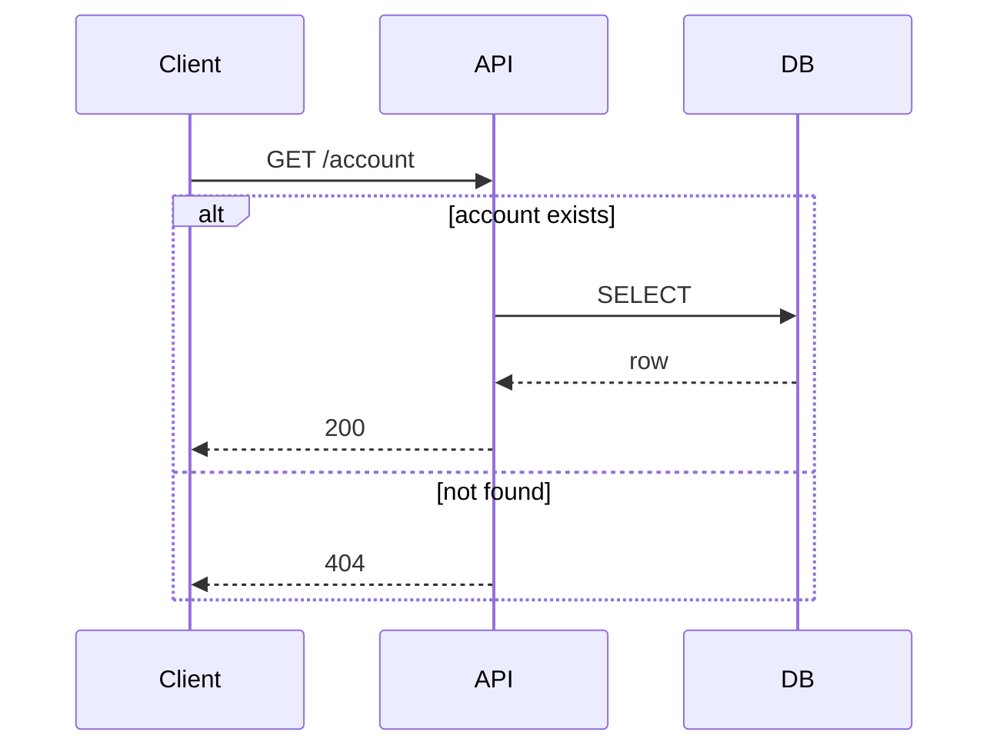
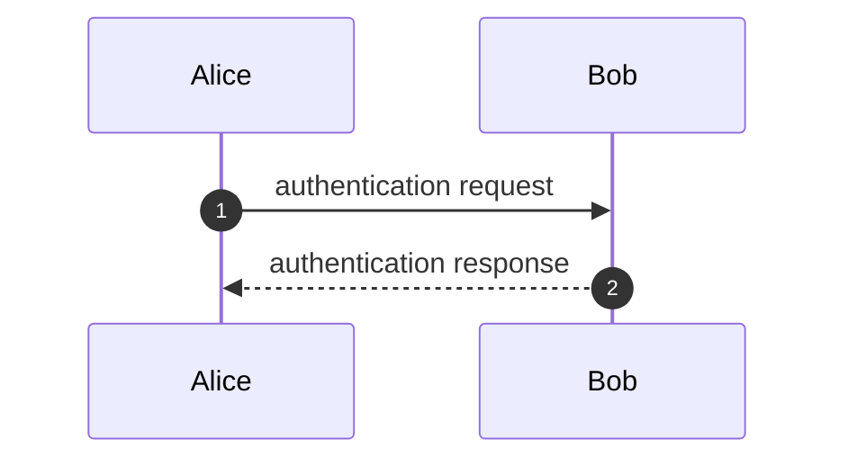
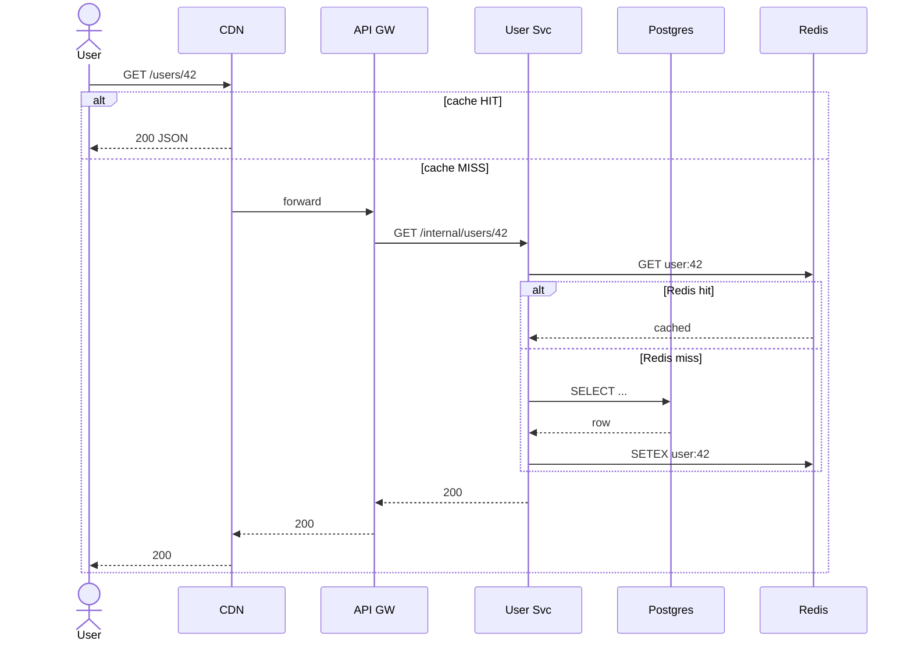

Mermaid — Part III
**Sequence diagrams** show **who talks to whom, in what order** — ideal for HTTP calls, queue handoffs, auth flows, and failure paths. They are the default choice in GitHub READMEs and design docs.

## 1. Basic syntax

| Arrow | Meaning |
|-------|---------|
| **`->>`** | Solid line — call / request |
| **`-->>`** | Dashed line — return / response |
| **`-x>>`** | Lost message (async failure style) |
| **`--x>>`** | Lost return |

Define participants once; alias with **`as`** for shorter references in messages.

## 2. Participant types

| Keyword | Use |
|---------|-----|
| **`actor`** | Human or external system (stick figure) |
| **`participant`** | Service, module, queue, cache |

Mermaid does not expose PlantUML's full stereotype set (`boundary`, `control`, `entity`) as separate shapes — use clear **aliases** and **notes** instead.

## 3. Activation bars

Append **`+`** after arrow target to activate; **`-`** before source to deactivate — shorthand for nested call stacks.

## 4. Notes and grouping

| Block | Purpose |
|-------|---------|
| **`Note left/right of X: text`** | Annotate a participant |
| **`Note over A,B: text`** | Span multiple participants |
| **`rect rgb(r,g,b)` … `end`** | Visual grouping (non-semantic) |
| **`alt` / `else` / `end`** | Conditional branches |
| **`opt` / `end`** | Optional fragment |
| **`loop` / `end`** | Repeated steps |
| **`par` / `and` / `end`** | Parallel fragments |

### `alt` example (error path)

Document **both** happy and unhappy paths — reviewers catch missing error handling early.

## 5. Autonumber and delays

| Feature | Syntax |
|---------|--------|
| **Step numbers** | `autonumber` at top |
| **Reset numbering** | `autonumber 1` mid-diagram |
| **Links on messages** | `Alice->>Bob: click here` with `link Bob: https://...` (viewer-dependent) |

## 6. Realistic API + cache flow

Cross-link concepts: [CDN overview](../cdn/i-overview.md), [Redis patterns](../redis/iv-patterns-and-use-cases.md), [API gateway overview](../api-gateway/i-overview.md).

## 7. Style tips

| Tip | Why |
|-----|-----|
| **Keep participant list short** | Wide diagrams wrap poorly in GitHub |
| **Consistent naming** | Match service names in code and Terraform |
| **One scenario per file** | `checkout-happy.mmd`, `checkout-payment-fail.mmd` |
| **Use `autonumber` in incidents** | Aligns diagram steps with timeline writeups |

## Mermaid vs PlantUML for sequences

| Prefer Mermaid | Prefer PlantUML |
|----------------|-----------------|
| README on GitHub with no CI | `ref over`, create/destroy lifelines, deep `par` |
| Quick PR diagram inline | C4 sequence overlays, pinned stdlib includes |
| Docs site already on Mermaid | Pixel-tuned UML for formal architecture repos |

## Next

Continue with [Flowcharts & architecture](iv-flowcharts-and-architecture.md) for structural and topology-style layouts.
