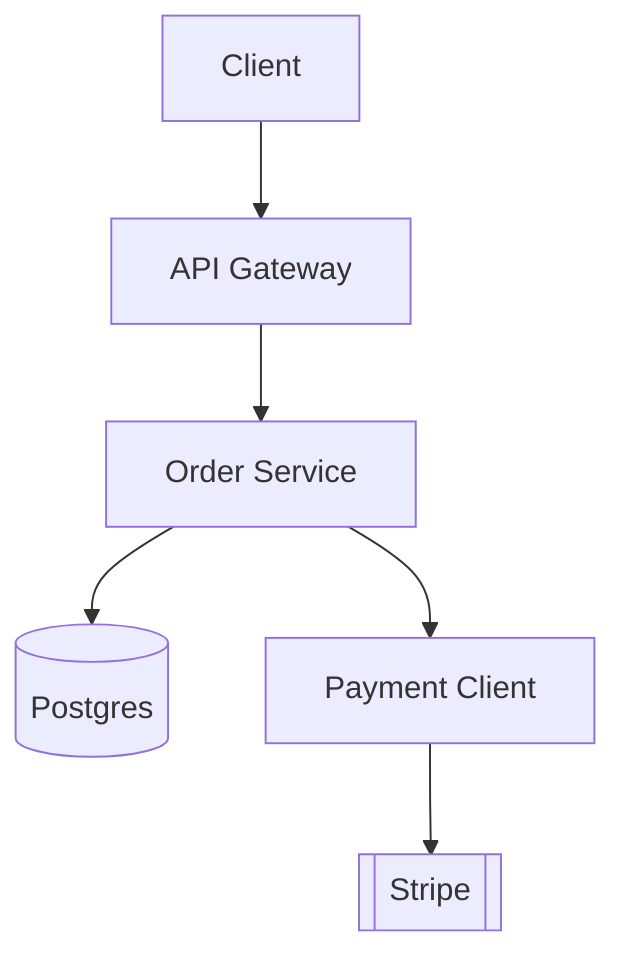
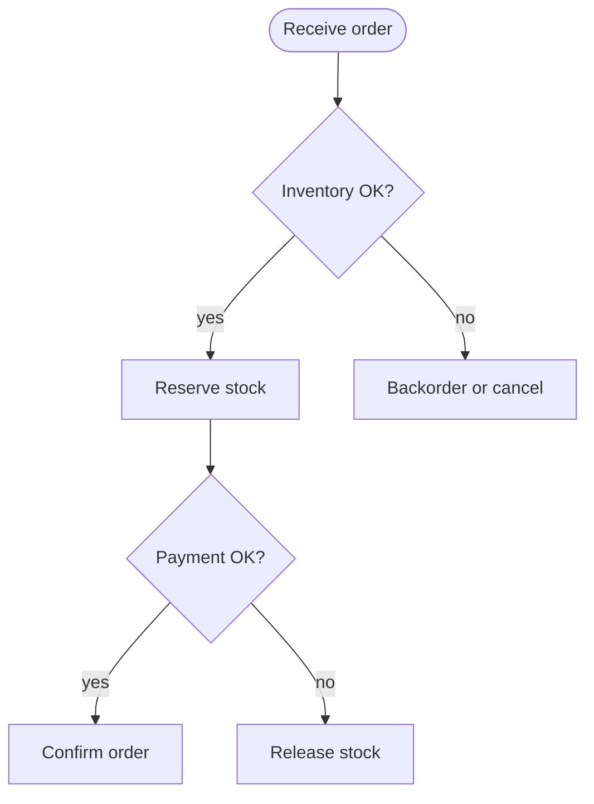
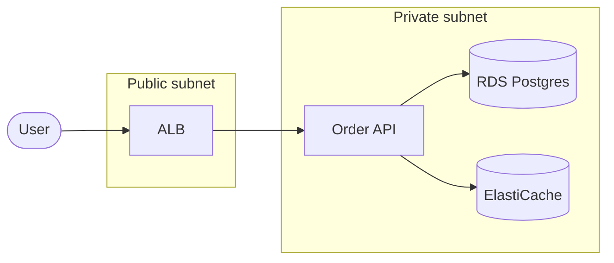
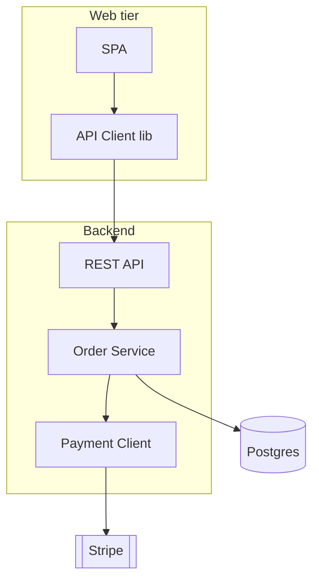
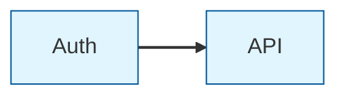
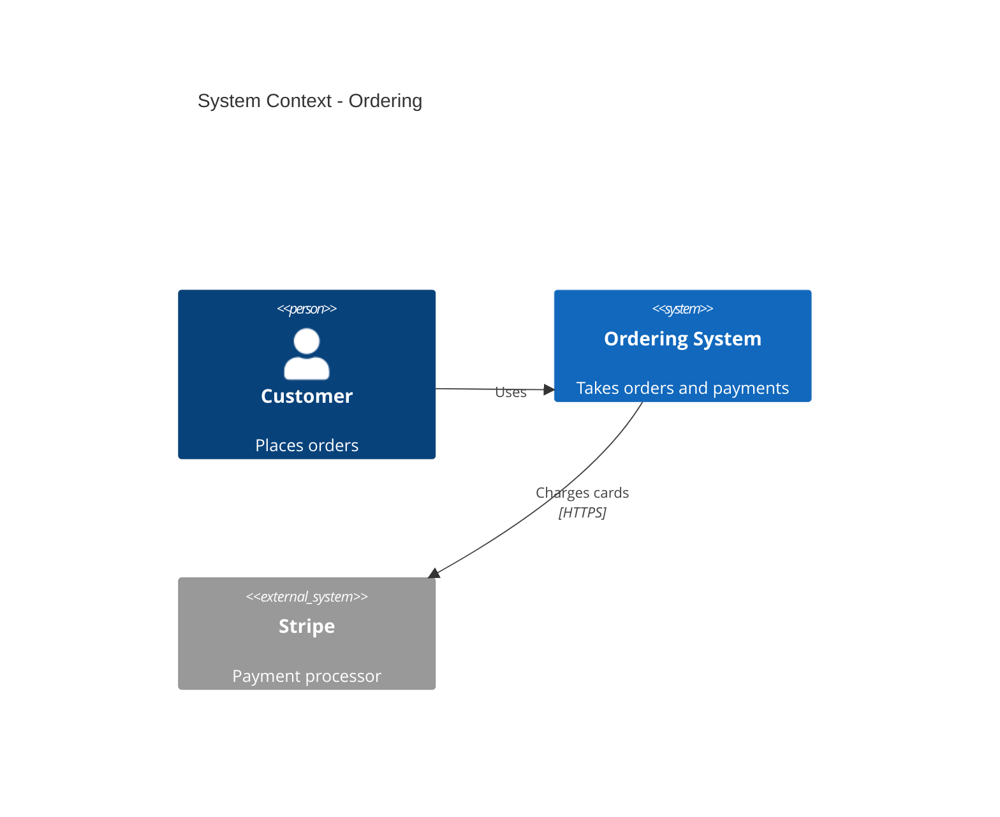

Mermaid — Part IV
**Flowcharts** show **steps, decisions, and dependencies** — pipelines, request paths, and service graphs. **Subgraphs** group nodes into tiers (web, backend, data) for deployment-style sketches before Terraform or Kubernetes YAML.

For scalable topology patterns, see [Core building blocks](../sysdesign/i-core-building-blocks.md) and [Classic designs](../sysdesign/classic-designs/i-overview.md).

## 1. Flowchart basics

| Shape | Syntax | Typical meaning |
|-------|--------|-----------------|
| **Rectangle** | `[Label]` | Process, service, step |
| **Rounded** | `(Label)` | Start/end event |
| **Stadium** | `([Label])` | Terminal |
| **Cylinder** | `[(Label)]` | Database |
| **Subroutine** | `[[Label]]` | External system |
| **Diamond** | `{Label}` | Decision |

Direction: **`TD`** top-down, **`LR`** left-right, **`BT`**, **`RL`**.

## 2. Decisions and labels

Edge labels after **`-->|text|`** document branch conditions — keep them short.

## 3. Subgraphs (tiers and boundaries)

| Pattern | Use |
|---------|-----|
| **`subgraph id["Title"]`** | VPC, region, bounded context |
| **Nested subgraphs** | Account → VPC → subnet (keep depth ≤ 2 for readability) |
| **`direction LR` inside subgraph** | Control layout per group |

Deployment diagrams in Mermaid are **logical** — they document intent; Terraform state is the operational source of truth.

## 4. Component-style dependency graph

Keep **names aligned** with [sequence diagrams](iii-sequence-diagrams.md) in the same doc set — mismatched labels confuse readers.

## 5. Styling nodes and links

| Directive | Effect |
|-----------|--------|
| **`classDef name fill,stroke`** | Reusable style |
| **`class node1,node2 name`** | Apply style |
| **`style node fill:#f9f`** | One-off override |
| **`linkStyle index stroke:...`** | Style nth link (0-based) |

Put shared `classDef` blocks in a **`theme.mmd` fragment** your build prepends before render.

## 6. C4-style context (lightweight)

Mermaid supports **C4** diagrams in recent versions (enable in config). Example **system context**:

| Level | Question it answers |
|-------|---------------------|
| **Context** | Who uses the system and what external systems exist? |
| **Container** | Major apps and data stores (`C4Container`) |
| **Component** | Modules inside one container (`C4Component`) |

Pin Mermaid version in CI — C4 syntax evolved across releases. For full C4-PlantUML stdlib and pinned includes, see [PlantUML component & deployment](../plantuml/iv-component-and-deployment.md).

## 7. Anti-patterns

| Avoid | Prefer |
|-------|--------|
| One giant flowchart with every microservice | Context diagram + per-domain flowcharts |
| Subgraph nesting deeper than two levels | Multiple linked `.mmd` files |
| Different service names than in sequence diagrams | Shared glossary in doc intro |
| Relying on manual `linkStyle` indices | Named `classDef` and stable node order |

## Next

Continue with [Class, state & ER](v-class-state-and-er.md) for domain models and data sketches.
