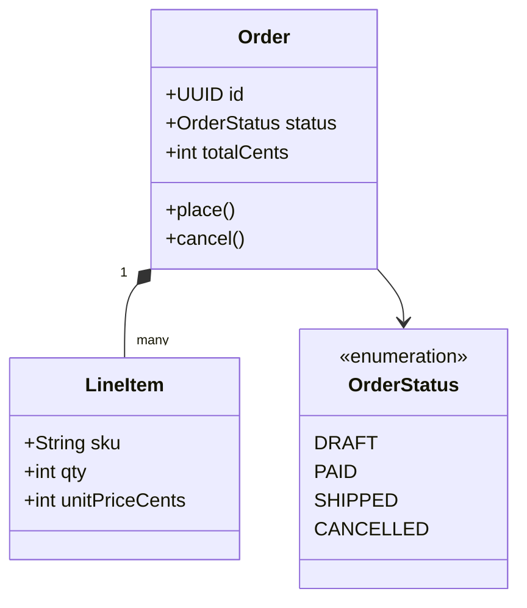
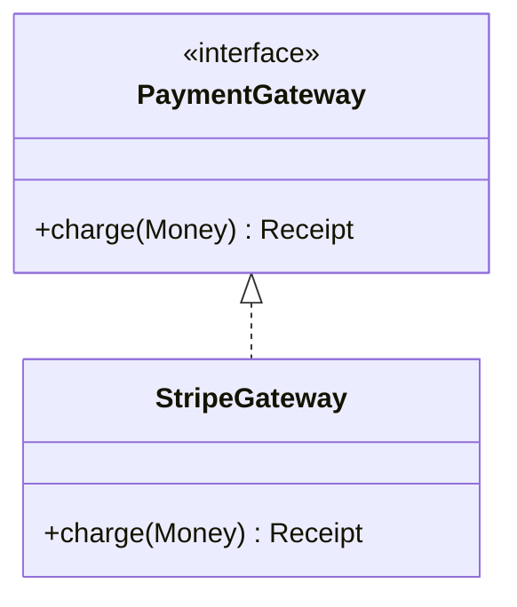
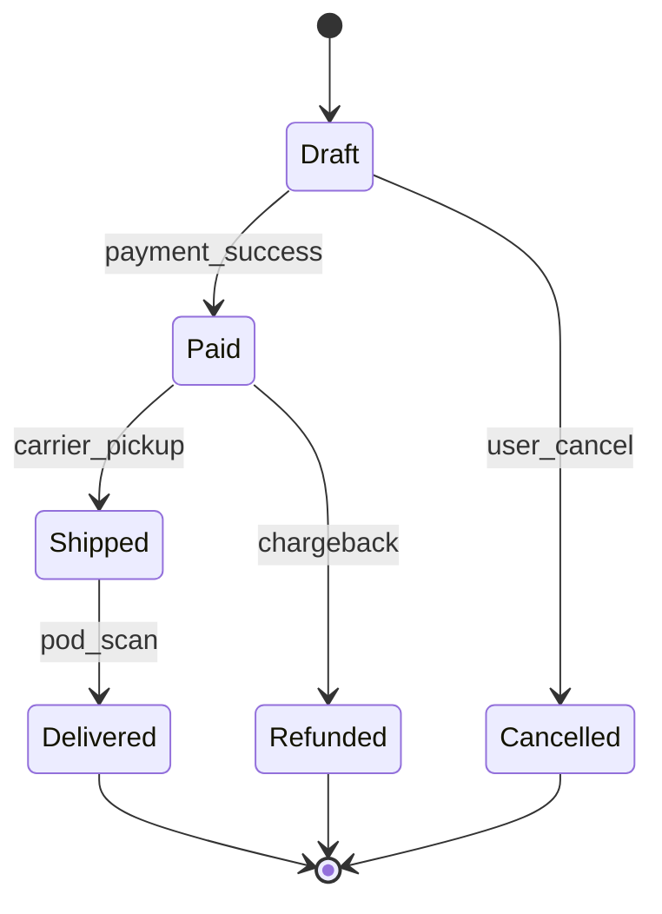
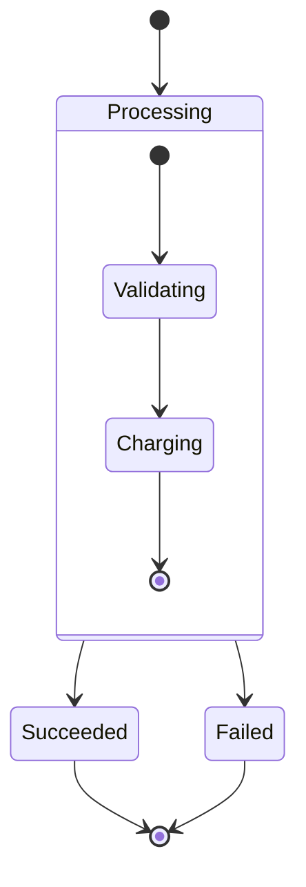
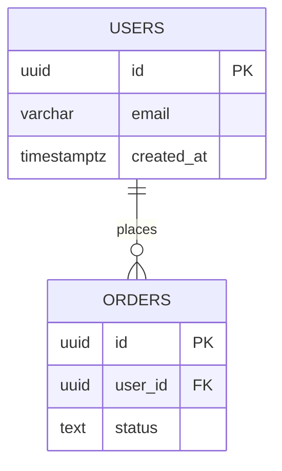
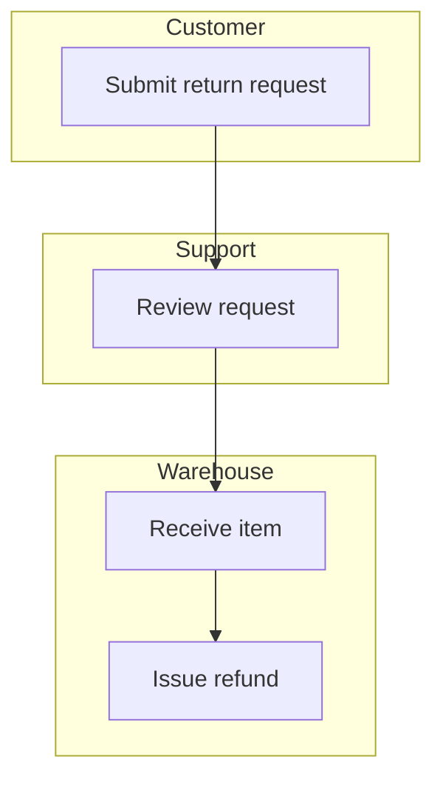

Mermaid — Part V
**Class** diagrams model **types and relationships**. **State** diagrams model **lifecycle transitions**. **ER** diagrams model **tables and keys**. Use them for domain design, onboarding, and clarifying business rules — not as a substitute for auto-generated code diagrams.

## 1. Class diagrams

| Syntax | Meaning |
|--------|---------|
| **`+` / `-` / `#`** | public / private / protected |
| **`*--`** | Composition |
| **`o--`** | Aggregation |
| **`-->`** | Association |
| **`<|--`** | Inheritance |
| **`<|..`** | Implementation |
| **`<<enumeration>>`** | Stereotype |

### Interfaces and abstracts

**Tip:** generate class diagrams from code with **IDE plugins** when the codebase is the source of truth; hand-drawn classes are best for **early design** and **bounded-context** discussions.

## 2. State diagrams

| Syntax | Meaning |
|--------|---------|
| **`[*]`** | Start / end pseudo-state |
| **`State --> State : event`** | Transition on event |
| **`state "Long Name" as SN`** | Alias long states |

### Composite states

Map states to **enum values** or **status columns** in the database — reviewers can verify code and diagram agree.

## 3. ER diagrams

| Cardinality | Syntax |
|-------------|--------|
| **One to many** | `\|\|--o{` |
| **Many to many** | `}o--o{` |
| **One to one** | `\|\|--\|\|` |

Pair with [Postgres schema notes](../postgres/iii-schema-and-migrations.md) when documenting table design.

## 4. Activity-style flows (alternative)

Mermaid has no separate **activity** diagram type like PlantUML — use **flowchart** with decisions for business workflows, or **stateDiagram-v2** when the focus is lifecycle not steps.

| Need | Diagram |
|------|---------|
| **Approval chain with branches** | `flowchart TD` with `{decision}` nodes |
| **Order / job lifecycle** | `stateDiagram-v2` |
| **Swimlanes** | `flowchart` + `subgraph` per lane |

Swimlane sketch:

## 5. When to use which

| Diagram | Best for |
|---------|----------|
| **Class** | Domain nouns, service boundaries, ORM mapping discussions |
| **State** | Order status, job lifecycle, connection state machines |
| **ER** | Table relationships before writing migrations |
| **Flowchart** | Multi-step workflows, ETL pipelines, swimlanes |

## 6. Mermaid vs PlantUML for modeling

| Prefer Mermaid | Prefer PlantUML |
|----------------|-----------------|
| ER + state in same README as sequences | Full activity diagrams with swimlane syntax |
| GitHub-native preview | ER with detailed column types and notes |
| Small domain sketches | Large class hierarchies with layout control |

## Next

Continue with [Docs, repos & CI](vi-docs-repos-and-ci.md) to embed diagrams in Markdown and validate them in pipelines.
