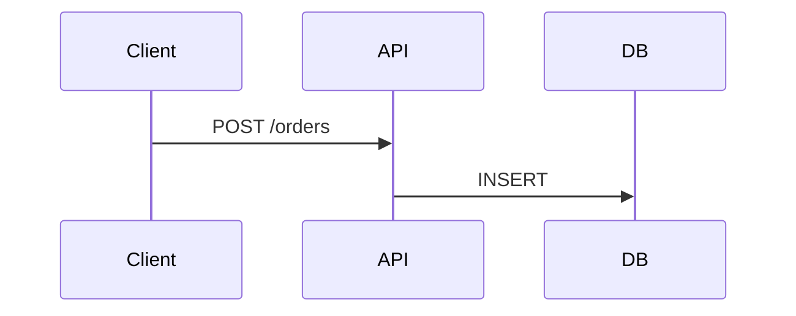

Mermaid — Part VI
How to keep **Mermaid source** in Git, embed it in **Markdown**, split large designs across files, and **render or validate** in **CI** so broken diagrams fail the build.

For Git workflow basics, see [Everyday commands](../git/essentials/iii-everyday-commands.md). For CI concepts, see [CI/CD fundamentals](../../sre101/cicd/i-fundamentals.md).

## 1. Store source in the repo

| Approach | Pros | Cons |
|----------|------|------|
| **Inline in `.md` only** | GitHub renders with zero setup | Harder to reuse same diagram in multiple pages |
| **`.mmd` + link or embed** | Single source for CLI and docs | GitHub README still needs fence or SVG link |
| **`.mmd` + committed `.svg`** | Visible in PR diffs everywhere | Must regenerate on change |
| **Generated in docs build** | Always fresh on site | Requires build step for readers |

**Recommended for GitHub-first teams:** inline **` ```mermaid `** in Markdown; add **`.mmd` + SVG** when you need slides or PDFs.

```text
docs/
  diagrams/
    checkout.mmd
    checkout.svg    ← optional, generated
  README.md         ← inline or 
```

Add to **`.gitignore`** if you never commit outputs:

```gitignore
docs/diagrams/*.png
docs/diagrams/*.svg
```

## 2. Markdown embedding

GitHub **natively renders** Mermaid in Markdown (unlike PlantUML). Options:

| Method | How |
|--------|-----|
| **Fenced block** | ` ```mermaid ` … ` ``` ` in `.md` |
| **Link to SVG** | `` |
| **Standalone `.mmd`** | Render with CLI; embed SVG in pages |
| **Docs site plugin** | MkDocs, Docusaurus, VuePress Mermaid extensions |

Example in a service README:

````markdown
## Architecture



Static export: [checkout.svg](docs/diagrams/checkout.svg) — regenerate with `make diagrams`.
````

## 3. Modular design without `!include`

Mermaid core has no **`!include`**. Split by **bounded context** or **diagram type**:

```text
docs/diagrams/
  _shared/
    theme.mmd          ← classDef blocks (prepended by script)
  ordering/
    context.mmd
    seq-place-order.mmd
```

**Build script** (concatenate theme + diagram before CLI):

```bash
#!/usr/bin/env bash
set -euo pipefail
THEME="docs/diagrams/_shared/theme.mmd"
for f in docs/diagrams/ordering/*.mmd; do
  { cat "$THEME"; cat "$f"; } | npx mmdc -i - -o "${f%.mmd}.svg"
done
```

| Rule | Detail |
|------|--------|
| **One scenario per file** | Easier review and reuse |
| **Shared styles in theme fragment** | Prepended, not pasted into every file |
| **Large include trees** | Consider [PlantUML](../plantuml/vi-docs-repos-and-ci.md) instead |

## 4. Makefile / npm script (local render)

```makefile
MMDC = npx mmdc
SRC = docs/diagrams

diagrams:
	$(MMDC) -i $(SRC)/ordering -o $(SRC)/ordering -e svg
```

Or in `package.json`:

```json
{
  "scripts": {
    "diagrams": "mmdc -i docs/diagrams -o docs/diagrams -e svg"
  }
}
```

Invoke before `mkdocs build`, `npm run docs`, or static site deploy.

## 5. CI: validate and publish

### Validate only (fast PR check)

```yaml
# .github/workflows/diagrams.yml (excerpt)
jobs:
  mermaid:
    runs-on: ubuntu-latest
    steps:
      - uses: actions/checkout@v4
      - uses: actions/setup-node@v4
        with:
          node-version: "20"
      - run: npm ci
      - run: npx mmdc -i docs/diagrams -o /tmp/out -e svg
```

Any parse error fails the job — good gate for PRs.

### Pin version + render artifact

```yaml
      - run: npm ci   # @mermaid-js/mermaid-cli pinned in package-lock.json
      - run: npx mmdc -i docs/diagrams -o out -e svg
      - uses: actions/upload-artifact@v4
        with:
          name: diagrams
          path: out/
```

Use the official **`minlag/mermaid-cli`** Docker image in CI if Puppeteer setup is painful.

## 6. Review checklist (PRs that touch diagrams)

| Check | Question |
|-------|----------|
| **Names** | Match services/env vars in code and infra? |
| **Scope** | One scenario per sequence/flow file? |
| **Secrets** | No real hostnames, keys, or internal-only URLs in public repos? |
| **Output** | If SVG is committed, was it regenerated? |
| **Alt paths** | Error and timeout paths shown where relevant? |
| **GitHub preview** | Does fenced block render in PR description or README preview? |

## 7. Mermaid vs PlantUML in the same repo

| Use Mermaid | Use PlantUML |
|-------------|--------------|
| GitHub README and issue diagrams | UML sequence with rich `ref`, create/destroy |
| Inline flowchart next to code | C4-PlantUML with vendored `!include` |
| Docs site on Mermaid plugin | Formal architecture repo with `-checkonly` JAR |

Both can coexist — pick per doc audience and renderer. See [PlantUML docs, repos & CI](../plantuml/vi-docs-repos-and-ci.md) for the Java-side pipeline.

## Track complete

You now have overview → toolchain → sequence → flowchart/architecture → class/state/ER → docs/CI. Apply these to your next RFC, service README, or [system design](../sysdesign/classic-designs/ii-url-shortener.md) walkthrough.
