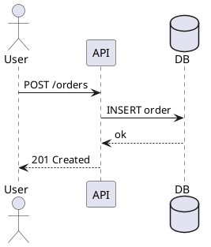

PlantUML — overview
**PlantUML** turns **text** into **diagrams** — sequence, component, deployment, class, activity, and more. Engineers use it in **Markdown docs**, **READMEs**, **design reviews**, and **CI** because diagrams live in **version control** next to code and update with a diff, not a separate image file.

For system-design vocabulary (services, caches, queues), see [System design](../sysdesign/i-core-building-blocks.md). For Git workflow when diagrams live in repos, see [Git essentials](../git/essentials/i-overview.md).

## Map of this track

| Part | Focus |
|------|--------|
| **I — Overview** | What PlantUML is, diagram types, when to use it |
| **II — Install & toolchain** | Java, CLI, VS Code, server mode |
| **III — Sequence diagrams** | Actors, messages, alt/opt, notes |
| **IV — Component & deployment** | Boxes, interfaces, nodes, cloud-ish layouts |
| **V — Class, activity & state** | OOP shapes, flows, lifecycles |
| **VI — Docs, repos & CI** | Markdown embeds, `!include`, GitHub Actions |

## Why text-based diagrams

| Benefit | What it means in practice |
|---------|---------------------------|
| **Diffable** | PRs show what changed in the architecture, not a binary PNG |
| **Repeatable** | Same `.puml` file renders the same output everywhere |
| **Fast to edit** | Rename a service in one line instead of dragging boxes |
| **Embeddable** | Many tools render PlantUML inside Markdown or wikis |
| **Composable** | `!include` splits large designs into maintainable files |

## Diagram types engineers reach for

| Type | Keyword | Typical use |
|------|---------|-------------|
| **Sequence** | `@startuml` + participants | API flows, auth, retries, error paths |
| **Component** | `[Component]` syntax | Service boundaries, package deps |
| **Deployment** | `node`, `artifact` | Runtime topology — LB, app tier, DB |
| **Class** | `class Name` | Domain models, ORM sketches |
| **Activity** | `start`, `:step;`, `stop` | Business workflows, state machines |
| **C4** | C4-PlantUML includes | Context/container diagrams for system design |

PlantUML also supports **ER**, **Gantt**, **mindmap**, and **JSON/YAML** helpers — this track focuses on the types most common in **application and system design** docs.

## Mental model

```text
.puml source (text)
      ↓
PlantUML engine (Java) + optional Graphviz
      ↓
SVG / PNG / ASCII output
      ↓
Embedded in Markdown, wiki, or committed as an asset
```

| Piece | Role |
|-------|------|
| **Source (`.puml`)** | Human-edited diagram definition |
| **PlantUML JAR / server** | Parses text, lays out shapes |
| **Graphviz (`dot`)** | Optional — improves layout for some diagram types |
| **Renderer** | IDE extension, CLI, CI job, or hosted server |

## PlantUML vs other options

| Tool | Strength | Trade-off |
|------|----------|-----------|
| **PlantUML** | Rich UML + sequence; mature ecosystem | Java dependency; syntax learning curve |
| **Mermaid** | Native in many Markdown viewers (GitHub, etc.) | Fewer UML primitives; layout less flexible |
| **draw.io / Excalidraw** | Freeform whiteboarding | Binary or JSON canvas — harder to diff |
| **ASCII / SVG in notes** | Zero tooling (see other SWE101 notes) | Manual layout for complex diagrams |

**Rule of thumb:** use **PlantUML** when you want **UML fidelity** and **includes** in a repo; use **Mermaid** when the viewer already renders it with no build step.

## Minimal example



Save as `order-create.puml`, render with the CLI or a VS Code extension — output is a sequence diagram of the happy path.

## When PlantUML fits

| Good fit | Poor default |
|----------|--------------|
| Design docs in Git | One-off slide for a keynote (use a drawing tool) |
| Sequence flows for APIs and events | Pixel-perfect marketing diagrams |
| Deployment sketches before Terraform | Auto-generated diagrams from live AWS inventory alone |
| Shared includes across microservice READMEs | Diagrams that must render inside GitHub Markdown with zero plugins |

## Next

Continue with [Install & toolchain](ii-install-and-toolchain.md) to run PlantUML locally and in the editor.
