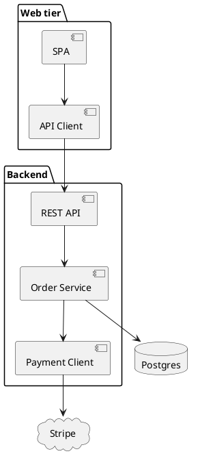
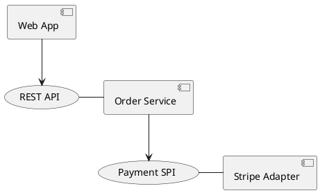
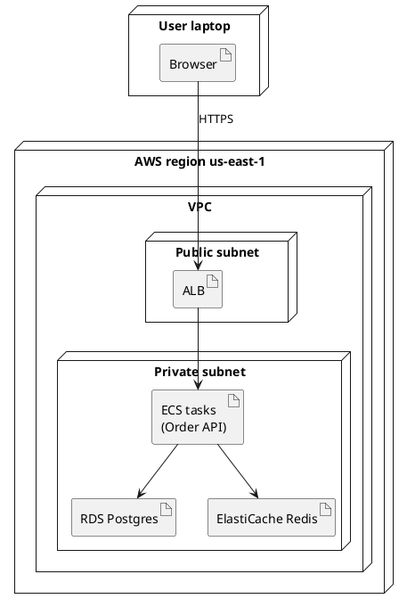

PlantUML — Part IV
**Component** diagrams show **software structure** — packages, interfaces, and dependencies. **Deployment** diagrams show **where things run** — nodes, artifacts, and network boundaries. Use them in READMEs and design docs before drawing infrastructure in Terraform or Kubernetes YAML.

For scalable topology patterns, see [Core building blocks](../sysdesign/i-core-building-blocks.md) and [Classic designs](../sysdesign/classic-designs/i-overview.md).

## 1. Component diagram basics



| Element | Syntax |
|---------|--------|
| **Component** | `[Name]` or `component Name` |
| **Package** | `package "Label" { ... }` |
| **Interface** | `()` or `interface Name` |
| **Dependency** | `-->` between components |
| **External system** | `cloud`, `node`, `frame` |

### Interfaces between components



`(Name)` is a **lollipop** interface — good for ports/adapters and hexagonal sketches.

## 2. Deployment diagram basics



| Keyword | Meaning |
|---------|---------|
| **`node`** | Machine, VPC, region, device |
| **`artifact`** | Deployable unit — JAR, container image, static bundle |
| **`cloud`** | External SaaS |
| **`frame`** | Grouping box (optional styling) |

Deployment diagrams are **logical** — they document intent; Terraform state is the operational source of truth.

## 3. Combining component + deployment

Typical doc set:

| File | Shows |
|------|--------|
| **`components.puml`** | Code/module dependencies |
| **`deployment.puml`** | Runtime on AWS/K8s |
| **`sequences/*.puml`** | Request paths through the boxes |

Keep **names aligned** across all three — mismatched labels confuse readers.

## 4. C4 model (context & container)

[C4-PlantUML](https://github.com/plantuml-stdlib/C4-PlantUML) is a stdlib for **context** and **container** diagrams — common in system design interviews and RFCs.

```plantuml
@startuml
!include https://raw.githubusercontent.com/plantuml-stdlib/C4-PlantUML/master/C4_Context.puml

Person(customer, "Customer", "Places orders")
System(ordering, "Ordering System", "Takes orders and payments")
System_Ext(stripe, "Stripe", "Payment processor")

Rel(customer, ordering, "Uses")
Rel(ordering, stripe, "Charges cards", "HTTPS")
@enduml
```

| C4 level | Question it answers |
|----------|---------------------|
| **Context** | Who uses the system and what external systems exist? |
| **Container** | What are the major deployable apps and data stores? |
| **Component** | What modules inside one container? |
| **Code** | Class-level (usually auto-generated, not hand-maintained) |

Pin C4 includes to a **commit SHA** or vendor them into your repo — remote `!include` URLs can change.

## 5. Layout and skinparam

```plantuml
@startuml
left to right direction
skinparam componentStyle rectangle
skinparam shadowing false
skinparam defaultFontName Helvetica

[Auth] - [API]
@enduml
```



| `skinparam` | Effect |
|-------------|--------|
| **`shadowing false`** | Flatter look for docs |
| **`componentStyle rectangle`** | Boxy components |
| **`packageStyle frame`** | Package borders |
| **`nodesep` / `ranksep`** | Spacing tuning |

Put shared styles in `_styles/theme.puml` and `!include` from every diagram.

## 6. Anti-patterns

| Avoid | Prefer |
|-------|--------|
| One giant diagram with every microservice | Context + per-bounded-context container diagrams |
| Deployment diagram that mirrors every K8s pod | One node per **service** or **deployment** |
| Different service names than in sequence diagrams | A `glossary.puml` or shared aliases file |
| Remote includes without pinning | Vendored stdlib or pinned URL |

## Next

Continue with [Class, activity & state](v-class-activity-and-state.md) for domain models and workflows.
