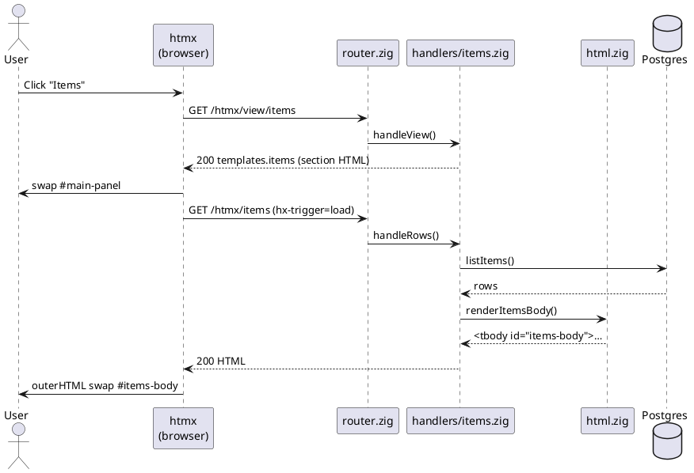
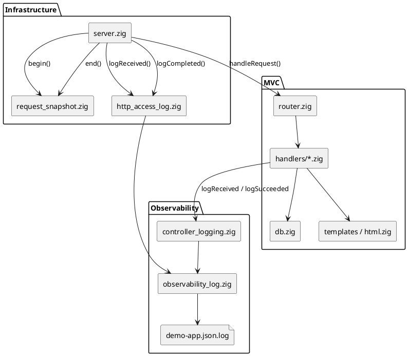
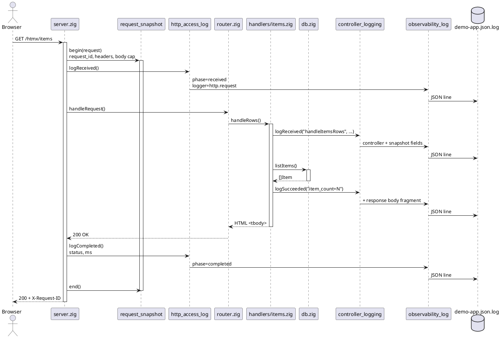
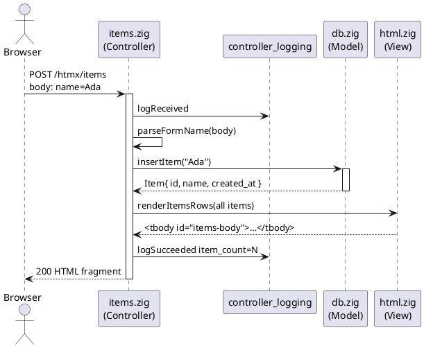

Zig — Part V: Web MVC project layout
Zig has **no built-in web framework** like Spring MVC — you assemble **Model** (data access), **View** (HTML templates), and **Controller** (HTTP handlers) yourself. This page documents a **complete layout** for a small server-rendered + htmx app: folder structure, **creating and reusing templates**, **htmx + Zig wiring**, and logging flow (PlantUML).

Assumes **Part I** (syntax, errors) and **Part II** (`build.zig`). The structure mirrors production-style Zig web apps (explicit router, embedded templates, structured JSON logs).

## 1. MVC in Zig (mental map)

| MVC role | Zig location | Responsibility |
|----------|--------------|----------------|
| **Model** | `db.zig`, `auth/repository.zig`, domain structs | Postgres queries, Redis session storage, business rules |
| **View** | `templates/`, `templates.zig`, `html.zig` | HTML shell, htmx partials, escaped row fragments |
| **Controller** | `handlers/*.zig` | Parse request → call model → write response |
| **Dispatcher** | `router.zig` | Match `method + path` → call the right handler |
| **Infrastructure** | `server.zig`, `app.zig`, `http_response.zig` | TCP accept, shared `App` state, status codes + headers |

```text
Browser ──► server.zig ──► router.zig ──► handlers/* (Controller)
                              │                    │
                              │                    ├──► db.zig (Model)
                              │                    └──► templates / html.zig (View)
                              └──► logging layers (snapshot → access → controller → JSON file)
```

There is no magic annotation layer — **every route is an explicit `if`** in `router.zig`. That is the trade-off: more boilerplate, full control.

## 2. Full folder structure

```text
hello-mvc/
  build.zig                 # Compile exe, embed templates, link libpq if needed
  build.zig.zon             # Optional package deps
  src/
    main.zig                # Entry: allocator, config, App, server.run()
    app.zig                 # Shared App { config, db, redis, session_config }
    config.zig              # Env vars → host, port, DB URL, Redis URL
    server.zig              # Listen, accept thread per connection, wrap logging
    router.zig              # method + path dispatch table
    http_response.zig       # writeTextResponse, writeJsonResponse, X-Request-ID
    request_snapshot.zig    # Per-request context (headers, body, timing)
    request_id.zig          # Generate or reuse X-Request-ID
    request_context.zig     # Thread-local origin for outbound calls
    http_access_log.zig     # Inbound HTTP access lines (received / completed)
    controller_logging.zig  # Handler INFO/WARN/ERROR → stdout + JSON file
    observability_log.zig   # Structured JSON line writer (demo-app.json.log)
    outbound_http_log.zig   # Logs for stack probes / external HTTP
    postgres_log.zig        # SQL correlation fields
    db.zig                  # Model: items CRUD against Postgres
    redis_client.zig        # Minimal RESP client for sessions
    html.zig                # View helpers: escape HTML, render table rows
    templates.zig           # @embedFile for shell + view partials
    metrics.zig             # Prometheus counter (optional)
    auth/
      session.zig           # Session JSON shape + TTL
      repository.zig        # Redis GET/SET/DEL for sessions
      service.zig             # ensure, login, logout, refresh
      cookies.zig             # Parse Cookie / build Set-Cookie
      password.zig            # bcrypt hash/verify
      guard.zig               # Block protected routes until logged in
    handlers/
      home.zig              # GET / shell, GET /htmx/view/home
      items.zig             # htmx items view + rows + create (Controller)
      api_items.zig         # REST JSON items API (Controller)
      auth.zig              # /api/auth/* (Controller)
      users.zig             # POST /api/users registration
      health.zig            # GET /health, GET /metrics
      stack.zig             # Stack probe htmx partials
      observability.zig     # Observability view partial
    templates/
      shell.html            # Full page: sidebar, #main-panel, htmx attrs
      views/
        home.html           # <section> fragment swapped into #main-panel
        items.html          # Items table skeleton + htmx form
        stack.html
        observability.html
  logs/                     # demo-app.json.log when EXERCISES_OBSERVABILITY=1
```

### What each top-level area serves

| Path | Serves |
|------|--------|
| **`main.zig`** | `GeneralPurposeAllocator`, load **`config`**, open **`db`** / **`redis`**, call **`server.run`**, **`deinit`** on shutdown |
| **`app.zig`** | Single **`App`** struct passed into every handler — holds connections and mutexes |
| **`server.zig`** | TCP loop; per connection: **`receiveHead`** → snapshot → router → access log complete |
| **`router.zig`** | The **front controller** — only place that knows all URL → handler mappings |
| **`handlers/`** | **Controllers** — thin: log, parse input, call **`db`**, render HTML or JSON |
| **`db.zig`** | **Model** for `items` table — SQL only, no HTTP types |
| **`templates/`** | **Views** — static HTML; dynamic rows built in **`html.zig`** at runtime |
| **`auth/`** | Session **model + service** — Redis-backed, cookie on wire |
| **`*_log.zig`** | Cross-cutting **observability** — not MVC, but wraps every request |

## 3. Code examples

### `main.zig` — bootstrap

```zig
const std = @import("std");
const app_mod = @import("app.zig");
const config_mod = @import("config.zig");
const server = @import("server.zig");
const observability_log = @import("observability_log.zig");

pub fn main() !void {
    var gpa = std.heap.GeneralPurposeAllocator(.{}){};
    defer _ = gpa.deinit();
    const allocator = gpa.allocator();

    observability_log.init(allocator);

    var config = try config_mod.load(allocator);
    defer config.deinit(allocator);

    var app = try app_mod.App.init(allocator, config);
    defer app.deinit();

    try server.run(&app);
}
```

### `app.zig` — shared application state

```zig
const std = @import("std");
const config_mod = @import("config.zig");
const db_mod = @import("db.zig");
const redis_mod = @import("redis_client.zig");

pub const App = struct {
    allocator: std.mem.Allocator,
    config: config_mod.Config,
    db: ?db_mod.Db,
    db_mutex: std.Thread.Mutex = .{},
    redis: ?redis_mod.Client,
    redis_mutex: std.Thread.Mutex = .{},

    pub fn deinit(self: *App) void {
        if (self.redis) |*c| c.deinit();
        if (self.db) |*d| d.deinit();
        self.config.deinit(self.allocator);
    }
};
```

### `router.zig` — dispatch (excerpt)

```zig
pub fn handleRequest(app: *app_mod.App, request: *std.http.Server.Request) !void {
    const path = http.targetOnly(http.pathname(request.head.target));

    if (request.head.method == .GET and std.mem.eql(u8, path, "/")) {
        return try home_handler.handleShell(app, request);
    }
    if (request.head.method == .GET and std.mem.eql(u8, path, "/htmx/view/items")) {
        return try items_handler.handleView(request);
    }
    if (request.head.method == .GET and std.mem.eql(u8, path, "/htmx/items")) {
        return try items_handler.handleRows(app, request);
    }
    if (request.head.method == .POST and std.mem.eql(u8, path, "/htmx/items")) {
        return try items_handler.handleCreate(app, request);
    }
    // ... auth, REST /api/items, health, metrics ...
    try http.writeTextResponse(request, .not_found, "text/plain", "not found");
}
```

### `handlers/items.zig` — Controller (htmx)

```zig
const SOURCE = "src/handlers/items.zig";

pub fn handleView(request: *std.http.Server.Request) !void {
    ctrl_log.logReceived("handleItemsView", SOURCE, "GET", "/htmx/view/items");
    try http.writeTextResponse(request, .ok, "text/html; charset=utf-8", templates.items);
    ctrl_log.logSucceeded("handleItemsView", SOURCE, "", .{});
}

pub fn handleRows(app: *app_mod.App, request: *std.http.Server.Request) !void {
    ctrl_log.logReceived("handleItemsRows", SOURCE, "GET", "/htmx/items");
    var database = app.db orelse return try writeErrorRow(app, request, "Postgres not configured.");
    app.db_mutex.lock();
    defer app.db_mutex.unlock();
    const items = try database.listItems(app.allocator);
    defer db_mod.Db.freeItems(items, app.allocator);
    const html = try html_mod.renderItemsRows(app.allocator, items);
    defer app.allocator.free(html);
    try http.writeTextResponse(request, .ok, "text/html; charset=utf-8", html);
    ctrl_log.logSucceeded("handleItemsRows", SOURCE, "item_count={d}", .{items.len});
}
```

### `db.zig` — Model (excerpt)

```zig
pub const Item = struct {
    id: i64,
    name: []const u8,
    created_at: []const u8,
};

pub fn listItems(self: *Db, allocator: std.mem.Allocator) ![]Item {
    postgres_log.logQuery("SELECT id, name, created_at FROM items ORDER BY id");
    // ... libpq fetch, allocate Item slice ...
}
```

### `templates.zig` + `templates/views/items.html` — View

```zig
pub const shell = @embedFile("templates/shell.html");
pub const items = @embedFile("templates/views/items.html");
```

```html
<section id="items-view">
  <h2>Items</h2>
  <form hx-post="/htmx/items" hx-target="#items-body" hx-swap="outerHTML">
    <input name="name" required />
    <button type="submit">Add</button>
  </form>
  <table>
    <tbody id="items-body"
           hx-get="/htmx/items"
           hx-trigger="load"
           hx-swap="outerHTML">
      <tr><td>Loading…</td></tr>
    </tbody>
  </table>
</section>
```

**`html.zig`** builds `<tr>` rows at runtime (escaped names) so the Model never emits raw HTML strings with user input.

### `build.zig` — wire the executable

```zig
const exe = b.addExecutable(.{
    .name = "hello-mvc",
    .root_source_file = b.path("src/main.zig"),
    .target = target,
    .optimize = optimize,
});
exe.linkLibC(); // if using libpq / bcrypt
b.installArtifact(exe);
```

## 4. Creating and reusing HTML templates

Zig has **no Thymeleaf/Jinja engine** in the standard library. Templates are usually:

1. **Static HTML** embedded at **compile time** (`@embedFile`) — layout shell, htmx view sections.
2. **Dynamic fragments** built in Zig (`std.fmt`, `ArrayList`) — table rows, status messages, anything with user data.

Splitting static vs dynamic keeps XSS risk visible: **never** splice unescaped user strings into HTML.

### 4.1 Three template layers

| Layer | File(s) | When to use | Reuse pattern |
|-------|---------|-------------|---------------|
| **Shell** | `templates/shell.html` | One full document per app (`<!DOCTYPE html>`, nav, scripts) | Single `@embedFile`; served only on `GET /` |
| **View partials** | `templates/views/*.html` | htmx sections swapped into `#main-panel` | One file per screen; `@embedFile` each in `templates.zig` |
| **Data partials** | `html.zig` | Rows, alerts, `<tbody>` bodies built from DB | Shared render functions; constant opening tags |

```text
templates/
  shell.html              ← compile-time, never changes at runtime
  views/
    home.html             ← compile-time section
    items.html            ← compile-time skeleton; htmx loads data partial
  partials/               ← optional: shared snippets (see below)
    table_shell.html

templates.zig             ← maps paths → pub const for handlers
html.zig                  ← runtime builders (escape + fmt)
```

### 4.2 Register templates with `@embedFile`

`@embedFile` reads a file **at compile time** and gives a `*const [N:0]u8` string literal — zero runtime file I/O, templates ship inside the binary.

**`src/templates.zig`:**

```zig
pub const shell = @embedFile("templates/shell.html");
pub const home = @embedFile("templates/views/home.html");
pub const items = @embedFile("templates/views/items.html");
pub const stack = @embedFile("templates/views/stack.html");
```

**Handler** — return the embedded bytes as the response body:

```zig
const templates = @import("../templates.zig");

pub fn handleView(request: *std.http.Server.Request) !void {
    try http.writeTextResponse(request, .ok, "text/html; charset=utf-8", templates.items);
}
```

Add a new screen:

1. Create `templates/views/reports.html`.
2. Add `pub const reports = @embedFile("templates/views/reports.html");` to `templates.zig`.
3. Add `GET /htmx/view/reports` in `router.zig` → handler returns `templates.reports`.

Rebuild (`zig build`) — embedded files are fixed at compile time.

### 4.3 Reuse pattern A — shared HTML constants in Zig

When the **same opening tag** must appear in a static `.html` file and a dynamic builder, define the tag once in `html.zig`:

```zig
/// Must match templates/views/items.html — id only, no hx-trigger here.
pub const items_tbody_open =
    \\<tbody id="items-body">
;
```

Static view (`items.html`) includes the matching `id` and htmx attrs. Dynamic responses wrap rows:

```zig
pub fn renderItemsBody(allocator: std.mem.Allocator, items: []const Item) ![]u8 {
    const rows = try renderItemsRows(allocator, items);
    defer allocator.free(rows);
    return std.fmt.allocPrint(allocator, "{s}{s}</tbody>", .{ items_tbody_open, rows });
}
```

**Why:** POST and GET data endpoints return the **same** `<tbody id="items-body">` shape so htmx `hx-swap="outerHTML"` keeps the target stable. The opening tag is not duplicated as a string literal in three places.

### 4.4 Reuse pattern B — one renderer, many handlers

Centralize row HTML in `html.zig`; controllers only fetch data and call render:

```zig
// html.zig — single source for item table markup
pub fn renderItemsRows(allocator: std.mem.Allocator, items: []const Item) ![]u8 { ... }
pub fn renderItemsBodyWithStatus(allocator: std.mem.Allocator, items: []const Item, status: ?ItemsStatus) ![]u8 { ... }

// handlers/items.zig
const html = try html_mod.renderItemsBody(app.allocator, items);
try http.writeTextResponse(request, .ok, "text/html; charset=utf-8", html);

// handlers/api_items.zig — different format, same Model
try http.writeJsonResponse(request, .ok, json_body);
```

| Output | Reuses |
|--------|--------|
| htmx `<tbody>` | `html.renderItemsBody` |
| REST JSON | `db.listItems` (Model only) |
| Full page (rare) | `templates.shell` + optional inline build |

### 4.5 Reuse pattern C — escape helper (all dynamic text)

```zig
pub fn escapeHtml(allocator: std.mem.Allocator, input: []const u8) ![]u8 {
    var list = std.ArrayList(u8).init(allocator);
    errdefer list.deinit();
    for (input) |ch| {
        switch (ch) {
            '&' => try list.appendSlice("&amp;"),
            '<' => try list.appendSlice("&lt;"),
            '>' => try list.appendSlice("&gt;"),
            '"' => try list.appendSlice("&quot;"),
            '\'' => try list.appendSlice("&#39;"),
            else => try list.append(ch),
        }
    }
    return list.toOwnedSlice();
}
```

Every `render*` function calls `escapeHtml` on user-controlled fields before `allocPrint`. **One helper, all partials.**

### 4.6 Reuse pattern D — optional `partials/` for copy-paste HTML

Zig cannot `` at runtime. Options:

| Approach | Trade-off |
|----------|-----------|
| **Duplicate small snippets** in two `.html` files | Simple; fine for &lt;10 lines |
| **`@embedFile("partials/foo.html")`** + string concat in Zig | Shared static chunk |
| **Comptime `join` of embeds** | Advanced; rarely needed |

Example — shared alert partial embedded once:

```zig
pub const alert_ok = @embedFile("templates/partials/alert_ok.html");

pub fn renderSuccess(allocator: std.mem.Allocator, message: []const u8) ![]u8 {
    const safe = try escapeHtml(allocator, message);
    defer allocator.free(safe);
    return std.fmt.allocPrint(allocator, "{s}<p class=\"ok\">{s}</p>", .{ alert_ok, safe });
}
```

### 4.7 Dynamic values without a template engine

For a greeting with a name, **format in the handler** (small strings) or add a tiny builder:

```zig
pub fn renderHello(allocator: std.mem.Allocator, name: []const u8) ![]u8 {
    const safe = try escapeHtml(allocator, name);
    defer allocator.free(safe);
    return std.fmt.allocPrint(allocator,
        "<section><h2>Hello, {s}</h2></section>", .{safe});
}
```

Larger apps sometimes adopt a Zig template crate — for learning and control, **`@embedFile` + `html.zig`** matches how production Zig servers are often structured.

### 4.8 Checklist — new template

1. **Static or dynamic?** — file under `templates/` vs function in `html.zig`.
2. **Register** — `pub const` in `templates.zig` if static.
3. **Route** — `router.zig` + handler returning `text/html; charset=utf-8`.
4. **Escape** — all DB/form fields through `escapeHtml`.
5. **htmx contract** — stable `id` on swap targets; same outer HTML shape on GET and POST responses.
6. **`zig build`** — re-embed after editing `.html` files.

## 5. htmx and Zig together

**htmx** runs in the browser; **Zig** serves HTML over HTTP. There is no Zig htmx binding — the contract is: **routes return HTML fragments**, and attributes on elements describe when and where to fetch them.

See also [htmx overview](../htmx/i-overview.md) and [Server responses & templates](../htmx/v-server-responses-and-templates.md).

### 5.1 Division of labour

| Piece | Technology | Role |
|-------|------------|------|
| Page chrome | `shell.html` + `@embedFile` | Load once; sidebar, styles, htmx script |
| Navigation | `hx-get` on buttons | Swap view partials without full reload |
| Forms / tables | `hx-post`, `hx-get` | Server validates; returns updated HTML |
| Data access | `db.zig` | Unchanged by htmx — still SQL in the Model |
| Routing | `router.zig` | Maps `/htmx/*` to handlers |

```text
Browser (htmx)                    Zig server
──────────────                    ──────────
hx-get /htmx/view/items    →      items.handleView → templates.items
hx-get /htmx/items         →      items.handleRows → html.renderItemsBody
hx-post /htmx/items        →      items.handleCreate → html.renderItemsBody
```

### 5.2 Two route families

| Family | Path pattern | Response | Purpose |
|--------|--------------|----------|---------|
| **View** | `GET /htmx/view/{section}` | `<section>…</section>` from `@embedFile` | Screen layout + htmx hooks |
| **Data** | `GET/POST /htmx/{resource}` | Generated partial (`<tbody>`, `<tr>`, …) | List/create/update rows |

Keep names consistent: view loads skeleton; data endpoints return the **same element** the skeleton targets.

### 5.3 Shell setup (load htmx once)

```html
<!DOCTYPE html>
<html lang="en">
  <head>
    <meta charset="UTF-8" />
    <script src="https://unpkg.com/htmx.org@2.0.4"></script>
  </head>
  <body>
    <nav>
      <button type="button"
              hx-get="/htmx/view/items"
              hx-target="#main-panel"
              hx-swap="innerHTML">
        Items
      </button>
    </nav>
    <main id="main-panel"
          hx-get="/htmx/view/home"
          hx-trigger="load"
          hx-swap="innerHTML"
          hx-on::after-settle="htmx.process(event.detail.elt)">
    </main>
  </body>
</html>
```

| Attribute | Effect |
|-----------|--------|
| **`hx-get`** | URL Zig must implement in `router.zig` |
| **`hx-target`** | CSS selector to replace |
| **`hx-swap="innerHTML"`** | Replace children of `#main-panel` |
| **`hx-trigger="load"`** | Fire when element enters the DOM (initial home view) |
| **`hx-on::after-settle`** | Re-scan swapped HTML so **nested** `hx-*` attrs work |

The **`htmx.process`** call is important: view partials contain new `hx-trigger="load"` nodes (e.g. items table). Without re-processing, nested triggers never register.

### 5.4 View partial with nested htmx

**`templates/views/items.html`** — static skeleton; data loads separately:

```html
<section id="items-view">
  <h2>Items</h2>
  <form hx-post="/htmx/items"
        hx-target="#items-body"
        hx-swap="outerHTML">
    <input name="name" required />
    <button type="submit">Add</button>
  </form>
  <table>
    <thead><tr><th>ID</th><th>Name</th><th>Created</th></tr></thead>
    <tbody id="items-body"
           hx-get="/htmx/items"
           hx-trigger="load"
           hx-swap="outerHTML">
      <tr><td colspan="3">Loading…</td></tr>
    </tbody>
  </table>
</section>
```

**Flow:**

1. User clicks **Items** → `GET /htmx/view/items` → swap into `#main-panel`.
2. New `#items-body` mounts → htmx fires `load` → `GET /htmx/items`.
3. Zig returns `<tbody id="items-body">…rows…</tbody>` → `outerHTML` swap.
4. User submits form → `POST /htmx/items` → Zig inserts row, returns **fresh** `<tbody>` (same id).

**Zig handler for POST** — return the same shape as GET:

```zig
pub fn handleCreate(app: *App, request: *std.http.Server.Request) !void {
    const name = parseFormName(try http.readBody(app.allocator, request)) orelse "";
    _ = try database.insertItem(app.allocator, name);
    const html = try html_mod.renderItemsBody(app.allocator, items);
    defer app.allocator.free(html);
    try http.writeTextResponse(request, .ok, "text/html; charset=utf-8", html);
}
```

### 5.5 Sequence — sidebar click to populated table



### 5.6 Zig-specific htmx rules

| Rule | Reason |
|------|--------|
| **Return HTML, not JSON**, for `hx-*` routes | htmx swaps DOM; JSON needs client JS |
| **Stable `id` on swap targets** | `outerHTML` replaces the element; id must survive |
| **Do not put `hx-trigger="load"` on server-built `<tbody>`** | Would re-fire after every swap → infinite loop |
| **Match `Content-Type`** | `text/html; charset=utf-8` |
| **Parse form bodies in Zig** | `application/x-www-form-urlencoded` — no framework parser |
| **Optional `HX-Request` check** | Header is `true` for htmx; branch if you also serve full pages on same URL |

Detect htmx in a handler (optional):

```zig
fn isHtmxRequest(request: *std.http.Server.Request) bool {
    return request.head.headers.get("HX-Request") != null;
}
```

Return a fragment when htmx, full `shell` when not — same idea as Thymeleaf branching in [htmx Part V](../htmx/v-server-responses-and-templates.md).

### 5.7 Response headers from Zig

Set extra headers before writing the body (e.g. redirect after create):

```zig
try request.respond(.{
    .status = .ok,
    .extra_headers = &.{
        .{ .name = "HX-Redirect", .value = "/htmx/view/items" },
    },
}, "");
```

| Header | Use |
|--------|-----|
| **`HX-Redirect`** | Full navigation after success |
| **`HX-Trigger`** | Fire a client event after swap |
| **`HX-Refresh: true`** | Full page reload |

### 5.8 What stays JSON

Use **htmx routes** for UI the user sees in the dashboard. Keep **REST** (`/api/items`) for scripts, mobile clients, or integration tests — same `db.zig`, different handler and `writeJsonResponse`.

Auth (`POST /api/auth/login`) stays JSON + `Set-Cookie`; the shell uses `fetch()` for session bootstrap, not htmx — cookies and JSON are awkward in swapped HTML.

### 5.9 Route map (quick reference)

```text
GET  /                      shell.html (full page, includes htmx.js)
GET  /htmx/view/home        home.html fragment
GET  /htmx/view/items       items.html fragment
GET  /htmx/items            <tbody> rows (data)
POST /htmx/items            <tbody> after create
GET  /htmx/stack            <tr> probe rows
GET  /api/items             JSON (non-htmx clients)
```

## 6. Request lifecycle (MVC + logging)

Every inbound HTTP request passes through **five logging-related stages** before the response leaves the process.

### 6.1 Component diagram



### 6.2 Sequence — one GET `/htmx/items` (full logging path)



### 6.3 Sequence — POST create item (Controller + Model + View)



### 6.4 Logging layers (reference table)

| Layer | Module | Logger id | When | Key fields |
|-------|--------|-----------|------|------------|
| **HTTP access** | `http_access_log.zig` | `http.request` | Every inbound request (unless quiet path) | `phase`, `method`, `path`, `status`, `ms`, `request_id` |
| **Request snapshot** | `request_snapshot.zig` | (feeds others) | Start of request | Allow-listed headers, parsed body (≤ 64 KiB), timing |
| **Controller** | `controller_logging.zig` | `controller` + `source` | Handler entry / success / warn / error | Merged snapshot + handler name |
| **Outbound HTTP** | `outbound_http_log.zig` | `http.client` | Stack probes | `relay_target`, `origin_path`, `request_id` |
| **Postgres** | `postgres_log.zig` | — | Before/after SQL | `target_service=postgres`, `application_name` |
| **JSON sink** | `observability_log.zig` | — | When `EXERCISES_OBSERVABILITY=1` | Writes `LOG_PATH/demo-app.json.log` |

**Quiet path filter:** `GET /metrics` is suppressed unless status ≠ 200 (avoids Prometheus scrape noise).

Example JSON line from controller logging:

```json
{
  "timestamp": "2026-06-16T12:00:00.000Z",
  "level": "INFO",
  "service": "exercises-zig",
  "controller": "handleItemsRows",
  "source": "src/handlers/items.zig",
  "message": "handleItemsRows succeeded item_count=3",
  "request_id": "1718534400123456-1",
  "method": "GET",
  "path": "/htmx/items"
}
```

Enable file logging:

```text
EXERCISES_OBSERVABILITY=1
LOG_PATH=./logs
```

Stdout via **`std.log`** still works when the JSON file is disabled.

## 7. Auth guard (cross-cutting before MVC)

Protected routes (`/htmx/*`, `/api/items*`) pass through **`auth/guard.zig`** in **`router.zig`** before reaching item handlers. Public routes: `/`, `/health`, `/metrics`, `/api/auth/*`, `POST /api/users`.

Session **Model** lives in Redis (`auth/repository.zig`); the browser holds an **HttpOnly cookie**. If Redis is down, session endpoints return **503** — the UI shows *Session unavailable (is Redis up?)* until **`REDIS_URL`** points at a running instance.

## 8. Compared to Spring Web MVC

| Spring | This Zig layout |
|--------|-----------------|
| `@Controller` + `@GetMapping` | `handlers/*.zig` + `router.zig` match |
| `@Service` | Functions in `db.zig` / `auth/service.zig` |
| `templates/*.html` (Thymeleaf) | `@embedFile` + `html.zig` builders |
| `application.properties` | `config.zig` reading env vars |
| Spring Boot logging | `controller_logging` + `observability_log` |

For JSON-only APIs, drop **`templates/`** and htmx handlers — keep **`router`**, **`handlers/api_*`**, and **`db.zig`**.

## 9. Related

- **Part I** — [Basics & toolchain](i-basics-and-toolchain.md)
- **Part II** — [Build system & packages](ii-build-system-and-packages.md)
- **Part IV** — allocators in public APIs [Memory, comptime & C interop](iv-memory-comptime-and-c-interop.md)
- **Part VI** — TLS, reverse proxy, deployment [TLS & deployment](vi-tls-and-deployment.md)
- [PlantUML — Sequence diagrams](../plantuml/iii-sequence-diagrams.md) — diagram syntax used above
- [htmx overview](../htmx/i-overview.md) — hypermedia vs SPA
- [htmx — Core attributes & swapping](../htmx/iii-core-attributes-and-swapping.md) — `hx-target`, `hx-swap`, triggers
- [htmx — Forms & requests](../htmx/iv-forms-and-requests.md) — `hx-post`, form encoding
- [Redis — app integration](../redis/v-app-integration.md) — session store patterns
