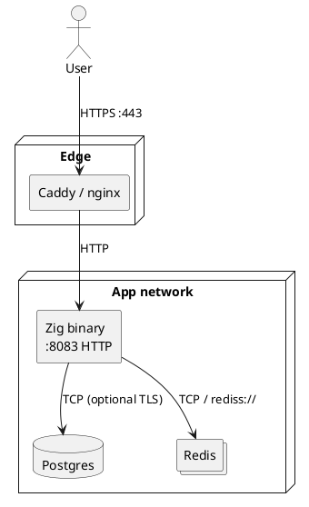

Zig — Part VI: TLS & deployment
How **TLS** fits (and does not yet fully fit) in Zig’s standard library, why **Part V** apps listen on **plain HTTP**, and practical **deployment** patterns — reverse proxy, containers, health checks, and HTTPS outbound from Zig.

Assumes **Part V** [Web MVC project layout](v-mvc.md) (`server.zig`, `router.zig`, env-based config).

## 1. Does Zig handle TLS?

**Partially.** The split that matters for web servers:

| Piece | In `std` today | Typical use |
|-------|----------------|-------------|
| **`std.crypto.tls`** | TLS crypto in the standard library | Client and (evolving) server primitives |
| **`std.http.Client`** | Can fetch **`https://`** URLs | `zig fetch`, outbound API calls, stack probes |
| **`std.http.Server`** | HTTP/1.x over a **plain** TCP stream by default | Handlers in Part V — no cert setup in app code |
| **TLS server in-process** | Still maturing ([`std.crypto.tls.Server`](https://github.com/ziglang/zig/issues/14171)) | Not the default production path yet |

```text
What works well today          What most Zig web apps do
─────────────────────          ─────────────────────────
HTTPS client (outbound)        HTTP server + TLS at reverse proxy
TLS 1.3 client crypto          nginx / Caddy / Traefik / cloud LB
```

**Part V’s `server.zig`** calls `address.listen()` and `std.http.Server` on raw TCP — **no TLS wrapper**. That is intentional and normal for Zig in 2026.

## 2. Stdlib TLS — strengths and limits

### Client (outbound HTTPS)

`std.http.Client` plus `std.crypto.tls` can request `https://` endpoints without linking OpenSSL:

```zig
const std = @import("std");

pub fn fetchHealth(allocator: std.mem.Allocator) !void {
    var client: std.http.Client = .{ .allocator = allocator };
    defer client.deinit();

    var req = try client.request(.GET, try std.Uri.parse("https://example.com/health"), .{
        .allocator = allocator,
    });
    defer req.deinit();

    try req.start();
    try req.wait();
    // read req.reader() ...
}
```

Exact API fields change between Zig minors — run `zig init` on your version and check [std.http](https://ziglang.org/documentation/master/) for the current `Client` shape.

**Limits people hit in production:**

| Limit | Impact |
|-------|--------|
| **TLS 1.2** gaps on some versions | Some legacy endpoints only speak 1.2 |
| **ALPN** (HTTP/2 negotiation) | Not always available — HTTP/1.1 over TLS is the common case |
| **Custom CA / mTLS** | More manual setup than in Go or Java keystores |
| **API churn** | Upgrade Zig → re-read release notes for `std.http` / `std.crypto.tls` |

When std TLS is not enough, teams use **libcurl** via `@cImport`, **mbedTLS** bindings, or a small C helper — same FFI patterns as **Part IV**.

### Server (inbound HTTPS)

A first-class “`listenTls(cert, key)` on `std.http.Server`” workflow is **not** the recommended production default yet. Options:

| Approach | When |
|----------|------|
| **Reverse proxy terminates TLS** | Almost all public web apps (recommended) |
| **`std.crypto.tls.Server`** (when stable on your Zig) | Embedded devices, no proxy, accepting stdlib limits |
| **mbedTLS / OpenSSL via FFI** | You need 1.2, ALPN, or FIPS-adjacent stacks today |

## 3. Recommended pattern — TLS at the reverse proxy

```text
                    ┌─────────────────────────────────────┐
  Browser           │  Reverse proxy (TLS termination)     │         Zig app
  ────────HTTPS────►│  nginx / Caddy / Traefik / ALB       │──HTTP──► :8083
                    │  • TLS certs (Let’s Encrypt)         │         server.zig
                    │  • HTTP/2, HSTS, rate limits         │         plain TCP
                    └─────────────────────────────────────┘
```

| Benefit | Why |
|---------|-----|
| **Cert renewal** | Proxy or cloud handles ACME; Zig binary unchanged |
| **Stable Zig code** | No TLS API churn in your app |
| **Defense in depth** | WAF, rate limits, request size at edge |
| **Matches Part V** | `EXERCISES_WEB_PORT=8083` behind proxy on 443 |

### Minimal nginx example

```nginx
server {
    listen 443 ssl http2;
    server_name app.example.com;

    ssl_certificate     /etc/letsencrypt/live/app.example.com/fullchain.pem;
    ssl_certificate_key /etc/letsencrypt/live/app.example.com/privkey.pem;

    location / {
        proxy_pass http://127.0.0.1:8083;
        proxy_http_version 1.1;
        proxy_set_header Host $host;
        proxy_set_header X-Real-IP $remote_addr;
        proxy_set_header X-Forwarded-For $proxy_add_x_forwarded_for;
        proxy_set_header X-Forwarded-Proto $scheme;
    }
}
```

Zig does not need to read those headers unless you build redirect URLs or audit logs — optional `config.zig` support for `X-Forwarded-Proto`.

### Caddy (automatic HTTPS)

```text
app.example.com {
    reverse_proxy localhost:8083
}
```

Caddy obtains and renews certificates by default — good for small deployments and local staging with a real hostname.

## 4. Deployment layout

Typical production bundle for a Part V–style app:

```text
deploy/
  Dockerfile              # multi-stage: zig build → slim runtime image
  docker-compose.yml      # zig + postgres + redis + (optional) caddy
  Caddyfile               # or nginx.conf
  .env                    # DB_*, REDIS_*, EXERCISES_WEB_*, LOG_PATH
```



| Service | TLS typical? |
|---------|----------------|
| **User → proxy** | Yes (HTTPS) |
| **Proxy → Zig** | Often HTTP on private network |
| **Zig → Postgres** | `sslmode=require` on managed clouds |
| **Zig → Redis** | `rediss://` when provider requires it — see [Redis install](../redis/ii-install-and-redis-cli.md) |

## 5. Container build (outline)

Multi-stage Docker keeps the runtime image small:

```dockerfile
# build stage
FROM ubuntu:24.04 AS build
ARG ZIG_VERSION=0.13.0
RUN apt-get update && apt-get install -y curl xz-utils
RUN curl -fsSL "https://ziglang.org/download/${ZIG_VERSION}/zig-linux-x86_64-${ZIG_VERSION}.tar.xz" \
    | tar -xJ -C /usr/local && mv /usr/local/zig-linux-* /usr/local/zig
ENV PATH="/usr/local/zig:${PATH}"
WORKDIR /app
COPY . .
RUN zig build -Doptimize=ReleaseFast

# runtime stage
FROM ubuntu:24.04
RUN apt-get update && apt-get install -y libpq5 ca-certificates && rm -rf /var/lib/apt/lists/*
COPY --from=build /app/zig-out/bin/hello-mvc /usr/local/bin/app
ENV EXERCISES_WEB_HOST=0.0.0.0
ENV EXERCISES_WEB_PORT=8083
EXPOSE 8083
CMD ["/usr/local/bin/app"]
```

| Check | Command |
|-------|---------|
| Image runs | `docker run -p 8083:8083 --env-file .env app` |
| Health | `curl http://localhost:8083/health` |
| Behind TLS | Point Caddy/nginx at container port 8083 |

Use **`ReleaseFast`** or **`ReleaseSmall`** for production binaries — **Part II** `-Doptimize=ReleaseFast`.

## 6. Health, metrics, and readiness

Part V already exposes ops routes — wire them into orchestrators:

| Route | Use |
|-------|-----|
| **`GET /health`** | Liveness — process up |
| **`GET /metrics`** | Prometheus scrape (keep on internal network) |

**Kubernetes sketch:**

```yaml
livenessProbe:
  httpGet:
    path: /health
    port: 8083
readinessProbe:
  httpGet:
    path: /health
    port: 8083
```

Readiness can be extended to check Postgres/Redis if you add a **`/ready`** handler — return 503 when dependencies are down (same idea as session *unavailable* when Redis is missing).

Do **not** expose `/metrics` on the public internet without auth — scrape from inside the cluster or via the proxy with IP allow-list.

## 7. Environment and secrets

| Variable | Deployment note |
|----------|-----------------|
| **`EXERCISES_WEB_HOST`** | `0.0.0.0` in containers |
| **`EXERCISES_WEB_PORT`** | Internal port (8083); proxy maps 443 → this |
| **`DB_*`** | From secret store — never bake into image |
| **`REDIS_URL`** | `redis://` or `rediss://` for TLS to managed Redis |
| **`EXERCISES_OBSERVABILITY`**, **`LOG_PATH`** | Mount a volume for `demo-app.json.log` |

Secrets belong in **Docker secrets**, **Kubernetes secrets**, or cloud parameter stores — not in `build.zig` or embedded files.

## 8. Local dev vs production

| Environment | TLS | URL |
|-------------|-----|-----|
| **Local** | None | `http://127.0.0.1:8083` |
| **Compose + Caddy** | Proxy cert (mkcert or real DNS) | `https://app.localhost` |
| **Production** | Proxy or cloud LB | `https://app.example.com` |

Keep **`zig build run`** on plain HTTP for fast iteration — only add TLS in front when testing realistic cookies, `Secure` flags, or mixed-content rules.

## 9. When to terminate TLS inside Zig

Consider in-process TLS only when:

- No reverse proxy (embedded device, single-binary appliance)
- You accept maintaining certs in the app or via sidecar anyway
- Your Zig version’s `std.crypto.tls.Server` meets your requirements

Otherwise **proxy termination** is simpler, matches the rest of the industry, and keeps **Part V** code unchanged.

## 10. Quick troubleshooting

| Symptom | Likely cause | Fix |
|---------|--------------|-----|
| `link.exe` / build fails on Windows | MSVC for C deps | Part I — or use Linux container |
| Browser shows *not secure* | Hitting Zig port directly | Use `https://` via proxy |
| Redirect loop http/https | App builds `http://` URLs | Honor `X-Forwarded-Proto` |
| `TlsInitializationFailed` on client | TLS version / cert trust | Update Zig; add CA; try curl FFI |
| Session 503 | Redis unreachable | `REDIS_URL`, network, `rediss://` if required |
| 502 from proxy | Zig not listening | Check `EXERCISES_WEB_HOST=0.0.0.0`, port mapping |

## 11. Related

- **Part V** — [Web MVC project layout](v-mvc.md) — `server.zig`, health routes
- **Part II** — release builds [Build system & packages](ii-build-system-and-packages.md)
- **Part IV** — C FFI for libcurl/mbedtls [Memory, comptime & C interop](iv-memory-comptime-and-c-interop.md)
- [CDN — Setup & origin](../cdn/iv-setup-and-origin.md) — edge TLS and origin
- [API gateway — How gateways work](../api-gateway/ii-how-api-gateways-work.md) — TLS at the trust boundary
- [Redis — install](../redis/ii-install-and-redis-cli.md) — `rediss://` for TLS to Redis
