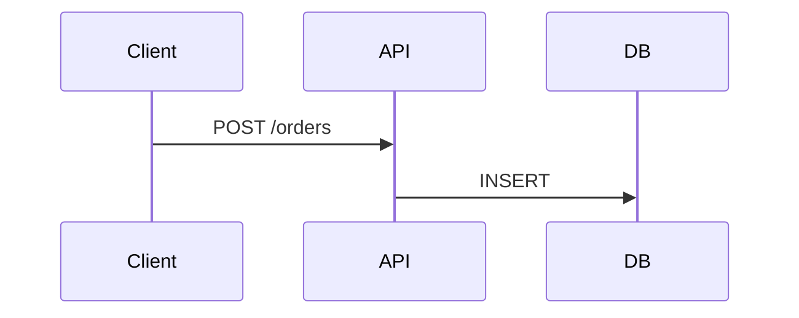

Obsidian — Part III
**Markdown** is the source format for every note. Obsidian adds **wikilinks**, **callouts**, **embeds**, and **YAML frontmatter** on top of common Markdown — all stored as plain text.

For Mermaid diagrams in notes, see **Mermaid** — [Overview](../languages&frameworks/mermaid/i-overview.md).

## 1. Standard Markdown

Obsidian supports typical Markdown:

```markdown
# Heading 1
## Heading 2

**bold**, *italic*, `inline code`

- bullet
- list

1. ordered
2. list

[External link](https://example.com)

| Col A | Col B |
|-------|-------|
| foo   | bar   |
```

| Mode | Use |
|------|-----|
| **Live Preview** | WYSIWYG-style editing (default for many users) |
| **Source mode** | Raw Markdown — good for precise diffs and tables |
| **Reading view** | Read-only; good for review |

Toggle with the editor icon or command palette: **Toggle Live Preview / Source mode**.

## 2. Markdown links vs wikilinks

| Context | Syntax | Example |
|---------|--------|---------|
| **Obsidian vault** | Wikilink | `[[ADR-003 idempotency]]` |
| **This curriculum repo** (Cursor Notes) | Markdown + relative path | `See [Docker in CI](../../sre101/cicd/tools-and-platforms/v-docker-in-ci.md).` |
| **Same Obsidian submenu** | Filename only | `[Install & vault setup](ii-install-and-vault-setup.md)` |

In **this repository**, cross-links use the target note’s **`subtitle`** as link text — see [Topics and folders](../../getting-started/guide-topics-and-folders.md). Do not use bare backtick paths; use markdown links.

## 3. Wikilinks and embeds

Internal links use double brackets:

```markdown
See [[Redis cache-aside]] for the pattern.
Link with alias: [[redis/i-overview|Redis track]].
```

**Embed** another note or image:

```markdown
![[reference/redis-commands]]
![[attachments/architecture.png]]
```

| Syntax | Result |
|--------|--------|
| `[[Note]]` | Link to `Note.md` (or `Note` in a subfolder) |
| `[[folder/note\|label]]` | Link with custom display text |
| `![[note]]` | Transclude note content inline |
| `![[file.png]]` | Inline image |

Broken links show as unresolved until you create the target note — useful for **stub-first** knowledge graphs.

## 4. Callouts

Obsidian callouts extend blockquotes:

```markdown
> [!note]
> Neutral information.

> [!tip]
> Shortcut or best practice.

> [!warning]
> Production pitfall — check TTL before deploy.

> [!example]
> ```
> redis-cli SET session:abc "{}" EX 3600
> ```
```

Common types: `note`, `tip`, `warning`, `info`, `question`, `failure`, `bug`, `example`, `quote`. Foldable callouts: `> [!note]-` (collapsed) or `> [!note]+` (expanded).

## 5. YAML frontmatter

Metadata at the top of a file:

```yaml
---
title: Order service ADR-003
date: 2026-07-06
tags:
  - adr
  - payments
status: accepted
---
```

Frontmatter powers **templates**, **Dataview** queries (plugin), and sorting — keep keys consistent across note types.

## 6. Code blocks

Fenced blocks with language tags for syntax highlighting:

````markdown
```java
@RestController
@RequestMapping("/api/orders")
public class OrderController { }
```

```bash
git status
git add docs/adr-003.md
git commit -m "docs: ADR for idempotent checkout"
```


````

Mermaid renders natively when the **Mermaid** core plugin is enabled (default).

## 7. Math and diagrams

- **LaTeX math:** `$inline$` and `$$block$$` with the core **Math** plugin.
- **Excalidraw:** community plugin for hand-drawn sketches stored as `.md` or `.excalidraw` — popular for whiteboard-style architecture.

## 8. Editing habits for Git-friendly notes

| Habit | Why |
|-------|-----|
| One main topic per file | Smaller diffs, clearer backlinks |
| Stable filenames | `adr-003-idempotency.md` beats `Untitled 7.md` |
| Wrap long lines (~80–120 chars) | Optional; improves `git diff` readability |
| Avoid paste-only PDFs | Prefer text + link; OCR if needed |

## Rehearsal

- Difference between `[[link]]` and `![[embed]]`?
- Name two callout types you would use in a runbook.

## Next

Continue with [Links, graph & tags](iv-links-graph-and-tags.md) for backlinks, graph view, and maps of content.
