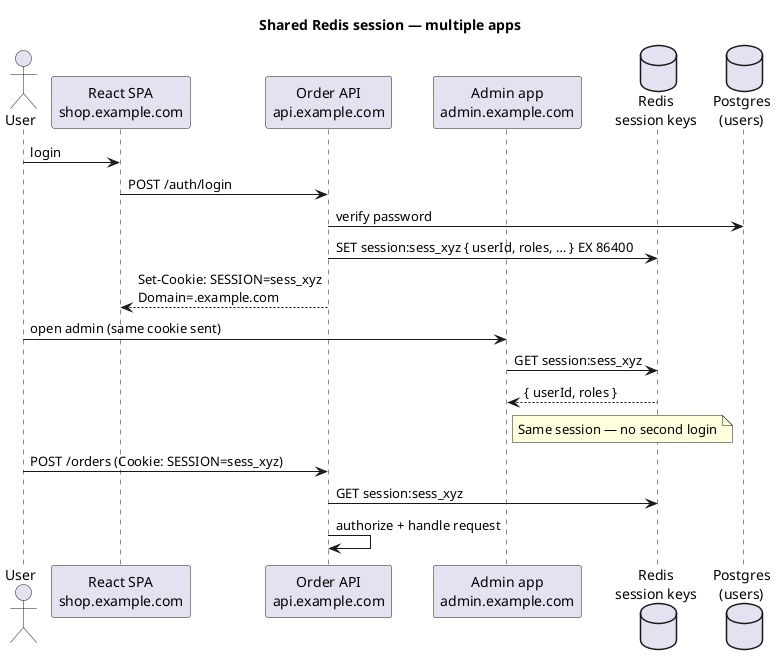
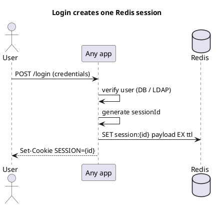
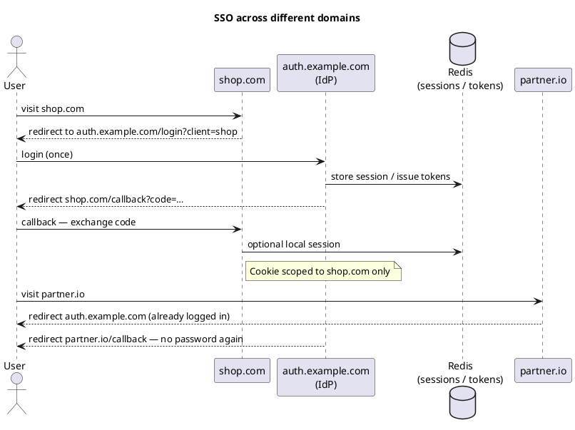

Redis — shared sessions across apps
When **multiple applications** must treat a user as logged in — e.g. **React SPA** + **Spring Boot API**, **admin portal** + **customer app**, or **microservices** behind one domain — store **one server-side session** in **Redis** and share the **same session id** (cookie) across apps. Each app reads/writes the **same key**; logout in one app ends the session everywhere.

Prerequisites: [Session store pattern](iv-patterns-and-use-cases.md#2-session-store), [App integration](v-app-integration.md). Auth concepts: [React authentication](../javascript/react/iv-authentication.md).

## 1. Problem

```text
App A (shop.example.com)     →  session in memory on server 1
App B (admin.example.com)    →  separate login again
API  (api.example.com)       →  JWT in localStorage — different model
```

Without a **central session store**, users re-authenticate per app, or you duplicate token logic. **Redis** becomes the shared session database for a **stateless HTTP tier** (any pod can serve any request).

## 2. Target architecture



| Piece | Role |
|-------|------|
| **Session id** | Opaque random string in **HttpOnly cookie** — not the JWT payload |
| **Redis** | Authoritative session blob — `userId`, roles, cart id, … |
| **Each app** | Validates cookie → **GET** session from Redis → allow or 401 |
| **Postgres** | User accounts — Redis holds **session**, not the password |

## 3. Key design

```text
session:{sessionId}     →  JSON or hash (userId, username, roles, …)
TTL: EX 86400           →  sliding or absolute expiry
```

| Convention | Example |
|------------|---------|
| **Prefix** | `session:` or library default `spring:session:sessions:` |
| **Session id** | Cryptographically random — `sess_` + 32+ bytes base64url |
| **Value** | Small JSON — avoid large objects; reference ids if needed |
| **Namespace** | Same Redis **DB index** and **key prefix** for **all** apps |

```text
SET session:sess_abc123 "{\"userId\":42,\"roles\":[\"user\",\"beta\"]}" EX 86400
GET session:sess_abc123
EXPIRE session:sess_abc123 86400   # extend on activity (sliding session)
DEL session:sess_abc123            # logout — all apps see it gone
```

**Spring Session Redis** uses its own key layout — all Spring apps sharing one Redis with the same config automatically share sessions.

## 4. Cookie rules for cross-app sharing

Apps must agree on **cookie name**, **domain**, and **path**.

| Attribute | Cross-subdomain sharing |
|-----------|-------------------------|
| **`Domain=.example.com`** | Cookie sent to `shop.`, `admin.`, `api.` subdomains |
| **`Path=/`** | All paths on those hosts |
| **`HttpOnly`** | JS cannot read — mitigates XSS stealing session |
| **`Secure`** | HTTPS only in production |
| **`SameSite=Lax`** | Default for same-site subdomains; **`None` + Secure** if SPA on different site |

```http
Set-Cookie: SESSION=sess_xyz; Domain=.example.com; Path=/; HttpOnly; Secure; SameSite=Lax; Max-Age=86400
```

**Different top-level domains** (`shop.com` + `partner.io`) **cannot share a cookie** — browsers isolate cookies per registrable domain. Redis can still hold sessions, but you need **SSO (OAuth 2 / OpenID Connect)** or a **central login domain** — see [§13 Different domains](#13-different-domains-not-subdomains).

## 5. Login flow (shared session)



Only **one** service needs to perform login (auth service or primary API). Other apps **trust the cookie** and read Redis — they do not re-verify password on every app.

## 6. Spring Boot — multiple services, one Redis

**Dependencies** (each Spring app that participates):

```xml
<dependency>
  <groupId>org.springframework.session</groupId>
  <artifactId>spring-session-data-redis</artifactId>
</dependency>
<dependency>
  <groupId>org.springframework.boot</groupId>
  <artifactId>spring-boot-starter-data-redis</artifactId>
</dependency>
```

```yaml
# Same on order-api, admin-api, etc.
spring:
  session:
    store-type: redis
    redis:
      namespace: mycompany:session   # shared namespace
  data:
    redis:
      host: redis.internal
      port: 6379
```

```java
@Configuration
@EnableRedisHttpSession(maxInactiveIntervalInSeconds = 86400)
public class SessionConfig {
  // optional: cookie serializer for Domain=.example.com
  @Bean
  public DefaultCookieSerializer cookieSerializer() {
    DefaultCookieSerializer serializer = new DefaultCookieSerializer();
    serializer.setCookieName("SESSION");
    serializer.setDomainName(".example.com");
    serializer.setSameSite("Lax");
    return serializer;
  }
}
```

After login on **Order API**, opening **Admin API** with the same cookie loads the same Spring Security context from Redis.

## 7. Node / Express — `connect-redis`

Non-Spring apps use the **same key format** or a **shared JSON schema**:

```javascript
import session from 'express-session';
import RedisStore from 'connect-redis';
import { createClient } from 'redis';

const redis = createClient({ url: 'redis://redis.internal:6379' });
await redis.connect();

app.use(session({
  store: new RedisStore({ client: redis, prefix: 'session:' }),
  name: 'SESSION',
  secret: process.env.SESSION_SECRET,  // same secret if signing cookie — or opaque id only
  cookie: {
    domain: '.example.com',
    httpOnly: true,
    secure: true,
    maxAge: 86400000,
    sameSite: 'lax',
  },
  resave: false,
  saveUninitialized: false,
}));
```

**Interop tip:** Spring Session and `connect-redis` use **different serializers** by default. Easiest paths:

| Approach | Detail |
|----------|--------|
| **All Spring** | Spring Session everywhere — no custom parsing |
| **Mixed stack** | **Auth service** writes a **simple JSON** key `session:{id}`; each stack reads that contract |
| **API gateway session** | Gateway validates Redis session; backends get internal headers (`X-User-Id`) |

## 8. React SPA + API (typical setup)

React does **not** store the session in `localStorage` for this pattern — the browser sends the **cookie** automatically:

```javascript
// fetch from React — cookie included when SameSite/domain allow
await fetch('https://api.example.com/orders', {
  credentials: 'include',
});
```

API CORS must allow credentials:

```java
// Spring — WebMvcConfigurer
registry.addMapping("/api/**")
    .allowedOrigins("https://shop.example.com")
    .allowCredentials(true);
```

Session lives in **Redis on the server**; React only holds UI state.

## 9. Logout everywhere

```text
POST /logout
  → DEL session:sess_xyz   (or Spring Session invalidate)
  → Set-Cookie: SESSION=; Max-Age=0
```

Any app that calls logout clears Redis — other apps’ next `GET session:…` returns null → redirect to login.

Optional: maintain a **session registry set** per user for “logout all devices”:

```text
SADD user:42:sessions sess_xyz sess_def
DEL session:sess_xyz session:sess_def
SREM user:42:sessions sess_xyz sess_def
```

## 10. Security checklist

| Item | Why |
|------|-----|
| **Random session ids** | Prevent guessing |
| **HttpOnly + Secure cookies** | Reduce theft |
| **Short TTL + sliding refresh** | Limit stolen-session window |
| **Redis AUTH / TLS** | Network exposure |
| **No PII in session blob** | Store `userId` only; load profile from DB if needed |
| **Regenerate session id on login** | Session fixation mitigation |

Redis loss: sessions disappear — users re-login; **not** a substitute for user data in Postgres.

## 11. Redis Session vs JWT across apps

| | **Redis shared session** | **JWT in every app** |
|---|--------------------------|----------------------|
| **Logout everywhere** | Delete one Redis key | Hard — need blocklist or short TTL |
| **Revoke roles** | Update session or delete | Wait for JWT expiry |
| **Cross-app** | Same cookie + Redis | Same issuer/secret or JWKS |
| **Mobile** | Cookie awkward — often JWT + refresh | Common |

Many teams: **Redis session for web** (subdomains), **JWT for mobile/API clients**.

## 12. Operations

| Concern | Practice |
|---------|----------|
| **Memory** | `maxmemory` + `volatile-lru`; session keys have TTL |
| **HA** | Redis Sentinel or Cluster — session store is critical path |
| **Sticky sessions** | **Not required** when session is in Redis |
| **Monitoring** | Session key count, memory, connection count per app |

See [Operations & persistence](vi-operations-and-persistence.md) for replication and persistence — sessions are usually **acceptable to lose on full cluster failure** (users re-auth), but production still wants failover.

## 13. Different domains (not subdomains)

### Why Redis + cookie is not enough

| Setup | Cookie `Domain=` works? |
|-------|-------------------------|
| `shop.example.com` + `admin.example.com` | **Yes** — use `Domain=.example.com` |
| `example.com` + `example.co.uk` | **No** — different registrable domains |
| `myshop.com` + `mybrand.io` | **No** |
| `localhost:3000` + `localhost:8080` | **Same site** (localhost) — cookie port quirks; use one cookie domain in dev carefully |
| SPA on `app.com`, API on `api.com` | **No** for shared session cookie — use tokens or SSO |

The **session blob can still live in Redis** — but each domain gets its **own cookie** (or token), linked by the **same user id** and **central auth**.

### Pattern A — Central auth domain (SSO login)

One **Identity Provider (IdP)** at `auth.example.com` (or Keycloak, Auth0, Okta, Azure AD).



| Piece | Role |
|-------|------|
| **IdP** | Single login UI; may use **Redis** for its own server sessions |
| **Each app** | OAuth **client** — gets its **own cookie** on its domain after callback |
| **Redis** | Shared **auth server** session store, or **token/session registry** keyed by `userId` + client |

User logs in **once** at the IdP; other domains redirect there and skip password if IdP session is still valid.

### Pattern B — JWT access + refresh (API-first)

Common when domains differ and you have SPAs:

```text
auth.example.com  →  POST /token  →  { accessToken, refreshToken }
shop.com SPA      →  stores tokens (memory or httpOnly cookie on shop.com only)
partner.io SPA    →  separate login OR same IdP OAuth flow
```

| Token | Lifetime | Storage |
|-------|----------|---------|
| **Access JWT** | Short (5–15 min) | Memory preferred |
| **Refresh token** | Days | HttpOnly cookie on **auth** domain, or secure storage |

Each API validates JWT signature (shared **JWKS** from IdP). **Redis** optional for **refresh token rotation**, **logout blocklist**, or **session registry**:

```text
SET refresh:token_xyz  userId:42  EX 604800
DEL refresh:token_xyz   # logout this device
SADD user:42:revoked_jti  jti_abc   # block access JWT until expiry
```

### Pattern C — Backend-for-frontend (BFF) per domain

Each site has its **own backend** on the **same parent domain** as the SPA:

```text
shop.com        →  shop.com/api   (cookie Domain=shop.com, Redis session)
partner.io      →  partner.io/api (cookie Domain=partner.io, Redis session)
                      ↑
              both validate user via same IdP / shared user DB
              optional: shared Redis with keys session:shop:{id} vs session:partner:{id}
              linked by userId inside payload
```

No cross-domain cookie — each stack is independent but **same user account** via IdP or shared Postgres users table.

### Pattern D — Token exchange at login (one Redis, many cookies)

After IdP proves identity, **each app** creates **its own** Redis session on first visit:

```text
1. User authenticates at auth.example.com
2. auth stores:  SET sso:grant:one_time_code  { userId, roles } EX 60
3. Redirect to partner.io/sso?code=one_time_code
4. partner.io backend: GET grant, DEL grant, SET session:partner_sess_…  EX 86400
5. Set-Cookie on partner.io only
```

One-time code bridges domains safely (like OAuth authorization code).

### What to use when

| Scenario | Approach |
|----------|----------|
| Subdomains only | **Shared Redis session cookie** (`Domain=.example.com`) — [§4](#4-cookie-rules-for-cross-app-sharing) |
| Different brands / TLDs | **OAuth/OIDC SSO** + per-domain cookies or JWT |
| Mobile + web | **JWT + refresh**; Redis for refresh/revocation |
| Logout everywhere cross-domain | IdP **global logout** + revoke refresh tokens in Redis; JWTs expire short |

### Redis role across domains

Redis does **not** magically cross domain boundaries. It **does**:

- Store **IdP sessions** (Keycloak/Spring Authorization Server + Spring Session Redis)
- Store **refresh tokens** and **revocation lists**
- Store **per-app sessions** that all reference the same **`userId`**

It **does not** replace **SSO protocol** when cookies cannot be shared.

## Next

Return to [Redis overview](i-overview.md) or [Patterns & use cases](iv-patterns-and-use-cases.md).
