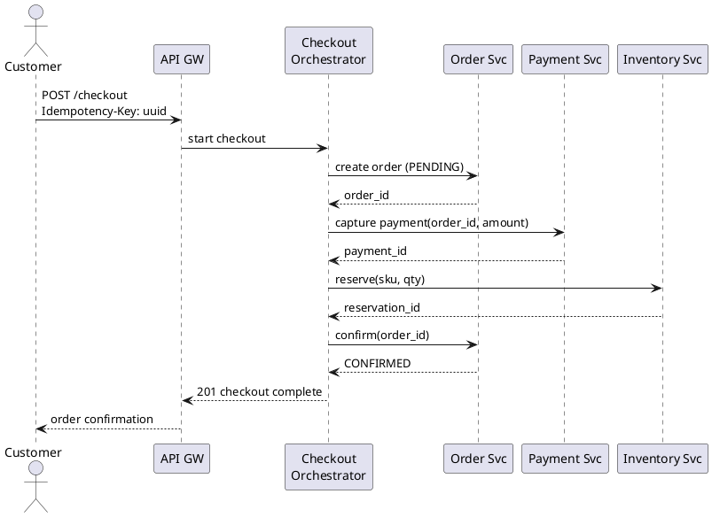
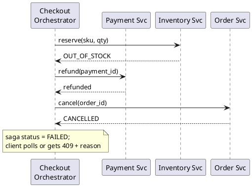

E-commerce checkout saga
An **orchestrated saga** for **checkout** — create order, charge payment, reserve inventory — when each step lives in a **separate service** with its own database. No distributed `COMMIT`; failures trigger **compensating transactions** in reverse order.

For saga theory, choreography vs orchestration, and idempotency keys, see [Distributed transactions](../scalable-patterns/vii-distributed-transactions.md). For the **transactional outbox**, see [Message queues & async](../scalable-patterns/iii-message-queues-and-async.md).

## 1. Requirements

| Functional | Non-functional |
|------------|----------------|
| Customer checks out a cart (1+ line items) | **No double charge** on retries |
| Order visible to customer when confirmed | Payment provider may be slow (seconds) |
| Stock reserved before confirmation email | Inventory service must not oversell |
| Cancel releases stock and refunds if possible | Partial outages must not leave orphan charges |

**Consistency model:** **eventual** across services — customer sees `CONFIRMED` only after all forward steps succeed. Intermediate states (`PENDING`, `PAYMENT_CAPTURED`) are valid and must be queryable.

## 2. Services and data ownership

```text
                    ┌─────────────────┐
                    │ Checkout        │
                    │ Orchestrator    │
                    │ (state machine) │
                    └────────┬────────┘
         commands/events     │
    ┌────────────┬───────────┼───────────┬────────────┐
    ▼            ▼           ▼           ▼            ▼
 Order Svc   Payment Svc  Inventory   Notification  (read)
 (Postgres)  (Postgres +  (Postgres)  (email queue)
              Stripe API)
```

| Service | Owns | Shard key (if sharded) |
|---------|------|------------------------|
| **Order** | `orders`, `order_items`, saga state pointer | `customer_id` |
| **Payment** | `payments`, idempotency keys, Stripe ids | `customer_id` |
| **Inventory** | `stock_levels`, `reservations` | `sku` or `warehouse_id` |
| **Checkout orchestrator** | `checkout_sagas` — current step, correlation id | `checkout_id` |

**Rule:** services do not read each other's tables — only **APIs** and **events**.

## 3. Who is the orchestrator?

**Yes — in the common shape, the orchestrator is its own program (often a Java/Spring Boot microservice) that calls the other microservices in order.** It is not the API gateway, not the browser, and not “whichever service happens to run first.”

| Component | Orchestrator? | Role |
|-----------|---------------|------|
| **Checkout service** (dedicated app) | **Yes** | Runs saga state machine; HTTP/gRPC **client** to Order, Payment, Inventory |
| **API gateway** | No | Auth, rate limit, route `POST /checkout` → Checkout service |
| **Order / Payment / Inventory** | No | **Participants** — one local transaction per command; expose APIs only |
| **Monolith controller** (early stage) | Yes (in-process) | Same logic before you split services — still “orchestrator,” just not a separate deployable yet |

### What the Checkout service (Java) actually does

```text
Customer → API GW → Checkout Service (orchestrator)
                         │
                         ├─ RestClient / Feign → Order Service
                         ├─ RestClient / Feign → Payment Service
                         └─ RestClient / Feign → Inventory Service
                         │
                         └─ own DB: checkout_sagas (step, ids, status)
```

| Responsibility | Owner |
|----------------|--------|
| Decide **next step** from current saga state | Checkout service |
| **Call** participant APIs (create order, capture, reserve, confirm) | Checkout service |
| **Persist** `checkout_id`, `order_id`, `payment_id`, `current_step` | Checkout service DB |
| On failure, **invoke compensations** in reverse order | Checkout service |
| **Business rules** for one order row, one payment row, stock math | Each participant service |

Participants do **not** call each other in a chain (`Order → Payment → Inventory`). The orchestrator is the **only** component that knows the full workflow.

### Sketch (Spring-style — illustrative)

```java
// Checkout service — orchestrator, not Order service
@PostMapping("/checkout")
public CheckoutResponse checkout(@RequestHeader("Idempotency-Key") String key, @RequestBody Cart cart) {
    CheckoutSaga saga = sagaRepo.findOrStart(key, cart);
    try {
        if (saga.step() == STARTED) {
            saga.setOrderId(orderClient.createPending(cart));
            saga.advance(ORDER_CREATED);
        }
        if (saga.step() == ORDER_CREATED) {
            saga.setPaymentId(paymentClient.capture(saga.getOrderId(), cart.total()));
            saga.advance(PAYMENT_CAPTURED);
        }
        if (saga.step() == PAYMENT_CAPTURED) {
            inventoryClient.reserve(saga.getOrderId(), cart.items());
            saga.advance(INVENTORY_RESERVED);
        }
        if (saga.step() == INVENTORY_RESERVED) {
            orderClient.confirm(saga.getOrderId());
            saga.advance(CONFIRMED);
        }
        return CheckoutResponse.confirmed(saga);
    } catch (InventoryException e) {
        compensate(saga);  // refund → cancel order
        throw e;
    }
}
```

`orderClient`, `paymentClient`, `inventoryClient` are **outbound HTTP clients** to other microservices. Saga rows live in the **Checkout service database**, not in Order’s DB.

### What is not the orchestrator

| Mistake | Why it hurts |
|---------|--------------|
| Order service calls Payment then Inventory | Order service owns order data only; workflow logic is **coupled** and hard to change |
| Fat API gateway runs saga | Gateway should stay thin (auth, routing); business workflows belong in a service |
| Frontend calls Order, then Payment, then Inventory | No server-side compensation; retries double-charge; secrets exposed |

### Alternative: workflow engine as orchestrator

The **orchestrator role** can be a product instead of your Java class:

| Engine | Who “calls” microservices |
|--------|---------------------------|
| **Temporal / Cadence** | Worker process (Java/Go) executes workflow code; engine stores state |
| **AWS Step Functions** | State machine invokes Lambda or HTTP tasks |
| **Camunda** | BPMN process drives service tasks |

Your Java code still **calls** microservices — it runs inside a **workflow worker**, with durable timers and retries provided by the engine.

## 4. Saga steps (forward)

| Step | Service | Local transaction | Publishes |
|------|---------|-------------------|-----------|
| **1** | Order | `INSERT order` status `PENDING` | `OrderCreated` |
| **2** | Payment | Authorize/capture via Stripe; `INSERT payment` | `PaymentCaptured` |
| **3** | Inventory | `UPDATE stock`; `INSERT reservation` | `InventoryReserved` |
| **4** | Order | `UPDATE order` status `CONFIRMED` | `OrderConfirmed` |
| **5** | Notification | Enqueue confirmation email (async) | — |

Steps 1–4 are **synchronous commands** from the orchestrator (or async with polling); step 5 is fire-and-forget.

### Happy path (sequence)



<figure class="notes-diagram"><svg xmlns="http://www.w3.org/2000/svg" viewBox="0 0 480 100" role="img" aria-label="Orchestrated saga forward steps all green">
  <text x="12" y="20" fill="#d4d4d8" font-size="11" font-weight="600">Checkout saga — happy path</text>
  <rect x="12" y="36" width="64" height="28" rx="3" fill="rgba(34,197,94,0.15)" stroke="#86efac"/>
  <text x="22" y="54" fill="#e4e4e7" font-size="8">1. Order</text>
  <path d="M76 50 H96" stroke="#a1a1aa" stroke-width="1.5"/>
  <rect x="96" y="36" width="64" height="28" rx="3" fill="rgba(34,197,94,0.15)" stroke="#86efac"/>
  <text x="102" y="54" fill="#e4e4e7" font-size="8">2. Payment</text>
  <path d="M160 50 H180" stroke="#a1a1aa" stroke-width="1.5"/>
  <rect x="180" y="36" width="64" height="28" rx="3" fill="rgba(34,197,94,0.15)" stroke="#86efac"/>
  <text x="186" y="54" fill="#e4e4e7" font-size="8">3. Inventory</text>
  <path d="M244 50 H264" stroke="#a1a1aa" stroke-width="1.5"/>
  <rect x="264" y="36" width="64" height="28" rx="3" fill="rgba(34,197,94,0.15)" stroke="#86efac"/>
  <text x="272" y="54" fill="#e4e4e7" font-size="8">4. Confirm</text>
  <text x="12" y="82" fill="#71717a" font-size="9">Orchestrator drives order; each box is one local ACID transaction</text>
</svg></figure>

## 5. Compensations (backward)

If step **3** (inventory) fails after payment succeeded:

| Order | Compensation | Service |
|-------|--------------|---------|
| 1 (undo 2) | **Refund** payment | Payment |
| 2 (undo 1) | **Cancel** order (`CANCELLED`) | Order |



<figure class="notes-diagram"><svg xmlns="http://www.w3.org/2000/svg" viewBox="0 0 460 120" role="img" aria-label="Saga compensation refund then cancel order">
  <text x="12" y="20" fill="#d4d4d8" font-size="11" font-weight="600">Compensation after inventory failure</text>
  <rect x="12" y="36" width="72" height="28" rx="3" fill="rgba(34,197,94,0.15)" stroke="#86efac"/>
  <text x="24" y="54" fill="#e4e4e7" font-size="8">1. Order OK</text>
  <path d="M84 50 H108" stroke="#a1a1aa" stroke-width="1.5"/>
  <rect x="108" y="36" width="72" height="28" rx="3" fill="rgba(34,197,94,0.15)" stroke="#86efac"/>
  <text x="118" y="54" fill="#e4e4e7" font-size="8">2. Pay OK</text>
  <path d="M180 50 H204" stroke="#f87171" stroke-width="1.5"/>
  <rect x="204" y="36" width="72" height="28" rx="3" fill="rgba(248,113,113,0.15)" stroke="#f87171"/>
  <text x="214" y="54" fill="#e4e4e7" font-size="8">3. Stock FAIL</text>
  <text x="12" y="82" fill="#fbbf24" font-size="9">Compensate: refund (2) → cancel order (1)</text>
  <path d="M180 90 H108" stroke="#fbbf24" stroke-width="1" stroke-dasharray="3 2"/>
  <path d="M108 90 H36" stroke="#fbbf24" stroke-width="1" stroke-dasharray="3 2"/>
</svg></figure>

| Forward step | Compensation | Must be idempotent? |
|--------------|--------------|---------------------|
| Create order | Cancel order | Yes — retry cancel safe |
| Capture payment | Refund | Yes — same `payment_id` |
| Reserve stock | Release reservation | Yes — release twice OK |

## 6. Orchestrator state machine

```text
                    ┌──────────┐
         start      │ STARTED  │
        ──────────▶ │          │
                    └────┬─────┘
                         │ order created
                         ▼
                    ┌──────────┐
                    │ ORDER_   │
                    │ CREATED  │
                    └────┬─────┘
                         │ payment ok
                         ▼
                    ┌──────────┐     inventory fail
                    │ PAYMENT_ │──────────────────┐
                    │ CAPTURED │                  │
                    └────┬─────┘                  ▼
                         │ stock ok         ┌───────────┐
                         ▼                  │COMPENSATING│
                    ┌──────────┐             └─────┬─────┘
                    │ CONFIRMED│                   │
                    └──────────┘                   ▼
                                            ┌──────────┐
                                            │ FAILED   │
                                            └──────────┘
```

Store state in `checkout_sagas` with `checkout_id`, `current_step`, `order_id`, `payment_id`, `updated_at`. On orchestrator crash, **resume** from last completed step (idempotent downstream calls).

## 7. Why orchestration (not choreography) here

| Factor | Choice |
|--------|--------|
| **4+ steps** with strict order | Central state machine is easier to reason about |
| **Compensation order** must be exact | Orchestrator enforces reverse sequence |
| **Customer-facing status** | One place to answer “where is my checkout?” |
| **Debugging** | Single correlation id across steps |

**Choreography** (each service reacts to events only) can work for 2-step flows; checkout with refunds and stock is usually **orchestrated** or a workflow engine (Temporal, Cadence, AWS Step Functions).

## 8. Reliability building blocks

### Idempotency-Key (client → API)

```http
POST /v1/checkout
Idempotency-Key: 7b9e2c1a-...
```

Orchestrator stores key → `checkout_id` + final HTTP response. Retries return the same result — critical when mobile clients retry on timeout.

### Idempotent service handlers

| Service | Key |
|---------|-----|
| Payment capture | `order_id` or idempotency key → same Stripe id |
| Inventory reserve | `order_id` + `sku` → one reservation row |
| Refund | `payment_id` → second call returns prior refund |

### Transactional outbox

Each service writes **business row + outbox row** in one local transaction; a relay publishes to Kafka/SQS.

```text
Order Svc DB transaction:
  INSERT orders ...
  INSERT outbox (topic=OrderCreated, payload=...)
→ relay → message bus
```

Avoids “order saved but event never sent.”

### Timeouts and partial failure

| Risk | Mitigation |
|------|------------|
| Payment hangs | Timeout → treat as unknown; **query** Stripe before compensating |
| Orchestrator dies mid-saga | Cron/worker resumes `COMPENSATING` or stale `PAYMENT_CAPTURED` |
| Duplicate messages | Idempotent consumers keyed by `checkout_id` |

## 9. API and customer experience

| HTTP | Behavior |
|------|----------|
| `POST /checkout` | Starts saga; returns `202` + `checkout_id` or `201` when fast path completes |
| `GET /checkout/{id}` | `PENDING` / `CONFIRMED` / `FAILED` + reason |
| Failure | `FAILED` + `reason: OUT_OF_STOCK` — not a silent rollback |

Do not expose internal compensation steps to the client — only final status and safe messaging.

## 10. Observability

| Signal | Use |
|--------|-----|
| `checkout_id` correlation id | Trace across Order, Payment, Inventory |
| Saga duration p99 | SLA for checkout |
| Compensation rate | Product/ops alert if inventory failures spike |
| Stuck sagas (`PAYMENT_CAPTURED` > 5 min) | Worker alert — resume or compensate |

## 11. Trade-offs and alternatives

| Approach | When |
|----------|------|
| **Orchestrated saga** (this example) | Microservices, separate DBs, need visible workflow |
| **Single monolith + one DB** | Local ACID — no saga until you split services |
| **2PC across services** | Avoid — blocking, fragile |
| **Choreography** | Few steps, strong event culture, no central coordinator |
| **Sync chain** `Order→Pay→Stock` in one API | Simple early on; cascading failure and no compensation story |

## 12. Rehearsal questions

- Who calls Payment service — Order service, API gateway, or Checkout orchestrator?
- Payment succeeds; inventory fails — what runs, in what order?
- Client sends the same `Idempotency-Key` twice — what must not happen?
- Why is “query payment status before refund” important on timeout?
- How would **sharding** Order by `customer_id` and Inventory by `sku` affect this saga?

**Other checkout examples:** [Choreography](iii-ecommerce-checkout-choreography.md) · [Local ACID](iv-ecommerce-checkout-local-acid.md) · [Outbox](v-ecommerce-checkout-transactional-outbox.md) · [Idempotency](vi-ecommerce-checkout-idempotency.md) · [Sharded](ix-ecommerce-checkout-sharded.md) · [Workflow engine](x-ecommerce-checkout-workflow-engine.md) — full map in [Examples overview](i-overview.md).

**Related:** [Distributed transactions](../scalable-patterns/vii-distributed-transactions.md), [Database sharding](../scalable-patterns/ix-database-sharding.md) (cross-shard checkout), [API design](../scalable-patterns/ii-api-design.md).
