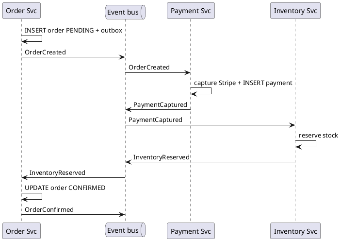
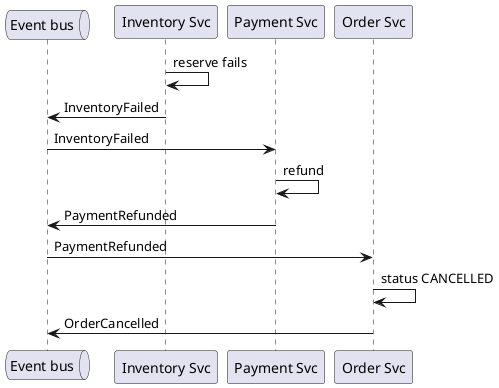

E-commerce checkout choreography
The **same checkout problem** as [E-commerce checkout saga](ii-ecommerce-checkout-saga.md) — order, payment, inventory in **separate microservices** — but coordinated by **events**, not a central Java orchestrator. Each service **reacts** to messages on a bus and runs its own local transaction plus **compensating** events on failure.

For theory, see [Distributed transactions](../scalable-patterns/vii-distributed-transactions.md) (choreography vs orchestration) and [Message queues & async](../scalable-patterns/iii-message-queues-and-async.md).

## 1. Same requirements, different coordinator

| | [Orchestrated saga](ii-ecommerce-checkout-saga.md) | **Choreography** (this note) |
|---|---------------------|------------------------------|
| Who drives the flow? | **Checkout service** calls others in order | **Events** — each service subscribes and acts |
| Global state | `checkout_sagas` table in orchestrator | **No single table** — inferred from events + per-service rows |
| Entry point | `POST /checkout` → orchestrator | `POST /checkout` → **Order service** (or thin API) publishes first event |
| Failure rollback | Orchestrator calls refund → cancel | **Payment** hears `InventoryFailed` → refund; **Order** hears `PaymentRefunded` → cancel |
| Best when | Many steps, need one place to debug | Mature event platform, looser coupling, fewer cross-cutting workflow changes |

**Still a saga** in the textbook sense (local transactions + compensations) — but **no orchestrator process** calling Feign clients in a loop.

## 2. Services and message bus

```text
  POST /checkout
        │
        ▼
   Order Svc ──publish──▶  Kafka / SNS+SQS
        ▲                      │
        │         ┌────────────┼────────────┐
        │         ▼            ▼            ▼
        │    Payment Svc  Inventory Svc  Notification
        │         │            │
        └─ subscribe OrderConfirmed, PaymentRefunded, ...
```

| Service | Subscribes to | Publishes |
|---------|---------------|-----------|
| **Order** | `PaymentCaptured`, `InventoryReserved`, `PaymentRefunded`, `InventoryFailed` | `OrderCreated`, `OrderConfirmed`, `OrderCancelled` |
| **Payment** | `OrderCreated`, `InventoryFailed` | `PaymentCaptured`, `PaymentRefunded`, `PaymentFailed` |
| **Inventory** | `PaymentCaptured` | `InventoryReserved`, `InventoryFailed` |
| **Notification** | `OrderConfirmed` | — |

**No Checkout orchestrator service** — optional **Checkout API** may only validate the cart and call `Order.create()`; it does not call Payment or Inventory directly.

## 3. Who starts checkout?

| Option | Flow |
|--------|------|
| **Order as entry** (common) | Client `POST /orders/checkout` → Order inserts `PENDING` + outbox `OrderCreated` |
| **Thin BFF** | BFF validates session, forwards to Order — still does **not** orchestrate payment/stock |

The **Java program that receives the HTTP request** is usually the **Order service** (or BFF → Order). Payment and Inventory are **event consumers**, not callees of that first request.

## 4. Happy path (events)



<figure class="notes-diagram"><svg xmlns="http://www.w3.org/2000/svg" viewBox="0 0 500 100" role="img" aria-label="Choreography event chain OrderCreated PaymentCaptured InventoryReserved">
  <text x="12" y="20" fill="#d4d4d8" font-size="11" font-weight="600">Choreography — forward events</text>
  <rect x="12" y="40" width="72" height="28" rx="3" fill="rgba(59,130,246,0.15)" stroke="#60a5fa"/>
  <text x="20" y="58" fill="#e4e4e7" font-size="8">OrderCreated</text>
  <path d="M84 54 H108" stroke="#a1a1aa" stroke-width="1.5"/>
  <rect x="108" y="40" width="88" height="28" rx="3" fill="rgba(34,197,94,0.15)" stroke="#86efac"/>
  <text x="114" y="58" fill="#e4e4e7" font-size="8">PaymentCaptured</text>
  <path d="M196 54 H220" stroke="#a1a1aa" stroke-width="1.5"/>
  <rect x="220" y="40" width="96" height="28" rx="3" fill="rgba(34,197,94,0.15)" stroke="#86efac"/>
  <text x="226" y="58" fill="#e4e4e7" font-size="8">InventoryReserved</text>
  <path d="M316 54 H340" stroke="#a1a1aa" stroke-width="1.5"/>
  <rect x="340" y="40" width="88" height="28" rx="3" fill="rgba(34,197,94,0.15)" stroke="#86efac"/>
  <text x="348" y="58" fill="#e4e4e7" font-size="8">OrderConfirmed</text>
  <text x="12" y="82" fill="#71717a" font-size="9">No central service issues commands — each box is a published event</text>
</svg></figure>

Each handler: **idempotent** on `order_id` / `event_id`; **transactional outbox** so DB write and publish are atomic.

## 5. Failure path (compensating events)

Inventory fails after payment succeeded:



| Event | Consumer action |
|-------|-----------------|
| `InventoryFailed` | Payment → refund |
| `PaymentRefunded` | Order → cancel |
| `PaymentFailed` | Order → cancel (no stock was reserved) |

**Order of compensation** is encoded in **who listens to what** — not in one orchestrator method. Getting this wrong (e.g. Order cancels before Payment refunds) is a common choreography bug; document event contracts in a **schema registry** or shared spec.

## 6. Sketch — Payment consumer (Java)

```java
// Payment service — reacts to events; does NOT call Inventory
@KafkaListener(topics = "OrderCreated")
public void onOrderCreated(OrderCreatedEvent event) {
    if (paymentRepo.existsByOrderId(event.orderId())) return; // idempotent
    String paymentId = stripe.capture(event.amount(), event.idempotencyKey());
    paymentRepo.save(new Payment(event.orderId(), paymentId));
    outbox.publish(new PaymentCapturedEvent(event.orderId(), paymentId));
}

@KafkaListener(topics = "InventoryFailed")
public void onInventoryFailed(InventoryFailedEvent event) {
    refundIfCaptured(event.orderId());
    outbox.publish(new PaymentRefundedEvent(event.orderId()));
}
```

Inventory service has a similar listener on `PaymentCaptured`. **No class** in the codebase lists all steps in one method — the workflow is **distributed across listeners**.

## 7. Checkout status without an orchestrator

| Approach | How customer sees status |
|----------|--------------------------|
| **Order service read model** | `GET /orders/{id}` — `PENDING` / `CONFIRMED` / `CANCELLED` updated by Order’s own handlers |
| **Event sourcing** (advanced) | Replay events for `order_id` to derive state |
| **CQRS read API** | Projector builds `checkout_status` from event stream |

There is no `GET /checkout/{checkout_id}` on a central orchestrator unless you add a **read-only aggregator** (that aggregator still does not command Payment/Inventory).

## 8. Choreography vs orchestration (this checkout)

| | Orchestration ([saga example](ii-ecommerce-checkout-saga.md)) | Choreography (this note) |
|---|----------------------------------|---------------------------|
| **New step** (fraud check) | Change Checkout service state machine | Add service + new subscriptions; touch multiple teams |
| **Debug “where stuck?”** | Query `checkout_sagas` | Trace event chain; check consumer lag / DLQ |
| **Coupling** | Participants only know APIs | Participants know **event names** and schemas |
| **SPF** | Orchestrator availability | Broker + each consumer |
| **Double publish** | Orchestrator retries HTTP | At-least-once delivery → idempotent handlers |

## 9. Reliability (same as saga, different shape)

| Concern | Choreography practice |
|---------|----------------------|
| **Idempotency** | Every consumer dedupes on `order_id` + event type or `event_id` |
| **Outbox** | Each publisher uses outbox relay — never publish before local commit |
| **Ordering** | Partition Kafka by `order_id` so events for one checkout stay ordered |
| **Poison message** | DLQ + alert; do not block partition forever |
| **Timeout** | **Harder** without orchestrator — use `PaymentCaptured` + SLA worker to emit `InventoryFailed` if no `InventoryReserved` within N minutes |

That last row is why many teams pick **orchestration** once compensations and timeouts get subtle.

## 10. When choreography fits checkout

| Good fit | Prefer orchestration instead |
|----------|------------------------------|
| Org already standardized on Kafka + schema registry | Team needs one diagram for the whole flow |
| Adding Payment provider is rare | Frequent workflow changes (promos, BNPL, fraud) |
| Services owned by separate teams with stable contracts | Strong need for synchronous `POST /checkout` response with final status |
| You accept **eventual** visibility of failure | Complex reverse compensation order |

## 11. Not saga at all — local ACID (same business, one database)

If services are not split yet, the other pattern is a **modular monolith**: one Java app, one Postgres, one `@Transactional` method — `INSERT order`, charge card, `UPDATE stock` in one `COMMIT`. No events, no compensations for the happy path; rollback is `ROLLBACK`.

Use that until bounded contexts and scale **force** separate deployables; then choose orchestration or choreography.

## 12. Rehearsal questions

- After `PaymentCaptured`, who invokes Inventory — Checkout service, Payment service, or the event bus?
- How do you prevent double capture if `OrderCreated` is delivered twice?
- Why is compensation order harder to see in choreography than in orchestration?
- When would you switch this design from choreography to an orchestrated saga?

**Other examples:** [Examples overview](i-overview.md) — local ACID, outbox, idempotency, catalog cache, search CDC, sharding, workflow engine.

**Related:** [E-commerce checkout saga](ii-ecommerce-checkout-saga.md), [Transactional outbox](v-ecommerce-checkout-transactional-outbox.md), [Distributed transactions](../scalable-patterns/vii-distributed-transactions.md), [Message queues & async](../scalable-patterns/iii-message-queues-and-async.md).
