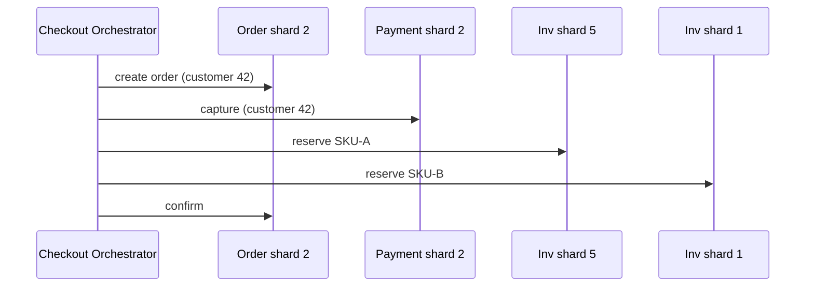

E-commerce checkout sharded
**Order** and **Payment** shard by `customer_id`; **Inventory** shards by `sku`. The [Orchestrated saga](ii-ecommerce-checkout-saga.md) still runs in **Checkout service**, but each HTTP call routes to a **different physical database**. No single cross-shard `COMMIT` — same saga + idempotency rules apply.

Theory: [Database sharding](../scalable-patterns/ix-database-sharding.md).

## 1. Shard map

| Service | Shard key | Example route |
|---------|-----------|---------------|
| **Order** | `customer_id` | `hash(customer_id) % 4` → Order DB shard 2 |
| **Payment** | `customer_id` | co-locate with Order when possible |
| **Inventory** | `sku` | `hash(sku) % 8` → Inventory DB shard 5 |

```text
Checkout orchestrator
  ├─► Order shard 2     (customer 42)
  ├─► Payment shard 2   (customer 42)
  └─► Inventory shard 5 (SKU-A), shard 1 (SKU-B)  ← multi-SKU cart = multiple shards
```

## 2. Happy path — multi-SKU cart



Each box is a **local ACID** transaction on one shard. Orchestrator sequences calls; failure triggers compensations per [Saga](ii-ecommerce-checkout-saga.md).

## 3. Cross-shard inventory failure

Reserved SKU-A on shard 5; SKU-B fails on shard 1:

| Step | Action |
|------|--------|
| 1 | Release reservation SKU-A (compensate inventory) |
| 2 | Refund payment (Payment shard 2) |
| 3 | Cancel order (Order shard 2) |

Compensation order matches non-sharded saga — orchestrator tracks `reservation_ids` per shard.

## 4. Shard key choices

| Decision | Rationale |
|----------|-----------|
| Order/Payment by `customer_id` | `GET /customers/42/orders` single shard |
| Inventory by `sku` | Stock row lives with SKU; write spread |
| **Do not** shard Order by `order_id` only | Customer order history scatter-gather |

**Co-location:** Payment shares `customer_id` with Order so refund and capture hit one Payment shard.

## 5. What breaks without design

| Anti-pattern | Result |
|--------------|--------|
| Login by email without routing index | Scatter-gather on Order shards |
| `JOIN` order + inventory in SQL | Impossible across shards — orchestrator merges |
| 2PC across Order + Inventory | Avoid — use saga |

## 6. Checkout + sharding checklist

- [ ] Orchestrator passes `customer_id` on every Order/Payment call
- [ ] Inventory `reserve` API accepts list of `{sku, qty}` — orchestrator fans out per shard
- [ ] [Idempotency](vi-ecommerce-checkout-idempotency.md) per `order_id` on each shard
- [ ] Per-shard connection pools — total conns = shards × pool size

## 7. vs single DB

| | Single Postgres | Sharded (this) |
|---|---------------|----------------|
| Checkout code | [Local ACID](iv-ecommerce-checkout-local-acid.md) possible | Saga required |
| Cart multi-SKU | One txn | N inventory txns + compensate story |
| Ops | One backup | Per-shard monitoring |

## 8. Rehearsal questions

- Why shard Inventory by `sku` but Order by `customer_id`?
- Three SKUs on three shards — how many reserve calls on success? How many releases on partial failure?
- When is sharding Order DB **not** worth it yet?

**Related:** [Database sharding](../scalable-patterns/ix-database-sharding.md), [Checkout saga](ii-ecommerce-checkout-saga.md).
