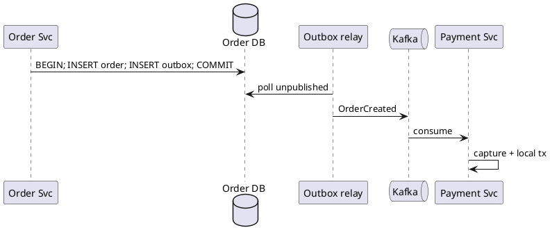

E-commerce checkout transactional outbox
**Order service** (monolith module or microservice) must save an order **and** notify Payment via Kafka without **dual-write** bugs. The **transactional outbox** writes the business row and an `outbox_events` row in **one** DB transaction; a **relay** publishes to the broker.

Theory: [Message queues & async](../scalable-patterns/iii-message-queues-and-async.md). Used by [Choreography](iii-ecommerce-checkout-choreography.md); also the first step when leaving [Local ACID](iv-ecommerce-checkout-local-acid.md).

## 1. The dual-write problem

```text
WRONG:
  1. INSERT order     ✓
  2. kafka.send()     ✗ broker down
  → order exists; Payment never charges
```

```text
WRONG:
  1. kafka.send()     ✓
  2. INSERT order     ✗ DB fail
  → Payment charged; no order row
```

## 2. Outbox pattern

<figure class="notes-diagram"><svg xmlns="http://www.w3.org/2000/svg" viewBox="0 0 440 130" role="img" aria-label="Transactional outbox for OrderCreated">
  <text x="12" y="20" fill="#d4d4d8" font-size="11" font-weight="600">Order service — transactional outbox</text>
  <rect x="12" y="36" width="110" height="80" rx="4" fill="rgba(24,24,27,0.95)" stroke="#52525b"/>
  <text x="24" y="54" fill="#86efac" font-size="9">BEGIN … COMMIT</text>
  <text x="24" y="72" fill="#a1a1aa" font-size="8">INSERT orders</text>
  <text x="24" y="86" fill="#a1a1aa" font-size="8">INSERT outbox_events</text>
  <path d="M122 76 H170" stroke="#a1a1aa" stroke-width="1.5"/>
  <rect x="170" y="56" width="80" height="40" rx="3" fill="rgba(59,130,246,0.12)" stroke="#60a5fa"/>
  <text x="182" y="80" fill="#e4e4e7" font-size="9">Outbox relay</text>
  <path d="M250 76 H298" stroke="#a1a1aa" stroke-width="1.5"/>
  <rect x="298" y="56" width="72" height="40" rx="3" fill="rgba(34,197,94,0.12)" stroke="#86efac"/>
  <text x="310" y="80" fill="#e4e4e7" font-size="9">Kafka</text>
</svg></figure>

| Table | Columns (example) |
|-------|-------------------|
| `orders` | `id`, `status`, `customer_id`, … |
| `outbox_events` | `id`, `aggregate_id`, `type`, `payload`, `created_at`, `published_at` |

## 3. Order service — Java sketch

```java
@Transactional
public Order createPendingOrder(Cart cart) {
    Order order = orderRepo.save(Order.pending(cart));
    outboxRepo.save(OutboxEvent.orderCreated(order));
    return order;
}

// Separate process or @Scheduled in same app
@Scheduled(fixedDelay = 500)
public void relayOutbox() {
    List<OutboxEvent> batch = outboxRepo.findUnpublished(limit);
    for (OutboxEvent e : batch) {
        kafka.send("OrderCreated", e.getPayload());
        outboxRepo.markPublished(e.getId());
    }
}
```

**Relay rules:** at-least-once publish → consumers must be **idempotent** ([Idempotency example](vi-ecommerce-checkout-idempotency.md)). Mark published **after** broker ack, or use idempotent producer + dedupe on `event_id`.

## 4. Checkout flow with outbox



Works with [Choreography](iii-ecommerce-checkout-choreography.md): every publisher (Order, Payment, Inventory) uses its **own** outbox in its **own** DB.

## 5. Implementation choices

| Relay | Pros | Cons |
|-------|------|------|
| **Polling** (`@Scheduled`) | Simple | Slight lag |
| **Debezium CDC** | Near real-time from WAL | Ops overhead — see [Order search CDC](viii-order-search-cdc.md) |
| **Same-app thread** | Few moving parts | Couples relay to API deploy |

## 6. Failure modes

| Scenario | Behavior |
|----------|----------|
| Crash after `COMMIT`, before relay | Event still in outbox; relay retries |
| Relay publishes, crash before `markPublished` | Duplicate on Kafka — idempotent consumer |
| Broker down | Outbox backlog grows; alert on lag |

## 7. Rehearsal questions

- Why not publish to Kafka inside `@Transactional` without outbox?
- Who owns `outbox_events` — Order DB only, or one shared outbox DB?
- How does outbox relate to [Saga orchestrator](ii-ecommerce-checkout-saga.md) calling Payment via HTTP?

**Related:** [Choreography](iii-ecommerce-checkout-choreography.md), [Order search CDC](viii-order-search-cdc.md).
