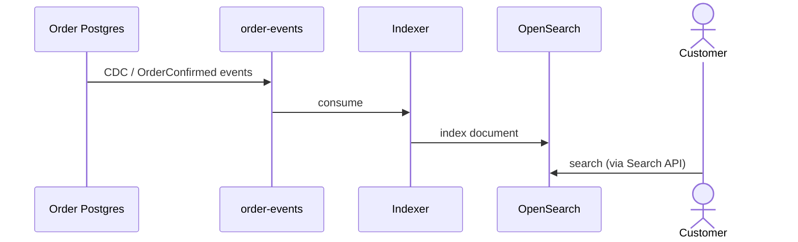

Order search CDC
Customers need **“find my orders”** by keyword, status, or date — poor fit for primary-key lookups on a sharded OLTP DB. **Change Data Capture (CDC)** streams order changes from Postgres to **OpenSearch/Elasticsearch** for fast full-text and filters.

Complements [Choreography](iii-ecommerce-checkout-choreography.md) (no central `checkout_sagas` table) and [Transactional outbox](v-ecommerce-checkout-transactional-outbox.md) (event source alternative).

Theory: [Search systems](../scalable-patterns/v-search-systems.md).

## 1. Architecture

```text
Order DB (Postgres)
  → Debezium / logical replication / outbox relay
      → Kafka topic order-events
          → Search indexer consumer
              → OpenSearch index orders
                    ↑
GET /orders/search?q=...&status=SHIPPED
```



## 2. Document model (search index)

```json
{
  "order_id": "ord_42",
  "customer_id": "cust_9",
  "status": "CONFIRMED",
  "total_cents": 4999,
  "line_summary": "Widget Pro x2",
  "created_at": "2026-06-08T10:00:00Z"
}
```

| Field | Source |
|-------|--------|
| `line_summary` | Denormalized from `order_items` at index time |
| `customer_id` | Filter — user sees **only** their orders in API |

**Rule:** search index is a **read model** — eventual lag acceptable (seconds).

## 3. CDC vs outbox → search

| Path | Mechanism |
|------|-----------|
| **Debezium CDC** | Reads Postgres WAL; all column changes |
| **Outbox / domain events** | `OrderConfirmed` payload — explicit schema |

Both land on Kafka; indexer logic is similar. Outbox aligns with [Choreography](iii-ecommerce-checkout-choreography.md); CDC indexes **any** column change without app publishing. Kafka basics: [SWE101 Kafka track](../../kafka/i-overview.md).

## 4. Indexer — idempotent upsert

```java
@KafkaListener(topics = "order-events")
public void index(OrderEvent e) {
    searchClient.index(
        IndexRequest.of(r -> r
            .index("orders")
            .id(e.orderId())
            .document(toDocument(e))
        )
    );
}
```

Use `order_id` as document id — replays **update** same doc. Deletes: tombstone event or `DELETE` on cancel.

## 5. Search API

```text
GET /orders/search?customer_id=cust_9&status=SHIPPED&q=widget
```

| Layer | Enforces |
|-------|----------|
| **Search API** | `customer_id` from auth token — never trust client-only filter |
| **OpenSearch** | Query bool filter on `customer_id` |

Do not expose raw OpenSearch to browsers.

## 6. Consistency expectations

| User action | OLTP | Search |
|-------------|------|--------|
| Completes checkout | `CONFIRMED` immediate | Appears in search after lag |
| Cancels order | `CANCELLED` | Indexer updates or removes doc |

UI copy: “Recent orders may take a minute to appear” if lag is visible.

## 7. Failure modes

| Issue | Mitigation |
|-------|------------|
| Indexer lag | Scale consumers; monitor consumer offset |
| Poison message | DLQ; skip bad event without blocking partition |
| Full reindex | New index alias swap — bulk load from Order DB snapshot |

## 8. Rehearsal questions

- Why not run `LIKE %widget%` on Postgres for order search?
- How is search different from [Catalog cache-aside](vii-product-catalog-cache-aside.md)?
- CDC vs outbox — which do you pick when Order service already has outbox?

**Related:** [Search systems](../scalable-patterns/v-search-systems.md), [Transactional outbox](v-ecommerce-checkout-transactional-outbox.md).
