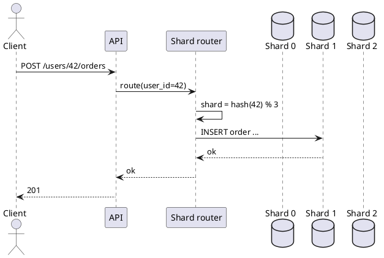
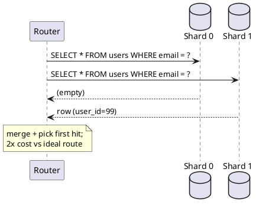
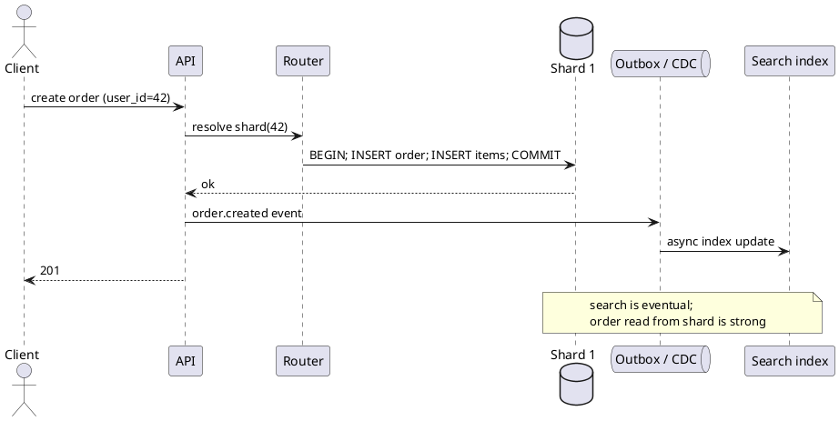

Database sharding
**Sharding** (horizontal partitioning) splits one logical database into **multiple physical databases** so **writes**, **storage**, and **connection load** scale beyond a single primary. It is one of the hardest scaling moves — shard key choice, cross-shard queries, and re-sharding dominate long-term pain.

For replication basics and a short sharding intro, see [Core building blocks](../i-core-building-blocks.md#6-replication--sharding). For write bottlenecks that lead to sharding, see [Database bottlenecks](../bottleneck-analysis/vi-database.md). For diagram tooling, see [PlantUML](../../plantuml/i-overview.md).

## 1. When to shard (and when not to)

| Signal | Likely next step |
|--------|------------------|
| Read-heavy, writes modest | Read replicas + [Redis cache](../../redis/iv-patterns-and-use-cases.md) |
| One hot table, rest small | Partition that table; archive cold data |
| Single primary CPU/IO maxed | Bigger instance, tune indexes, connection pool ([PgBouncer](../../postgres/vi-operations-and-backups.md)) |
| **Writes** or **storage** exceed one node | **Shard** or move to a sharded store (Cassandra, DynamoDB) |
| Complex cross-table transactions everywhere | Sharding cost is high — simplify domain or use CQRS |

```text
Scale path (typical SQL app)
  Vertical scale → read replicas → cache → partition/archive → SHARD
```

**Rule:** exhaust **replicas, cache, and query tuning** before sharding — sharding adds routing, ops, and application complexity you cannot easily undo.

## 2. Sharding vs replication vs partitioning

| Concept | What splits | Primary goal |
|---------|-------------|--------------|
| **Replication** | Copy of **same** data to multiple nodes | Read scale, HA |
| **Partitioning** | Rows in **one** DB by range/list/hash (Postgres partitions) | Prune scans, archival — still one primary |
| **Sharding** | Data across **independent** DB instances | Write + storage scale |

<figure class="notes-diagram"><svg xmlns="http://www.w3.org/2000/svg" viewBox="0 0 480 140" role="img" aria-label="Replication copies all data; sharding splits data across shards">
  <text x="12" y="20" fill="#d4d4d8" font-size="11" font-weight="600">Replication vs sharding</text>
  <text x="12" y="38" fill="#a1a1aa" font-size="9">Replication (same rows on each node)</text>
  <rect x="12" y="46" width="56" height="28" rx="3" fill="rgba(59,130,246,0.15)" stroke="#60a5fa"/>
  <text x="22" y="64" fill="#e4e4e7" font-size="8">Primary</text>
  <path d="M68 60 H88" stroke="#a1a1aa" stroke-width="1.5"/>
  <rect x="88" y="46" width="56" height="28" rx="3" fill="rgba(34,197,94,0.12)" stroke="#86efac"/>
  <text x="98" y="64" fill="#e4e4e7" font-size="8">Replica</text>
  <path d="M68 60 H88" stroke="#a1a1aa" stroke-width="1.5" transform="translate(0,0)"/>
  <rect x="156" y="46" width="56" height="28" rx="3" fill="rgba(34,197,94,0.12)" stroke="#86efac"/>
  <text x="166" y="64" fill="#e4e4e7" font-size="8">Replica</text>
  <text x="12" y="92" fill="#a1a1aa" font-size="9">Sharding (disjoint row sets per shard)</text>
  <rect x="12" y="100" width="72" height="28" rx="3" fill="rgba(168,85,247,0.12)" stroke="#a855f7"/>
  <text x="28" y="118" fill="#e4e4e7" font-size="8">Shard 0</text>
  <rect x="96" y="100" width="72" height="28" rx="3" fill="rgba(168,85,247,0.12)" stroke="#a855f7"/>
  <text x="112" y="118" fill="#e4e4e7" font-size="8">Shard 1</text>
  <rect x="180" y="100" width="72" height="28" rx="3" fill="rgba(168,85,247,0.12)" stroke="#a855f7"/>
  <text x="196" y="118" fill="#e4e4e7" font-size="8">Shard 2</text>
  <text x="268" y="118" fill="#71717a" font-size="8">user_id % 3 → one shard only</text>
</svg></figure>

## 3. Architecture: routing layer

Applications rarely connect to shards directly. A **router** picks the shard from the **shard key**.



| Router style | Examples | Notes |
|--------------|----------|-------|
| **App-level** | `shard = hash(userId) % N` in service code | Simple; logic duplicated per service |
| **Proxy / middleware** | Vitess, Citus coordinator, ProxySQL | Central routing rules |
| **Driver / ORM** | Hibernate ShardingSphere, MongoDB mongos | Framework-aware |
| **Managed service** | DynamoDB, Cosmos DB | Vendor routes by partition key |

<figure class="notes-diagram"><svg xmlns="http://www.w3.org/2000/svg" viewBox="0 0 460 120" role="img" aria-label="App tier through shard router to three database shards">
  <rect x="12" y="40" width="80" height="36" rx="3" fill="rgba(34,197,94,0.15)" stroke="#86efac"/>
  <text x="32" y="62" fill="#e4e4e7" font-size="9">App tier</text>
  <path d="M92 58 H132" stroke="#a1a1aa" stroke-width="1.5"/>
  <rect x="132" y="40" width="88" height="36" rx="3" fill="rgba(244,114,182,0.12)" stroke="#f472b6"/>
  <text x="142" y="58" fill="#e4e4e7" font-size="9">Shard router</text>
  <text x="142" y="70" fill="#71717a" font-size="7">hash(key)%N</text>
  <path d="M220 50 H260" stroke="#a1a1aa" stroke-width="1.5"/>
  <path d="M220 58 H260" stroke="#a1a1aa" stroke-width="1.5"/>
  <path d="M220 66 H260" stroke="#a1a1aa" stroke-width="1.5"/>
  <rect x="260" y="28" width="64" height="24" rx="3" fill="rgba(168,85,247,0.12)" stroke="#a855f7"/>
  <text x="276" y="44" fill="#e4e4e7" font-size="8">Shard 0</text>
  <rect x="260" y="56" width="64" height="24" rx="3" fill="rgba(168,85,247,0.12)" stroke="#a855f7"/>
  <text x="276" y="72" fill="#e4e4e7" font-size="8">Shard 1</text>
  <rect x="260" y="84" width="64" height="24" rx="3" fill="rgba(168,85,247,0.12)" stroke="#a855f7"/>
  <text x="276" y="100" fill="#e4e4e7" font-size="8">Shard 2</text>
  <text x="12" y="20" fill="#d4d4d8" font-size="11" font-weight="600">Logical DB = router + N physical shards</text>
</svg></figure>

## 4. Sharding strategies

### Range-based

Rows with `user_id` in `[0, 1M)` → shard 0; `[1M, 2M)` → shard 1.

| Pros | Cons |
|------|------|
| Range scans (`WHERE user_id BETWEEN …`) hit **one** shard | **Hot shard** if new users cluster on latest range |
| Easy to explain | Re-sharding when a range outgrows a machine |

### Hash-based

`shard_id = hash(shard_key) % N` (or consistent hash — §5).

| Pros | Cons |
|------|------|
| Even spread when hash is good | **No** cheap range queries — scatter-gather |
| Predictable single-key lookup | Changing **N** remaps many keys (unless consistent hashing) |

### Directory (lookup table)

Table: `tenant_id → shard_id`. Router consults directory on every request (often cached).

| Pros | Cons |
|------|------|
| **Flexible** placement (move one tenant) | Directory is **SPOF** / cache invalidation |
| Good for **multi-tenant** isolation | Extra hop on every route |

### Geo / tenant sharding

Shard key = `region` or `tenant_id` — data residency and blast-radius per customer.

| Pros | Cons |
|------|------|
| Compliance (EU data in EU shard) | Cross-region queries need federation |
| Noisy neighbour isolation per tenant | Uneven tenant sizes → hot shards |

## 5. Shard key selection

The **shard key** (partition key) determines which rows live together. It is the most important design decision.

| Good key properties | Why |
|---------------------|-----|
| **High cardinality** | Many distinct values → even spread |
| **Access-aligned** | Most queries filter on this key |
| **Write-aligned** | Writes spread across keys, not one hot key |

| Anti-pattern | Result |
|--------------|--------|
| Shard by `country` when US is 80% traffic | Hot shard |
| Shard by `user_id` but query by `email` only | **Scatter-gather** on every login |
| Low-cardinality key (`status = active`) | Entire table on few shards |

**Co-location rule:** entities queried together should share a shard key when possible.

```text
E-commerce: shard by customer_id
  orders, order_items, addresses for customer 42 → same shard
```

| Domain | Common shard key |
|--------|------------------|
| Social / messaging | `user_id`, `conversation_id` |
| SaaS multi-tenant | `tenant_id` |
| IoT / time-series | `device_id` + time partition |
| Global API | `region` + `user_id` |

## 6. Consistent hashing

Plain `hash(key) % N` remaps **most** keys when **N** changes (add/remove shard). **Consistent hashing** maps keys and nodes onto a **ring**; only keys between the removed node and its successor move.

<figure class="notes-diagram"><svg xmlns="http://www.w3.org/2000/svg" viewBox="0 0 200 200" role="img" aria-label="Consistent hash ring with three nodes and keys">
  <circle cx="100" cy="100" r="70" fill="none" stroke="#52525b" stroke-width="2"/>
  <circle cx="100" cy="30" r="8" fill="rgba(59,130,246,0.4)" stroke="#60a5fa"/>
  <text x="88" y="18" fill="#60a5fa" font-size="8">Node A</text>
  <circle cx="160" cy="130" r="8" fill="rgba(34,197,94,0.4)" stroke="#86efac"/>
  <text x="152" y="148" fill="#86efac" font-size="8">Node B</text>
  <circle cx="40" cy="130" r="8" fill="rgba(251,191,36,0.4)" stroke="#fbbf24"/>
  <text x="24" y="148" fill="#fbbf24" font-size="8">Node C</text>
  <circle cx="130" cy="55" r="4" fill="#e4e4e7"/>
  <circle cx="175" cy="95" r="4" fill="#e4e4e7"/>
  <circle cx="55" cy="75" r="4" fill="#e4e4e7"/>
  <text x="12" y="188" fill="#71717a" font-size="8">Key → clockwise to first node</text>
</svg></figure>

| Concept | Detail |
|---------|--------|
| **Ring** | Hash space 0..2³²-1 wrapped in a circle |
| **Virtual nodes** | Each physical node owns **multiple** ring positions → better balance |
| **Add node** | Steals slice from one neighbour only |
| **Used in** | DynamoDB, Cassandra, Redis Cluster, Memcached clients |

**Versus modulo:** prefer consistent hashing when shards are **added/removed live**; modulo is acceptable for **fixed** N with rare topology changes.

## 7. Single-shard vs cross-shard operations

### Single-shard (fast path)

Predicate includes shard key → router sends to **one** shard.

```sql
-- user_id = 42 → one shard
SELECT * FROM orders WHERE user_id = 42 AND created_at > '2026-01-01';
```

### Scatter-gather (slow path)

No shard key in query → router asks **all** shards, merges results.

```sql
-- email login without email→shard index: every shard queried
SELECT * FROM users WHERE email = 'ada@example.com';
```

| Fix for scatter-gather | Mechanism |
|------------------------|-----------|
| **Global secondary index** | Separate index store (per-shard or central) |
| **Lookup table** | `email → user_id → shard` in Redis |
| **Denormalize** | Duplicate routing field on every table |
| **Redesign API** | Require tenant/user id in every path |

### Cross-shard JOINs

SQL `JOIN` across shards is **not** one query plan — app or middleware runs **multiple** queries and joins in memory (expensive) or you **denormalize** / use **materialized aggregates**.

| Pattern | Use |
|---------|-----|
| **Denormalize** | Copy `customer_name` onto `orders` in same shard |
| **Reference by ID only** | Store `user_id`; fetch profile when needed (same shard) |
| **CQRS / read model** | Async build cross-shard views in search/warehouse |
| **Saga** | Cross-shard writes as local txs + events — see [Distributed transactions](vii-distributed-transactions.md) |



## 8. Hot shards and celebrities

Even with a good hash, **skew** happens:

| Cause | Example |
|-------|---------|
| **Celebrity** | One `user_id` with billions of followers |
| **Tenant whale** | One SaaS customer is 40% of rows |
| **Time hotspot** | All writes use `shard_key = today's date` |

| Mitigation | How |
|------------|-----|
| **Sub-shard split** | Split hot logical key across buckets `user_id#0..#k` |
| **Read path offload** | Cache, read replicas **for that shard**, fan-out read model |
| **Write queue** | Serialize hot key updates via queue |
| **Separate store** | Celebrity data in KV/CDN layer; shard holds metadata only |

**Related:** [Application-level bottlenecks](../bottleneck-analysis/vii-application-level.md) (hot partition).

## 9. Re-sharding

Growing from 3 → 4 shards (or doubling cluster) requires **moving data** without prolonged downtime.

| Approach | Summary |
|----------|---------|
| **Double shards** | 3 → 6: split each shard; consistent hash minimizes overlap |
| **Background copy** | Copy range to new shard; dual-write; cutover; delete old |
| **Directory update** | Move `tenant_id` in lookup table; migrate rows offline |
| **Managed** | DynamoDB / MongoDB resharding automation (still plan key design) |

```text
Re-shard phases (typical)
  1. Provision new shards
  2. Dual-write (old + new routing) OR change-log capture
  3. Backfill historical data
  4. Verify counts / checksums per shard
  5. Flip read traffic → new map
  6. Stop writes to old map; retire nodes
```

**Cost:** weeks of engineering for DIY SQL sharding; plan **headroom** and key choice up front.

## 10. Transactions and consistency across shards

| Scope | Pattern |
|-------|---------|
| **Single shard** | Normal ACID on that Postgres/MySQL instance |
| **Multi-shard atomic** | **2PC** (rare, fragile) or **avoid** — design around single-shard txs |
| **Multi-shard logical** | **Saga** + idempotency + outbox |
| **Read consistency** | Per-shard linearizable; global = eventual unless sync cross-shard protocol |

**Interview / design rule:** prefer **one shard per business transaction** (same `customer_id` for checkout).

## 11. Operational concerns

| Topic | Practice |
|-------|----------|
| **Schema migration** | Roll per shard; automation; same version everywhere before traffic |
| **Backups** | Per-shard backup schedule; test **restore one shard** |
| **Monitoring** | Per-shard QPS, lag, disk, slow queries — alert on **skew** |
| **Connection pools** | Pool **per shard**; total conns = shards × pool size |
| **Global IDs** | Snowflake / ULID / UUID — avoid auto-increment collisions across shards |

## 12. Bottlenecks of sharded databases

Sharding removes the **single-primary ceiling** (writes, disk, connections on one machine). It **trades** that limit for bottlenecks in routing, query shape, coordination, and operations — especially when the shard key or access patterns are wrong.

```text
Single DB bottleneck          Sharded DB — bottlenecks move to:
  one primary maxed out    →    hot shard, scatter-gather, router, N× pools, re-shard, ops
```

| Bottleneck | What breaks | Mitigation (see also) |
|------------|-------------|------------------------|
| **Hot shard / skew** | One partition gets most traffic despite many shards | Sub-shard buckets, cache, queue, celebrity read model — §8, [Application-level](../bottleneck-analysis/vii-application-level.md) |
| **Scatter-gather** | Queries without shard key hit **every** shard; cost ∝ shard count | Lookup table, GSI, API requires tenant/user id — §7 |
| **Cross-shard JOINs** | No single query plan; N round trips + merge in app | Co-locate by shard key, denormalize, CQRS — §7 |
| **Cross-shard transactions** | 2PC is fragile; latency and availability suffer | Single-shard tx per business action; saga + outbox — §10, [Distributed transactions](vii-distributed-transactions.md) |
| **Router / coordinator** | Extra hop, SPOF, routing bugs → wrong shard | HA proxy tier, pinned topology, integration tests per route — §3 |
| **Connection pool explosion** | `pods × pool × shards` vs per-shard `max_connections` | PgBouncer per shard, smaller pools, right-size fleet — §11 |
| **Re-sharding** | Dual-write, backfill, cutover risk during topology change | Consistent hashing, planned headroom, managed resharding — §9 |
| **Operational drag** | Migrations, backups, monitoring × N shards | Automation, per-shard dashboards, skew alerts — §11 |
| **Global consistency** | Strong per shard; cross-shard reads often eventual | Design around single-shard writes; async read models — §10 |

### Hot shards — you moved the bottleneck, not removed it

Even with hash sharding, **skew** concentrates load on one physical shard:

| Cause | Example |
|-------|---------|
| **Celebrity** | One `user_id` with outsized fan-out |
| **Tenant whale** | One SaaS customer is a large share of rows |
| **Range + time** | New users or events land on the “latest” range shard |
| **Bad cardinality** | Shard key `status` or `country` with uneven distribution |

Mitigations match §8: split hot keys (`user_id#0…#k`), read replicas on that shard only, write queues, or offload hot data to cache/KV.

### Scatter-gather — the hidden tax on “flexible” queries

The fast path requires the **shard key in the predicate** (§7). Without it:

```sql
-- login by email: every shard queried unless you add a route
SELECT * FROM users WHERE email = 'ada@example.com';
```

| Symptom | Why it hurts |
|---------|--------------|
| Latency p99 rises with shard count | Router waits for slowest shard |
| CPU on **all** shards for one lookup | Admin search, email login, global counts |
| Fan-out amplifies incidents | One sick shard slows the merged response |

Fixes: `email → user_id → shard` in Redis, global secondary index, or require `user_id` / `tenant_id` in every API path.

### Cross-shard work — coordination becomes the limit

| Pattern | Bottleneck |
|---------|------------|
| JOIN across shard keys | App-side merge; memory and latency |
| Checkout on `customer_id` + inventory on `sku` | Two shards → saga, not one ACID tx |
| Global `COUNT(*)` or `SUM` | Parallel aggregate + merge, or warehouse |

**Design rule:** keep one business transaction on **one shard** when possible; push cross-shard reporting to OLAP/search.

### Router and connections

<figure class="notes-diagram"><svg xmlns="http://www.w3.org/2000/svg" viewBox="0 0 460 100" role="img" aria-label="Connection pools multiply per shard">
  <text x="12" y="20" fill="#d4d4d8" font-size="11" font-weight="600">Pools scale with shard count</text>
  <text x="12" y="40" fill="#a1a1aa" font-size="9">100 pods × 10 conns/pod × 8 shards = 8 000 logical slots</text>
  <text x="12" y="58" fill="#f87171" font-size="9">Each shard still has max_connections (e.g. 500)</text>
  <text x="12" y="76" fill="#86efac" font-size="9">Mitigate: pooler per shard, fewer conns per pod, fewer pods</text>
</svg></figure>

The **router** adds latency and can be a blast-radius point (misroute = wrong data). Directory-based sharding adds a **lookup hot spot** unless cached.

### What sharding does and does not fix

| Sharding helps | Sharding does not fix |
|----------------|----------------------|
| Write throughput past one primary | Queries that ignore the shard key |
| Storage past one disk | Hot keys / celebrities without key design |
| Blast radius per shard (partial) | Cross-shard ACID without saga complexity |
| Regional placement by shard key | Cheap global SQL JOINs or ad-hoc analytics |

**Summary:** treat shard key choice and access patterns as part of the schema — adding shards without fixing skew or scatter-gather only spreads the problem across more bills.

## 13. Technology examples

| System | Sharding model |
|--------|----------------|
| **PostgreSQL + Citus** | Distributed tables; coordinator routes by distribution column |
| **Vitess** (MySQL) | Vindexes map key → shard; used at YouTube scale |
| **MongoDB** | `sh.shardCollection`; shard key on collection |
| **Amazon DynamoDB** | Partition key (+ optional sort key); adaptive splits |
| **Cassandra** | Partition key determines node; wide-column per partition |
| **Spanner / Cockroach** | Automatic sharding under SQL facade (different ops model) |

## 14. End-to-end write path (reference)



## 15. Checklist before you shard

- [ ] Measured primary **write** and **disk** limits — not just CPU
- [ ] Shard key on **every** hot query path documented
- [ ] Plan for **scatter-gather** queries (login, admin search)
- [ ] Cross-shard workflow uses **saga/outbox**, not distributed 2PC
- [ ] Re-sharding runbook or managed alternative chosen
- [ ] Per-shard dashboards and backup drills scheduled

## 16. Rehearsal questions

- Why is `hash(user_id) % 10` painful when scaling from 10 to 11 shards?
- Design shard keys for a multi-tenant B2B SaaS with heavy reporting per tenant.
- How do you implement `login by email` without scanning every shard?
- What breaks if checkout touches `inventory` and `orders` on different shard keys?
- When is Postgres **partitioning** enough without Citus/Vitess?
- Name three bottlenecks that **appear after** sharding even when the old single primary was healthy.

**Worked example:** [Sharded checkout](../examples/ix-ecommerce-checkout-sharded.md).

**Related:** [Core building blocks](../i-core-building-blocks.md), [Message queues & async](iii-message-queues-and-async.md), [Postgres indexes](../../postgres/iv-indexes-and-explain.md), [MongoDB sharding](../../mongodb/i-overview.md).
