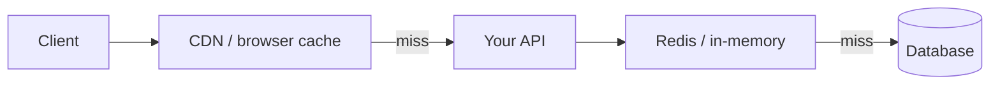

Caching — overview
Two different problems, two different tools: **HTTP caching** lets browsers and CDNs reuse responses; **application caching** (Redis, in-memory) avoids repeat work inside your service. Pick the layer that matches who should hold the data and how stale you can tolerate.

## Mental model

| Layer | Who caches | Best for | Invalidation |
|-------|------------|----------|--------------|
| **HTTP** | Client, CDN, reverse proxy | Public, identical GET responses (catalog, static item JSON) | `ETag`, `Cache-Control`, `304 Not Modified` |
| **App (Redis)** | Your service | Hot reads, computed aggregates, session-adjacent data | TTL, explicit delete on write, pub/sub — **hard** |

## HTTP caching essentials (Item resource)

| Header | Role |
|--------|------|
| `Cache-Control: public, max-age=60` | Fresh for 60s; CDN may cache |
| `Cache-Control: private, no-store` | User-specific — never shared cache |
| `ETag: "abc123"` | Content fingerprint for conditional GET |
| `If-None-Match: "abc123"` | Client asks: still the same? → **304** empty body |

**304** saves bandwidth; you still run auth and may hit the DB unless you short-circuit on ETag alone.

## When to use which

| Scenario | Approach |
|----------|----------|
| Public item detail, changes rarely | HTTP `ETag` + short `max-age` |
| Personalized dashboard per user | `private, no-store` or skip HTTP cache |
| Expensive DB query, same key for many users | Redis with TTL + delete on `PUT/DELETE` |
| List endpoints with filters | Cache carefully — key must include all query params |

## Cache invalidation

> *There are only two hard things in computer science: cache invalidation and naming things.*

| Strategy | Trade-off |
|----------|-----------|
| **TTL only** | Simple; stale reads until expiry |
| **Write-through delete** | `DELETE /items/:id` → `redis.del("item:42")` — consistent if you never miss a path |
| **Version in key** | `item:42:v7` — bump version on write; old keys expire via TTL |

## Language templates

| Note | Stack |
|------|--------|
| [Java — Spring](ii-java-spring.md) | `ETag` + `ResponseEntity` `Cache-Control` on GET item |
| [Python — FastAPI](iii-python-fastapi.md) | `Cache-Control` + `ETag`; 304 on `If-None-Match` |
| [JavaScript — Express](iv-javascript-express.md) | Same pattern |
| [Go — net/http](v-go-nethttp.md) | Same pattern |

## Notes

| Topic | Practice |
|-------|----------|
| **Don't cache personalized responses without `Vary`** | `Vary: Authorization` or prefer `private, no-store` |
| **ETag from content hash** | Stable hash of serialized body — not `updatedAt` alone unless it changes every write |
| **POST/PUT/DELETE** | Usually `Cache-Control: no-store` on responses; invalidate app cache keys |
| **Redis is not a HTTP cache** | Clients don't see Redis; use HTTP headers for client/CDN behavior |
| **Test 304** | Assert empty body + correct headers in integration tests |

## Next

Pick your stack — start with [Java — Spring](ii-java-spring.md) or [Python — FastAPI](iii-python-fastapi.md).
