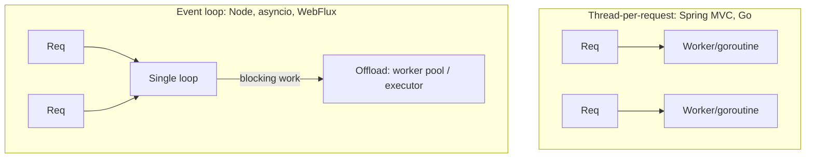

Concurrency — overview
A REST server handles **many requests at once**. How each stack achieves that differs — OS threads, async event loops, goroutines — but the senior concerns are the same: don't block the request pipeline, don't share mutable state unsafely, and don't exhaust your pools.

Pairs with [Resilience](../resilience/i-overview.md) (timeouts/bulkheads), [HTTP clients](../http-clients/i-overview.md) (outbound fan-out), and [Transactions](../transactions/i-overview.md) (consistency under parallel writes).

## Concurrency models per stack

Same goal — serve concurrent requests — very different runtime.

| Stack | Model | A request runs on | Blocking cost |
|-------|-------|-------------------|---------------|
| **Spring MVC** | Thread-per-request | An OS thread from a pool (Tomcat) | Blocks a whole thread — pool can exhaust |
| **Spring WebFlux** | Event loop (Reactor) | A few event-loop threads | Blocking a loop thread stalls many requests |
| **FastAPI / asyncio** | Single-threaded event loop | The loop (`async def`) | A blocking call freezes the loop — offload it |
| **Express / Node** | Single-threaded event loop | The loop | CPU-bound work blocks everyone |
| **Go net/http** | Goroutine-per-request | A cheap goroutine (M:N scheduler) | Cheap, but shared state still needs locks |

**Mnemonic:** threads (Spring MVC, Go) can block one worker; event loops (Node, asyncio, WebFlux) must **never** block — offload CPU/blocking work.

## Where concurrency bites

| Hazard | Symptom | Fix |
|--------|---------|-----|
| **Shared mutable state** | Race conditions, corrupted data | Immutability, locks, atomics, per-request scope |
| **Blocking the event loop** | Whole service latency spikes | `async` I/O, or offload to a worker/executor |
| **Thread/connection pool exhaustion** | Requests queue, then time out | Bound pools, timeouts, bulkheads |
| **Unbounded fan-out** | One request spawns 1000 tasks | Cap parallelism (semaphore / worker limit) |
| **Deadlock** | Requests hang forever | Consistent lock ordering; avoid nested locks |
| **Lost updates** | Two writers overwrite each other | DB transactions + optimistic/pessimistic locking |

## Golden rules

1. **Stateless handlers.** Keep per-request data on the stack / request scope — not in shared singletons.
2. **Never block an event loop.** In Node/asyncio, wrap CPU/blocking work in a worker thread/executor.
3. **Bound everything.** Thread pools, connection pools, and fan-out parallelism all need explicit limits.
4. **Make shared state safe.** Prefer immutable data; otherwise use the stack's concurrency primitives (locks, atomics, channels).
5. **Push consistency to the DB.** For concurrent writes, rely on [Transactions](../transactions/i-overview.md) and row locks — not in-memory guards.

## Parallel outbound calls (common need)

Fetching several upstreams for one response? Do it **in parallel with a bounded limit and a timeout** — see each stack page. This is where concurrency and [Resilience](../resilience/i-overview.md) meet.

## Language templates

| Note | Stack |
|------|--------|
| [Java — Spring](ii-java-spring.md) | Thread pools, `@Async`, `CompletableFuture`, `synchronized`/atomics |
| [Python — FastAPI](iii-python-fastapi.md) | `async`/`await`, `asyncio.gather`, `run_in_executor`, semaphore |
| [JavaScript — Express](iv-javascript-express.md) | Event loop, `Promise.all`, `worker_threads`, concurrency cap |
| [Go — net/http](v-go-nethttp.md) | Goroutines, `sync.WaitGroup`, `errgroup`, mutex, channels |

## Notes

| Topic | Practice |
|-------|----------|
| **Don't hand-roll** | Prefer the platform's executor/pool over raw threads |
| **Always timeout** | Parallel work needs a deadline — pair with [Resilience](../resilience/i-overview.md) |
| **Test under load** | Races hide until concurrency is high — load/stress test |
| **Measure** | Track pool saturation and queue depth — see [Observability](../observability/i-overview.md) |

## Next

Pick your stack — start with [Java — Spring](ii-java-spring.md) or [Go — net/http](v-go-nethttp.md).
