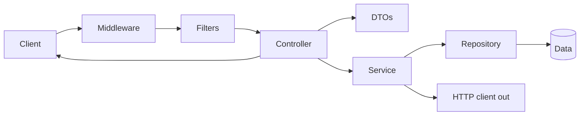

Controllers — overview
A **controller** (or **route handler**) is the HTTP edge of your app: bind the request, call application logic, return a response. Same job across stacks — different annotations and APIs.

Deep dives: [Spring REST controllers](../../languages&frameworks/java/springboot/iv-rest-controllers.md), [JavaScript](../../languages&frameworks/javascript/i-overview.md), [Python](../../languages&frameworks/python/i-basics-and-syntax.md).

## Mental model



| Responsibility | Belongs in controller? |
|----------------|------------------------|
| Path / method / status | Yes |
| DTO parse + validation | Yes — see [DTOs](../dtos/i-overview.md) |
| Authn / request ID | [Middleware](../middleware/i-overview.md) |
| Rate limit / body limits | [Filters](../filters/i-overview.md) |
| Business rules | **No** — [Services](../services/i-overview.md) |
| SQL | **No** — [Repositories](../repositories/i-overview.md) |
| Call other APIs | **No** — [HTTP clients](../http-clients/i-overview.md) from the service |
| Error → HTTP status | Map via [Errors](../errors/i-overview.md) |

## Language templates

| Note | Stack |
|------|--------|
| [Java — Spring](ii-java-spring.md) | `@RestController` |
| [Python — FastAPI](iii-python-fastapi.md) | `APIRouter` |
| [JavaScript — Express](iv-javascript-express.md) | Router + handlers |
| [Go — net/http](v-go-nethttp.md) | `ServeMux` / handler funcs |

## Shared shape (all languages)

```text
GET    /api/items       → list
GET    /api/items/{id}  → get one (404 if missing)
POST   /api/items       → create (201 + body)
PUT/PATCH /api/items/{id} → update
DELETE /api/items/{id}  → delete (204)
```

## Next

Pick your stack — start with [Java — Spring](ii-java-spring.md) or [Python — FastAPI](iii-python-fastapi.md).
