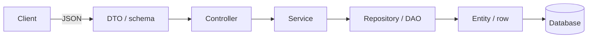

DTOs — overview
A **DTO** (Data Transfer Object) or **schema** is the shape of data crossing an **HTTP boundary** — request bodies, response bodies, query params. It is **not** a DAO, a database row, or your domain entity.

Deep dives: [Spring validation](../../languages&frameworks/java/springboot/iv-rest-controllers.md), [Python Pydantic](../../languages&frameworks/python/i-basics-and-syntax.md), [JavaScript](../../languages&frameworks/javascript/i-overview.md).

## DTO vs DAO (do not mix these up)

| | **DTO** | **DAO** |
|---|---------|---------|
| Expands to | **Data Transfer Object** | **Data Access Object** |
| Job | Carry data **across a boundary** (usually API ↔ app) | **Access persistence** (load/save rows) |
| Lives near | Controllers, request/response validation | Repositories / data layer — see [Repositories](../repositories/i-overview.md) |
| Typical names | `CreateItemRequest`, `ItemResponse`, Pydantic schema | `ItemDao`, `ItemRepository`, `JdbcItemDao` |
| Holds | Fields for JSON / wire contract | Methods like `findById`, `save`, `delete` |
| Talks to DB? | **No** | **Yes** (or wraps an ORM that does) |

**Mnemonic:** DTO = *shape of the message*; DAO = *how you reach the database*.

In this curriculum we prefer the name **repository** for the persistence boundary. A classic **DAO** is the same idea under an older name — still **not** a DTO.



## DTO vs entity

| Concept | Purpose | Example |
|---------|---------|---------|
| **Request DTO** | Validate incoming JSON | `name` (no `id` on create) |
| **Response DTO** | Safe, stable API contract | `id`, `name` |
| **Entity / model** | Persistence or domain state | DB columns, relations, secrets |
| **DAO / repository** | CRUD against storage | `findById`, `save` — *behavior*, not a JSON shape |

**Rule of thumb:** never expose entities (or DAO internals) on the wire — map to response DTOs so you can rename columns, hide internals, and version the API. Never put SQL or `JdbcTemplate` calls inside a DTO class.

## Language templates

| Note | Stack |
|------|--------|
| [Java — Spring](ii-java-spring.md) | Records + Bean Validation |
| [Python — FastAPI](iii-python-fastapi.md) | Pydantic `BaseModel` |
| [JavaScript — Express](iv-javascript-express.md) | Zod / JSDoc shapes |
| [Go — net/http](v-go-nethttp.md) | Structs + `json` tags |

## Shared shape (Item resource)

```text
CreateItemRequest   { "name": "..." }
ItemResponse        { "id": "...", "name": "..." }
```

## Next

Pick your stack — start with [Java — Spring](ii-java-spring.md) or [Python — FastAPI](iii-python-fastapi.md).
