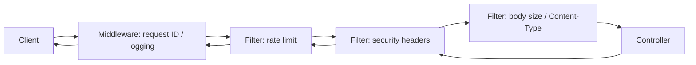

Filters — overview
**Filters** (and their stack-specific cousins) sit on the **inbound edge** after basic [Middleware](../middleware/i-overview.md) — request ID, logging, auth stubs — and **before** [Controllers](../controllers/i-overview.md). They enforce **policy** early: payload limits, content types, rate limits, security headers, and other reject-or-wrap decisions that should not live in every handler.

## Filter vs interceptor vs middleware

Same idea, different names — **wrap the request/response pipeline** before and after your handler runs.

| Stack | Inbound wrapper name | Typical scope |
|-------|----------------------|---------------|
| **Spring** | `Filter` (servlet) | Whole app / URL patterns |
| **Spring** | `HandlerInterceptor` | Controller-mapped paths only (after dispatch) |
| **FastAPI / Starlette** | Middleware | ASGI app |
| **Express** | Middleware `(req, res, next)` | Mounted path prefix |
| **Go net/http** | Middleware `func(next http.Handler) http.Handler` | Wrapped mux / router |

**Mnemonic:** [Middleware](../middleware/i-overview.md) = observability + identity; **filters** (this domain) = **edge policy** — reject bad traffic, add security headers, throttle abuse.

## Chain order (senior defaults)

| Order (inbound) | Filter | Why |
|-----------------|--------|-----|
| 1 | Request ID / logging | Already in [Middleware](../middleware/i-overview.md) |
| 2 | Rate limit | Fail cheap before parsing large bodies |
| 3 | Security headers | Set on every response, including early rejects |
| 4 | Body size / `Content-Type` | 413 / 415 before controller work |
| 5 | Auth enforcement (when global) | 401 before business logic |

On the **outbound** leg, filters run in **reverse** — headers added in filter 2 are still present when the response leaves filter 1.

## Request / response wrapping

| Pattern | Inbound | Outbound |
|---------|---------|----------|
| **Early reject** | Stop chain; write status + body; do **not** call `next` / `chain.doFilter` | N/A — short-circuit |
| **Header injection** | Read request headers (API key, client IP) | Set `X-Content-Type-Options`, `Strict-Transport-Security`, etc. |
| **Body inspection** | Wrap `HttpServletRequest` / limit `Content-Length` | Usually pass-through |
| **Rate limit** | Increment counter; 429 if over quota | Optional `Retry-After` |

## Early reject status codes

| Code | When | Example |
|------|------|---------|
| **413** | Payload too large | `Content-Length` or streamed body over limit |
| **415** | Unsupported media type | `POST` without `application/json` when required |
| **429** | Rate limited | Token bucket / fixed window per IP or API key |

Map domain validation failures (missing `name` on Item) in the controller or [Errors](../errors/i-overview.md) layer — **not** in a filter.

## Filter vs controller advice

| Use a **filter** | Use **controller advice** (@ControllerAdvice, exception handlers) |
|------------------|-------------------------------------------------------------------|
| Applies to **all** or **patterned** routes | Applies when a **controller** throws or returns errors |
| Decisions from **HTTP surface** (headers, size, rate) | Decisions from **business rules** after parsing [DTOs](../dtos/i-overview.md) |
| Must run **before** handler | Runs **after** handler invocation fails |
| Security headers, throttling, CORS preflight | `ItemNotFound` → 404, validation → 400 |

Spring **`HandlerInterceptor`** is a middle ground: controller-scoped timing or per-route auth — not servlet-wide body limits.

## Language templates

| Note | Stack |
|------|--------|
| [Java — Spring](ii-java-spring.md) | `OncePerRequestFilter` + `FilterRegistrationBean` |
| [Python — FastAPI](iii-python-fastapi.md) | ASGI middleware — 429 + security headers |
| [JavaScript — Express](iv-javascript-express.md) | Rate-limit stub + helmet-like headers |
| [Go — net/http](v-go-nethttp.md) | Middleware — 429 + security headers |

## Notes

| Topic | Practice |
|-------|----------|
| **Layer with middleware** | Request ID first ([Middleware](../middleware/i-overview.md)); policy filters after |
| **Fail fast** | Reject at the edge — save CPU and protect downstream [Services](../services/i-overview.md) |
| **Idempotent header filters** | Safe to run on error responses too |
| **Test short-circuits** | Assert 429 / 413 / 415 without hitting a real controller |
| **Production rate limits** | Redis / gateway (nginx, API GW) — in-app stubs teach the pattern |

## Next

Pick your stack — start with [Java — Spring](ii-java-spring.md) or [Python — FastAPI](iii-python-fastapi.md). Outbound calls use [HTTP clients](../http-clients/i-overview.md).
