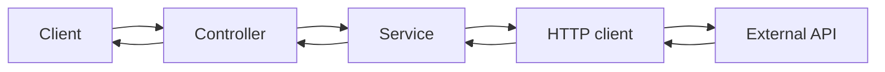

HTTP clients — overview
An **HTTP client** is how **your service calls another API** — outbound traffic. [Controllers](../controllers/i-overview.md) handle **inbound** requests; HTTP clients live in [Services](../services/i-overview.md) (or dedicated gateway modules) when you integrate catalog, payment, identity, or other remote systems.

## Inbound vs outbound

| Direction | Layer | Job |
|-----------|-------|-----|
| **Inbound** | [Controllers](../controllers/i-overview.md) + [Filters](../filters/i-overview.md) | Accept HTTP from clients |
| **Outbound** | HTTP client inside service | Call remote HTTP APIs |

Never block a request thread **forever** waiting on a flaky partner. Timeouts and status mapping are not optional.



## Senior checklist

| Rule | Why |
|------|-----|
| **Base URL from config** | `https://catalog.example.com` — not hard-coded in every call |
| **Timeouts mandatory** | Connect + read (or single total timeout) — default "wait forever" kills production |
| **Propagate `X-Request-Id`** | Tie your logs to upstream/downstream support tickets — see [Middleware](../middleware/i-overview.md) |
| **Map status codes** | 404 from remote ≠ 500 from your app — translate deliberately |
| **DTO for remote JSON** | Deserialize into [DTOs](../dtos/i-overview.md) / typed structs — not `Map<String, Object>` everywhere |
| **Never block forever** | Circuit breakers / retries with backoff come later — start with hard timeouts |
| **No raw HTTP in controllers** | Inject a client or service wrapper — keeps handlers thin |

## Typical flow (Item resource)

Your API exposes `Item` (`id`, `name`). A catalog service returns the same shape remotely:

```text
GET {baseUrl}/items/{id}  →  ItemResponse { "id": "...", "name": "..." }
```

Map remote 404 → domain "not found" → controller returns 404. Map remote 5xx → retry or fail gracefully → your 502/503 with logged correlation ID.

## Language templates

| Note | Stack |
|------|--------|
| [Java — Spring](ii-java-spring.md) | `RestClient` with timeout + `ItemResponse` |
| [Python — FastAPI](iii-python-fastapi.md) | `httpx.AsyncClient` with timeout |
| [JavaScript — Express](iv-javascript-express.md) | `fetch` + `AbortSignal` timeout |
| [Go — net/http](v-go-nethttp.md) | `http.Client{Timeout}` + JSON decode |

## Notes

| Topic | Practice |
|-------|----------|
| **Config** | Env var / properties for base URL, timeout ms, API keys |
| **Headers** | `Accept: application/json`, auth header, forwarded request ID |
| **Errors** | Wrap transport failures (`timeout`, `connection refused`) separately from HTTP 4xx/5xx |
| **Testing** | Mock the client interface — don't hit real APIs in unit tests |
| **Inbound filters** | [Filters](../filters/i-overview.md) protect your edge; timeouts protect you from theirs |

## Next

Pick your stack — start with [Java — Spring](ii-java-spring.md) or [Python — FastAPI](iii-python-fastapi.md).
