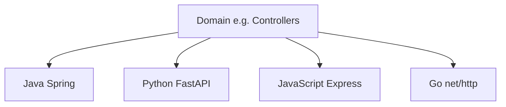

Templates — overview
**Copy-paste starting points** organized by **domain** (controllers, DTOs, services, …), then by **language / framework**. Use these when you need a known-good shape fast — not as a substitute for the deeper language tracks.

Related: [SWE101 overview](../i-overview.md), language tracks under `languages&frameworks/` (Java, Python, JavaScript, …).

## Map

| Note / domain | Focus |
|---------------|--------|
| **[REST package layout](ii-rest-package-layout.md)** | How layers fit together |
| **[Controllers](controllers/i-overview.md)** | HTTP request handlers |
| **[DTOs](dtos/i-overview.md)** | Request/response shapes + validation |
| **[Services](services/i-overview.md)** | Business logic / use-cases |
| **[Repositories](repositories/i-overview.md)** | Persistence boundary |
| **[Errors](errors/i-overview.md)** | Domain errors → HTTP mapping |
| **[Middleware](middleware/i-overview.md)** | Request ID, logging, auth stubs |

Each domain has the same stacks: **Java Spring**, **Python FastAPI**, **JavaScript Express**, **Go net/http**.

## How to use

1. Skim [REST package layout](ii-rest-package-layout.md).
2. Pick the **domain** (what layer you are writing).
3. Open the **language** page closest to your stack.
4. Wire layers together — controllers call services; services call repositories.

## Conventions in these templates

| Rule | Why |
|------|-----|
| **Thin handlers** | Parse input → call service → map response |
| **Explicit status codes** | Easier clients and tests |
| **Validation at the edge** | Fail fast with 400 (DTOs / schemas) |
| **No business rules in the controller** | Keep domain logic testable in services |
| **No SQL in the controller** | Repositories own persistence |

## Next

[REST package layout](ii-rest-package-layout.md) → [Controllers](controllers/i-overview.md).
