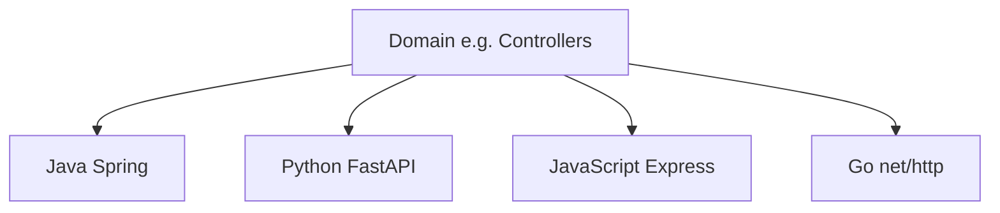

Templates — overview
**Copy-paste starting points** organized by **domain** (controllers, DTOs, services, …), then by **language / framework**. Use these when you need a known-good shape fast — not as a substitute for the deeper language tracks.

Related: [SWE101 overview](../i-overview.md), language tracks under `languages&frameworks/` (Java, Python, JavaScript, …).

## Core REST package

| Note / domain | Focus |
|---------------|--------|
| **[REST package layout](ii-rest-package-layout.md)** | How layers fit together |
| **[Controllers](controllers/i-overview.md)** | HTTP request handlers (**inbound**) |
| **[DTOs](dtos/i-overview.md)** | Request/response shapes + validation (≠ DAO) |
| **[Services](services/i-overview.md)** | Business logic / use-cases |
| **[Repositories](repositories/i-overview.md)** | Persistence boundary (DAO role) |
| **[Errors](errors/i-overview.md)** | Domain errors → HTTP mapping |
| **[Middleware](middleware/i-overview.md)** | Request ID, logging, auth stubs |

## Senior / production

| Note / domain | Focus |
|---------------|--------|
| **[Filters](filters/i-overview.md)** | Edge policy: rate limit, headers, 413/415/429 |
| **[HTTP clients](http-clients/i-overview.md)** | **Outbound** calls to other APIs |
| **[Pagination](pagination/i-overview.md)** | Bounded lists, cursor vs offset |
| **[Resilience](resilience/i-overview.md)** | Timeouts, retries, circuit breakers |
| **[Observability](observability/i-overview.md)** | Logs, metrics, traces |
| **[Caching](caching/i-overview.md)** | ETag / Cache-Control / app cache |
| **[Transactions](transactions/i-overview.md)** | ACID at the service boundary |
| **[Idempotency](idempotency/i-overview.md)** | Safe POST retries (`Idempotency-Key`) |

Each domain has the same stacks: **Java Spring**, **Python FastAPI**, **JavaScript Express**, **Go net/http**.

## How to use

1. Skim [REST package layout](ii-rest-package-layout.md).
2. Pick the **domain** (what layer or concern you are writing).
3. Open the **language** page closest to your stack.
4. Wire layers together — controllers call services; services call repositories (and outbound clients).

## Conventions in these templates

| Rule | Why |
|------|-----|
| **Thin handlers** | Parse input → call service → map response |
| **Explicit status codes** | Easier clients and tests |
| **Validation at the edge** | Fail fast with 400 (DTOs / schemas) |
| **No business rules in the controller** | Keep domain logic testable in services |
| **No SQL in the controller** | Repositories own persistence |
| **Timeouts on outbound HTTP** | Partners fail; your process must not hang |
| **Bounded lists** | Pagination in production — never dump whole tables |

## Next

[REST package layout](ii-rest-package-layout.md) → [Controllers](controllers/i-overview.md) or jump to [Filters](filters/i-overview.md) / [HTTP clients](http-clients/i-overview.md).
