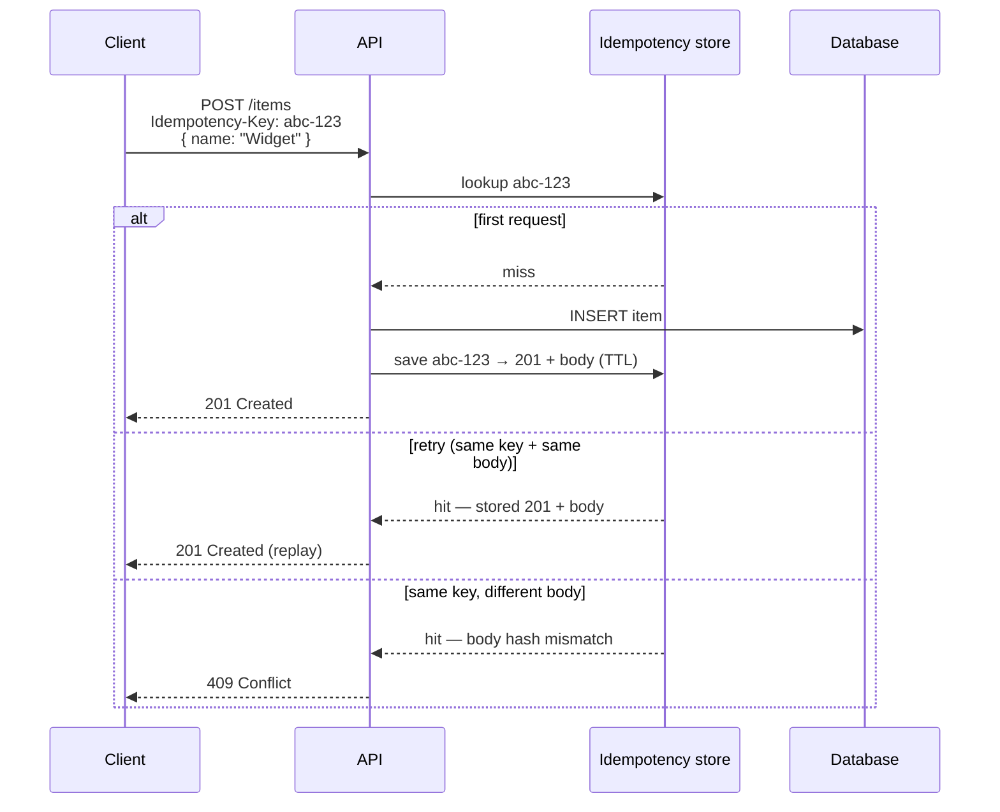

Idempotency — overview
Network failures and client retries make **duplicate POST** a production certainty — payments, inventory, sign-ups. **Idempotency** lets clients safely retry: same key + same body → same response; different body with same key → **409 Conflict**.

Pair with [Resilience](../resilience/i-overview.md) (when retries are allowed) and [Transactions](../transactions/i-overview.md) (atomic create + idempotency record).

## Mental model



## Client contract

| Header | Rule |
|--------|------|
| **`Idempotency-Key`** | Client-generated UUID (or opaque string); required on mutating POST you want retry-safe |
| **Same key + same body** | Return cached status + response body — do not create twice |
| **Same key + different body** | `409 Conflict` — client bug or key reuse |
| **TTL** | Expire stored keys (24–72h typical) — balance storage vs retry window |

Optional: require key only on `POST`; document that GET/PUT with natural idempotency don't need it.

## Server flow (POST /items → create Item)

```text
1. Read Idempotency-Key header (400 if missing on protected routes)
2. Hash request body (canonical JSON)
3. Lookup key in store (Redis, DB table, etc.)
4. If found + hash match → replay stored response
5. If found + hash mismatch → 409
6. Else → run create inside TX; persist key → response; return to client
```

Store **status code + response body** (and optionally headers like `Location`). Persist **before** or **in the same transaction as** the side effect so a crash can't double-charge.

## Language templates

| Note | Stack |
|------|--------|
| [Java — Spring](ii-java-spring.md) | Filter / interceptor + service check |
| [Python — FastAPI](iii-python-fastapi.md) | Middleware / dependency |
| [JavaScript — Express](iv-javascript-express.md) | Middleware before route |
| [Go — net/http](v-go-nethttp.md) | Middleware wrapper |

## Notes

| Topic | Practice |
|-------|----------|
| **Scope** | Start with high-risk POST (`/items`, payments) — expand gradually |
| **Body hash** | Compare normalized JSON — field order must not matter |
| **In-flight** | Optional "processing" lock to dedupe concurrent duplicates |
| **Idempotent ≠ safe retry forever** | TTL bounds storage; clients should use fresh keys for new intent |
| **Stripe-style** | Industry pattern — same header name, store → replay semantics |

## Next

Pick your stack — start with [Java — Spring](ii-java-spring.md) or [Python — FastAPI](iii-python-fastapi.md).
