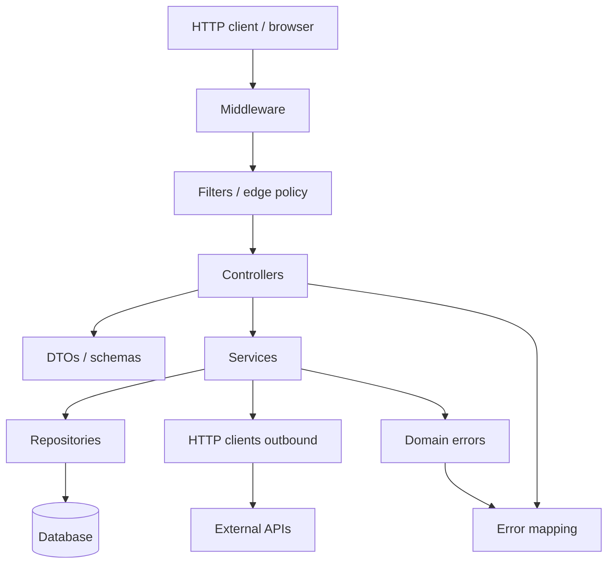

REST package layout
How the **templates domains** fit together in a typical REST backend. Controllers stay thin; everything else supports them — including **inbound** filters and **outbound** HTTP clients.

## Layers



| Layer | Template domain | Job |
|-------|-----------------|-----|
| Edge | [Middleware](middleware/i-overview.md) | Request ID, logging, auth stubs |
| Edge policy | [Filters](filters/i-overview.md) | Rate limit, security headers, 413/415/429 |
| HTTP in | [Controllers](controllers/i-overview.md) | Routes, status codes |
| Wire shapes | [DTOs](dtos/i-overview.md) | Request/response JSON + validation (**not** DAOs) |
| Use-cases | [Services](services/i-overview.md) | Business rules |
| Persistence | [Repositories](repositories/i-overview.md) | Load/save aggregates (DAO role) |
| HTTP out | [HTTP clients](http-clients/i-overview.md) | Call other services (timeouts required) |
| Failures | [Errors](errors/i-overview.md) | Typed errors → HTTP mapping |
| Lists | [Pagination](pagination/i-overview.md) | Bounded list responses |
| Hardening | [Resilience](resilience/i-overview.md) | Retries, circuit breakers |
| Ops | [Observability](observability/i-overview.md) | Logs / metrics / traces |
| Perf | [Caching](caching/i-overview.md) | ETag, Cache-Control, app cache |
| Consistency | [Transactions](transactions/i-overview.md) | ACID at service boundary |
| Safe writes | [Idempotency](idempotency/i-overview.md) | Replay-safe POST |

## Suggested package folders

```text
api/ or web/
  controllers/     # or handlers/  — HTTP in
  dto/             # or schemas/
  middleware/
  filters/         # rate limit, headers, body limits
application/ or service/
  ItemService...
  clients/         # outbound HTTP wrappers
domain/ or model/
  Item, errors...
infrastructure/ or repository/
  ItemRepository...
```

Names vary by team (hexagonal, clean architecture, “just packages”). The **dependencies** matter more than folder labels: controllers depend inward; repositories and HTTP clients sit at the edges.

## Same resource, all layers

The templates reuse one resource — **Item** (`id`, `name`) — so you can copy a vertical slice across languages.

## HTTP in vs HTTP out

| | **In** | **Out** |
|---|--------|---------|
| Direction | Client → your API | Your service → partner API |
| Templates | Controllers, filters, middleware | [HTTP clients](http-clients/i-overview.md), [resilience](resilience/i-overview.md) |
| Hard rule | Validate DTOs; thin handlers | **Always** set timeouts; map remote status codes |

## Next

[Controllers](controllers/i-overview.md), [Filters](filters/i-overview.md), or [HTTP clients](http-clients/i-overview.md).
